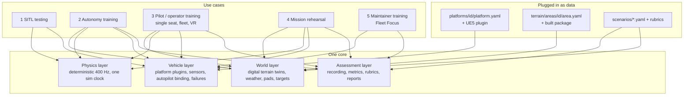

# 01 — Vision and Use Cases

> **Audience:** everyone — new engineers on day one, instructors, programme
> staff. Read this first, then [02 Architecture](02_ARCHITECTURE.md).
>
> **Maturity, stated plainly:** **RAVEN is the only programme CDPL has
> delivered.** CD Sim, as described in this repository, is **under build**:
> Phase 0 (skeleton) is in place, and none of the five use cases below is
> fielded, validated or operational yet. Each use case lists the roadmap
> phase that delivers it ([10 Roadmap](10_ROADMAP.md)).

---

## 1. What CD Sim is

CD Sim is Chakravyuha Dynamics Private Limited's (CDPL) **offline-first,
platform-agnostic mission-rehearsal, training and simulation platform**. It
is built on **Unreal Engine 5** (world, rendering, vehicle physics, VR) with
**Python services** (recording, assessment, API, terrain serving) and a
**React instructor console**, all packaged in Docker so that a laptop, a lab
server or a ruggedised field box can run it **with no network connection**.

Three ideas define it:

1. **One core, five use cases.** The same world, physics, vehicle and
   assessment layers serve autopilot testing, autonomy training, pilot
   training, mission rehearsal and maintainer training. Use cases are
   configurations, scenarios and UI screens — not separate products.
2. **Everything is data-driven.** A vehicle ("platform") is a YAML file plus
   a UE5 content plugin; an area of operations ("area package") is a YAML
   manifest plus a built terrain package. Adding either never touches the
   core ([04](04_PLATFORM_PLUGIN_SPEC.md), [03](03_DIGITAL_TERRAIN_TWINS.md)).
3. **Assessment is the point.** Every session is recorded on one simulation
   clock — telemetry, control inputs, world events, instructor injects and
   (with consent) trainee audio — and scored against a rubric. That is what
   makes CD Sim a *training system* rather than a game
   ([06](06_ASSESSMENT_ENGINE.md)).

## 2. Who uses it

| User | Wants | Main touch-points |
|---|---|---|
| **Trainee pilot / operator** | Learn to fly and operate CDPL platforms, handle emergencies, work as part of a fleet | UE5 seat (desktop, gamepad/RC transmitter, or VR headset); debrief report |
| **Instructor** | Run sessions, inject failures and events, watch live, debrief with evidence, track trainee progress | Instructor console in a browser; replay |
| **Maintainer trainee** | Learn parts, tools and procedures on an airframe twin before touching hardware | UE5 seat in maintainer mode (Fleet Focus); report |
| **Test engineer** | Validate autopilot configuration, mission scripts and failsafes against a realistic world without risking a vehicle | SITL containers, MAVLink scripts, headless runs, session files |
| **Autonomy engineer** | Generate labelled data, run scenario sweeps and RL episodes, export a policy | gRPC gym environment, headless multi-instance runs, ONNX export |
| **Platform / terrain engineer** (internal) | Add vehicles and areas | `platforms/`, `terrain/areas/`, scaffolders, CAD pipeline |
| **Box administrator** (internal) | Install and keep a field box running offline | `make deploy-box` bundle, compose profiles, health pages ([09](09_DEPLOYMENT_OFFLINE.md)) |

## 3. One core, five use cases

## 4. The five use cases

Each use case below has: actors, a concrete example session, the layers it
uses, how we will know it works (success criteria), and the phase that
delivers it. Success criteria are **targets**; none has been demonstrated.

### 4.1 Use case 1 — SITL testing

**Purpose:** engineering validation of CDPL platforms and mission scripts
with the real, unmodified autopilot firmware (ArduPilot now, PX4 later)
flying against the CD Sim world ([05](05_SITL_INTEGRATION.md)).

**Actors:** test engineer; optionally a GCS operator.

**Example session.** A test engineer changes the geofence parameters in
`platforms/cdpl_quad_01/ardupilot.parm` and wants to know the vehicle still
completes its standard mission and respects the fence. She starts
`make dev` and `make sitl`, launches UE5 headless on `flat_test`, and the
scenario runner executes `scenarios/sitl_core_loop.yaml`: upload
`scenarios/missions/core_loop.waypoints` over MAVLink, arm, take off to
10 m, fly 50 m north, land on `pad_target`. A GCS on her laptop shows the
flight live over UDP 14550. The run is repeated at 5× sim rate with a
`motor_m2_out` inject to check the failsafe behaviour. Each run produces a
session file she attaches to the change request.

**Layers:** physics, vehicle (autopilot binding, failure modes), world
(flat or real area), recording (session file); assessment optional
(pass/fail on landing outcome).

**Success criteria:**

- Scripted takeoff–waypoint–land runs headless without manual steps.
- The session file replays deterministically (re-simulation matches).
- Sim-rate 0.1–10× works with zero lost SITL frames at the rates the
  machine can sustain.
- Any MAVLink GCS can connect without CD Sim-specific configuration.

**Delivered by:** Phase 1 (core loop); failure injection into SITL in
Phase 3; PX4 later.

### 4.2 Use case 2 — Autonomy training

**Purpose:** teach a drone a precise action — first target: **precision
landing** on a marked pad, then a moving platform — using labelled data,
scripted scenario sweeps and reinforcement learning, and export the policy to
ONNX for the real vehicle ([08](08_AUTONOMY_TRAINING.md)).

**Actors:** autonomy engineer; test engineer (for SITL verification of the
exported policy).

**Example session.** An autonomy engineer launches eight headless UE5
instances with eight SITL containers on a GPU server (`rl` profile). The
Gymnasium-style `PrecisionLandingEnv` steps each instance over gRPC at 20 Hz
control (20 physics ticks per step), observing the downward camera, IMU and
estimated pad pose, and commanding velocity setpoints in guided mode. The
curriculum advances from a static pad in calm air, to wind of 4 m/s with
gusts, to a pad moving at 1 m/s, to a circling pad in 5 m/s wind. The best
policy is exported to ONNX and evaluated on 100 held-out seeded episodes,
each recorded as a session and scored with `precision_landing_v1`.

**Layers:** world (pads, wind), physics (lock-step, sim-rate up to 10×),
vehicle (camera, autopilot), assessment (the same landing metrics trainees
are scored on).

**Success criteria:**

- Episodes are reproducible from `(seed, policy)`.
- Headless multi-instance training runs faster than real time.
- The exported ONNX policy reproduces the PyTorch policy's actions within
  tolerance and runs within the onboard compute budget (to be defined with
  the target hardware).
- Landing success and radial error reported per curriculum stage.

**Delivered by:** Phase 7 (reward shaping and curriculum logic already
exist and are unit-tested in `services/rl`).

### 4.3 Use case 3 — Pilot / operator training

**Purpose:** immersive single-seat and networked **fleet** training (many
pilots, one shared world), on desktop or VR, run by an instructor
([07](07_TRAINING_MODES.md)).

**Actors:** trainees, instructor.

**Example session (single seat).** A trainee sits at a seat PC with an RC
transmitter. The instructor selects scenario `landing_motor_failure_01` in
the console: take off from Pad Alpha on `hyd_demo_01`, transit to Pad Bravo.
At T+60 s the scenario injects `motor_m1_degraded` (60 % thrust). The
trainee should call it out on voice, stabilise and land precisely on
Bravo. The console shows the vehicle, the inject and the trainee's audio
level live. Afterwards the debrief shows reaction time (inject → first
meaningful control input), decision latency (inject → correct mode change),
voice onset, landing radial error, touchdown vertical speed and attitude,
each against the `precision_landing_v1` bands, with a replay scrubbed to the
inject.

**Example session (fleet).** Four trainees join a dedicated server on the
classroom LAN with a six-character session code. The instructor fires one
`alarm` inject broadcast to all four at the same sim time; the report ranks
their reaction times side by side.

**Layers:** all four.

**Success criteria:**

- Session setup to first flight in under five minutes by an instructor
  without engineering help.
- Reaction-time measurement verified to within 20 ms against a synthetic
  stimulus (Phase 3 acceptance).
- A golden recorded session scores identically on every run.
- Fleet: 4 clients + instructor on a LAN; one inject reaches all trainees at
  the same sim time; per-trainee recording and scoring.
- VR is a configuration of the same build, not a fork.

**Delivered by:** assessment engine Phase 3; console and single-seat mode
Phase 4; fleet and VR Phase 5.

### 4.4 Use case 4 — Mission rehearsal

**Purpose:** rehearse a specific task on a **digital terrain twin of the
actual area** before doing it for real ([03](03_DIGITAL_TERRAIN_TWINS.md)).

**Actors:** operator crew, instructor/mission commander, terrain engineer
(builds the area package beforehand).

**Example session.** A crew is to survey a stretch of reservoir edge. A
terrain engineer builds an area package from open data (DEM, satellite
imagery, OpenStreetMap) — or, where CDPL has flown the area, from
photogrammetry — and installs it on the field box, which then runs with no
network. The crew plans the route, then rehearses it in CD Sim: launch from
the pad they will actually use, fly the route at the planned altitudes
against the real terrain relief, avoid the declared no-fly volume, handle a
simulated GPS loss en route, recover to the alternate pad. The instructor
replays the rehearsal to check terrain clearance and timing.

**Layers:** world (the twin is central), physics, vehicle, assessment
(geofence breaches, timing, landing).

**Success criteria:**

- An area package is built reproducibly from its manifest and served fully
  offline.
- Elevation in UE5 matches the source DEM at check points; pads, targets
  and no-fly volumes appear at their manifest positions.
- Rehearsal sessions are recorded and scored like any other.

**Delivered by:** Phase 2 (terrain twins in UE5), with scoring from Phase 3
and scenario authoring from Phase 4.

### 4.5 Use case 5 — Maintainer training (Fleet Focus)

**Purpose:** digital-twin-based maintainer training in three modes —
**Explore** (walk the airframe twin, identify parts), **Rehearse** (guided
procedure with 3D anchors, tool selection, step timing), **Improve**
(after-action review from the assessment engine). Procedures come from the
platform YAML ([04 §11](04_PLATFORM_PLUGIN_SPEC.md#11-maintenance-procedures-design)).

**Actors:** maintainer trainee, maintenance instructor.

**Example session.** A maintainer trainee selects `cdpl_quad_01` →
*Motor replacement (M2)*. In Rehearse mode each step highlights its anchor
(e.g. `SOCKET_Motor_M2`), shows the instruction, and asks for the tool. The
trainee skips "Disconnect flight battery" — a critical step — and the
procedure is marked failed at that point, but continues for practice. The
Improve report shows adherence, step times against expected durations and
the critical omission.

**Layers:** vehicle (platform twin, parts, anchors, procedures), assessment
(`maintainer_procedure_v1`). World and flight physics are not needed.

**Success criteria:**

- Every procedure in `platform.yaml` can be completed in Rehearse mode with
  no platform-specific code.
- Each step produces a `procedure_step` outcome with the tool used and
  timing.
- Swapping placeholder geometry for real CAD requires no procedure changes
  (anchors keep their names).

**Delivered by:** Phase 6 (on the placeholder airframe, ready for real CAD).

### 4.6 Use-case summary

| # | Use case | World | Physics | Vehicle | Assessment | Session kind | Phase |
|---|---|---|---|---|---|---|---|
| 1 | SITL testing | ● | ● | ● | ○ | `sitl_test` | 1 |
| 2 | Autonomy training | ● | ● | ● | ● | `autonomy` | 7 |
| 3 | Pilot / operator training | ● | ● | ● | ● | `pilot_single`, `pilot_fleet` | 3–5 |
| 4 | Mission rehearsal | ● | ● | ● | ● | `mission_rehearsal` | 2 (+3, 4) |
| 5 | Maintainer training | ○ | — | ● | ● | `maintainer` | 6 |

● core to the use case · ○ optional · — not used. Session kinds are the
`SessionKind` values in `schemas/session.proto`.

## 5. Product principles

1. **Offline-first.** Nothing needs the internet at runtime. Internet is
   used only at build time to fetch open data and container images. A
   deployed box must work air-gapped ([09](09_DEPLOYMENT_OFFLINE.md)). Any
   feature that would need a network service outside the box is redesigned
   or rejected.
2. **Platform-agnostic.** The core knows vehicle *classes*, never specific
   vehicles. A new platform is data plus a content plugin. Needing a core
   edit for a new platform is a bug.
3. **Terrain twins are the foundation.** Realistic, reproducible areas of
   operations are what turn flying practice into rehearsal.
4. **Assessment as core, not a feature.** Every session is recorded on one
   clock and scorable; metrics are deterministic and explainable (bands,
   weights, evidence events), so an instructor can defend every score.
5. **Real autopilot, real behaviour.** Unmodified autopilot firmware in the
   loop, so modes, failsafes and handling match the vehicle.
6. **Honesty about maturity.** RAVEN is the only delivered CDPL programme.
   CD Sim capabilities in this repository are under build; unbuilt code is
   marked **UNVERIFIED BUILD**, unimplemented endpoints return 501 with the
   phase, and we never invent test results or claim fielded, validated or
   operational status.
7. **Consent and privacy.** Trainee audio is recorded only with explicit
   consent and kept only for the configured retention period.
8. **Built to be handed over.** Documentation, modularity and
   reproducibility are deliverables. Boring, well-documented technology over
   clever technology.

## 6. Non-goals

- **Not a cloud service.** No SaaS, no hosted backend, no remote telemetry.
- **Not a game.** No entertainment features; realism and assessment come
  first. Visual fidelity serves training value, not spectacle.
- **Not a flight-certification or airworthiness tool.** SITL results support
  engineering judgement; they do not replace flight test or certification.
- **Not an autopilot.** CD Sim does not modify or replace ArduPilot/PX4; it
  simulates the vehicle around them.
- **Not a general-purpose GIS or photogrammetry suite.** The terrain
  pipeline packages areas for simulation using existing open-source tools.
- **Not a real-time operational C2 or mission-planning system.** Rehearsal
  plans are for training; the operational system of record is elsewhere.
- **Not a source of real airspace data.** No-fly volumes in areas are
  training constructs.
- **No platform-specific code in the core** — ever.

## 7. Glossary pointers

Terms such as *platform*, *area package*, *sim time*, *stimulus*, *inject*,
*rubric*, *band*, *session file* are defined in [GLOSSARY](GLOSSARY.md). For
a first-week reading order, see [ONBOARDING](ONBOARDING.md).

## Status (Phase 0)

**In place (Phase 0, verified by running):** repository skeleton; schemas
for events, telemetry, sessions, control, platforms, areas, scenarios and
rubrics; the Python services (api, recorder, assessment scoring, four
terrain services) with unit tests; the instructor console shell; `make dev`
bringing all core, terrain and lms containers to healthy; one placeholder
platform (`cdpl_quad_01`), two area manifests (`flat_test`, `hyd_demo_01`),
two scenarios and two rubrics, all validated.

**Written but never compiled or run:** the UE5 project and C++ skeleton
(`sim/`), the ArduPilot SITL image, CI workflows.

**Not yet delivered:** every use case above. The first end-to-end capability
is the Phase 1 core loop (use case 1). No CD Sim capability is fielded,
validated or operational; RAVEN remains CDPL's only delivered programme.
