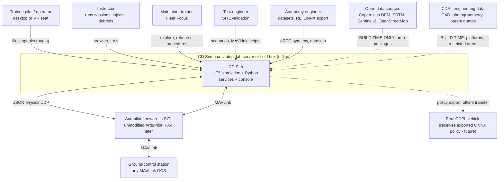
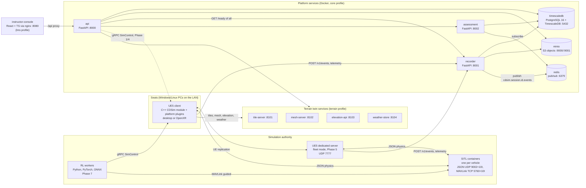
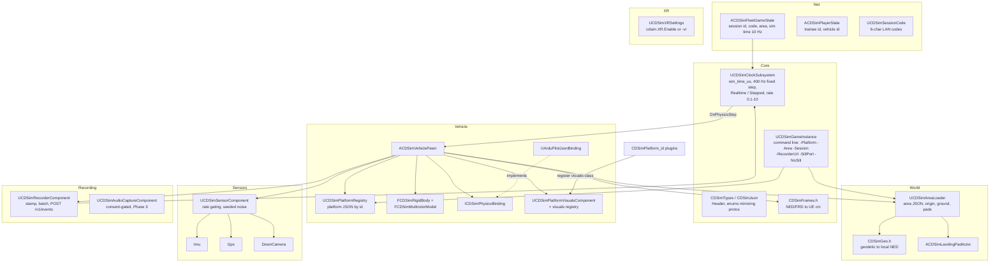
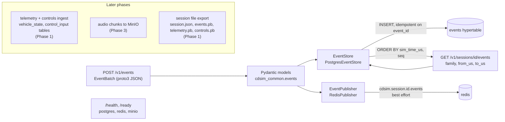
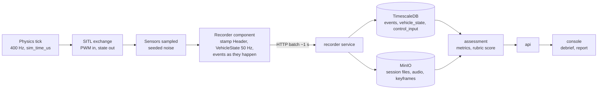
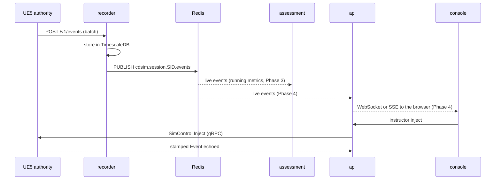
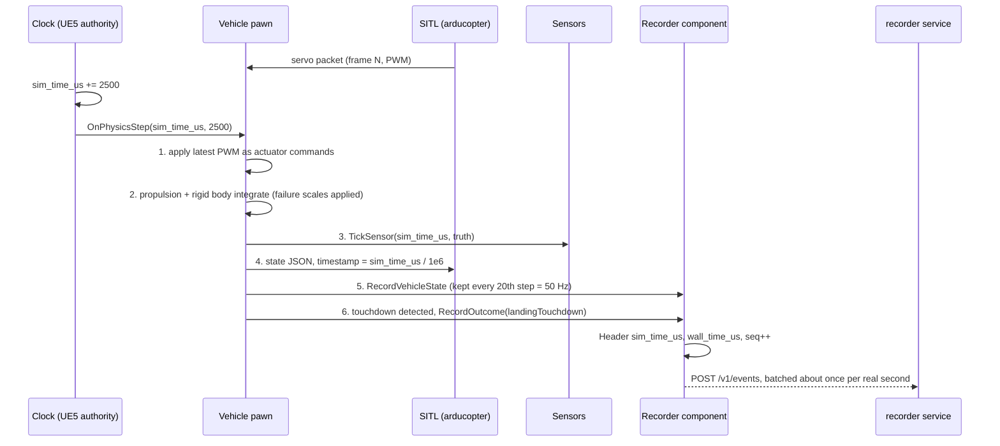

# 02 — Architecture

> **Audience:** every engineer. Read after [01 Vision and use cases](01_VISION_AND_USECASES.md).
>
> **Maturity:** CD Sim is under build. RAVEN is CDPL's only delivered
> programme. This document describes the target architecture and marks, for
> every part, what exists in Phase 0 and which phase delivers the rest
> ([10 Roadmap](10_ROADMAP.md)). See [Status (Phase 0)](#status-phase-0).

Related ADRs: [0001 monorepo](ADR/0001-monorepo-and-layout.md) ·
[0002 UE 5.4 + LFS](ADR/0002-unreal-engine-5-4-and-git-lfs.md) ·
[0003 SITL JSON](ADR/0003-ardupilot-sitl-json-physics.md) ·
[0004 offline terrain](ADR/0004-offline-terrain-twins-in-docker.md) ·
[0005 FastAPI](ADR/0005-python-fastapi-services.md) ·
[0006 TimescaleDB](ADR/0006-postgresql-timescaledb.md) ·
[0007 MinIO](ADR/0007-minio-object-storage.md) ·
[0008 Redis](ADR/0008-redis-live-pubsub.md) ·
[0009 React console](ADR/0009-react-typescript-console.md) ·
[0010 dedicated server](ADR/0010-ue5-replication-dedicated-server.md) ·
[0011 OpenXR](ADR/0011-openxr-vr-as-configuration.md) ·
[0012 RL gRPC](ADR/0012-rl-gym-env-grpc-pytorch-onnx.md) ·
[0013 audio](ADR/0013-audio-opus-whisper.md) ·
[0014 compose profiles](ADR/0014-compose-profiles-and-air-gap-bundle.md) ·
[0015 time base](ADR/0015-unified-sim-time-base.md) ·
[0016 schemas](ADR/0016-schema-contracts-protobuf-and-json-schema.md) ·
[0017 terrain services](ADR/0017-own-lightweight-terrain-services.md)

---

## 1. Architectural principles

1. **One core, five use cases.** SITL testing, autonomy training, pilot
   training, mission rehearsal and maintainer training use the same world,
   physics, vehicle, recording and assessment layers. Use cases differ only
   in configuration, scenario and UI.
2. **Data-driven extension.** Vehicles (`platforms/<id>/platform.yaml` +
   UE5 plugin) and areas (`terrain/areas/<id>/area.yaml` + built package)
   are plugins. Adding either never changes the core
   ([04](04_PLATFORM_PLUGIN_SPEC.md), [03](03_DIGITAL_TERRAIN_TWINS.md)).
3. **Offline-first.** Every runtime dependency runs on the box: no cloud, no
   internet, no telemetry, no update checks. Internet is used only at build
   time (images, open data).
4. **One clock.** Every recorded datum carries `sim_time_us` from a single
   authoritative simulation clock (§6). Wall-clock is reference only.
5. **Schemas first.** Anything crossing a process boundary is defined in
   `schemas/` (protobuf for messages, JSON Schema for YAML manifests) before
   code uses it ([ADR 0016](ADR/0016-schema-contracts-protobuf-and-json-schema.md)).
6. **Deterministic where it matters.** Vehicle dynamics run in plain C++ at a
   fixed step, not in the engine's variable-rate physics, so sessions can be
   replayed and golden sessions scored identically.
7. **Boring technology, honest stubs.** Unimplemented behaviour returns HTTP
   501 or raises `NotImplementedError` naming the phase.

## 2. Level 1 — System context



Dashed arrows are build-time or offline-transfer paths; nothing crosses them
while a session runs. The autopilot runs *inside* the box (as a container)
but is an external system in the architectural sense: CD Sim does not modify
it.

## 3. Level 2 — Containers



| Container | Tech | Responsibility | Phase 0 state |
|---|---|---|---|
| **UE5 client** | Unreal Engine 5.4, C++ module `CDSim`, plugins `CDSimPlatform_<id>` | World, vehicle physics (authority in single-seat), sensors, SITL binding, rendering, input, audio capture, VR, recording client | Source skeleton, **UNVERIFIED BUILD** |
| **UE5 dedicated server** | same code, `CDSimServer` target | Authority in fleet mode: clock, physics for all vehicles, SITL bindings, stimuli broadcast | Declared in compose (`multiplayer` profile); image not buildable yet (Phase 5) |
| **SITL containers** | unmodified ArduPilot `Copter-4.5.7` | Autopilot firmware per vehicle | Dockerfile written, **UNVERIFIED BUILD** |
| **api** | Python 3.11, FastAPI | Catalogue (platforms, areas, scenarios, rubrics), system health aggregation, sessions/trainees/replay/score (501 until their phase), console backend | Implemented, tested |
| **recorder** | FastAPI | Ingest events (idempotent), ordered read-back, live fan-out on Redis; telemetry/controls (Phase 1), audio (Phase 3) | Events implemented, tested |
| **assessment** | FastAPI | Rubric validation, deterministic band scoring; metric extraction from recordings (Phase 3); reports | Scoring implemented, metrics stubbed |
| **tile-server / mesh-server / elevation-api / weather-store** | FastAPI (one image, four entrypoints) | Serve built area packages offline ([03](03_DIGITAL_TERRAIN_TWINS.md)) | Implemented; serve flat areas / manifests; DEM, tiles once built (Phase 2) |
| **timescaledb** | PostgreSQL 16 + TimescaleDB 2.16.1 | Sessions, events, vehicle state, control input (hypertables) | Schema applied on first start |
| **redis** | Redis 7.4 | Live pub/sub of session events to console and assessment | Running; recorder publishes |
| **minio** | MinIO (S3 API) | Buckets `cdsim-recordings` (session files, audio, keyframes) and `cdsim-areas` (area packages) | Running; buckets created by `minio-init` |
| **instructor-console** | React + TypeScript, Vite, nginx | Session control, live monitoring, replay, scoring, trainee records, scenario authoring | Shell with health view; features Phase 4 |
| **RL workers** | Python, Gymnasium-style env, PyTorch, ONNX | Headless training over gRPC | Reward/curriculum code tested; env stubs (Phase 7) |

## 4. Level 3 — Components

### 4.1 UE5 client (`sim/Source/CDSim/`)

All files carry the **UNVERIFIED BUILD** marker; none has been compiled.



| Folder | Key classes | Responsibility |
|---|---|---|
| `Core/` | `UCDSimGameInstance`, `UCDSimClockSubsystem`, `CDSimTypes`, `CDSimJson.h`, `CDSimFrames.h` | Launch options, the authoritative clock, shared types mirroring `schemas/*.proto`, frame conversions |
| `World/` | `UCDSimAreaLoader`, `CDSimAreaSpec`, `CDSimGeo.h`, `ACDSimLandingPadActor` | Load an area by id, fix the UE origin at the area origin, spawn ground and pads; terrain streaming from services in Phase 2 |
| `Vehicle/` | `UCDSimPlatformRegistry`, `FCDSimPlatformSpec`, `ACDSimVehiclePawn`, `FCDSimRigidBody`, `FCDSimMultirotorModel`, `ICDSimPhysicsBinding`, `UArduPilotJsonBinding`, `UCDSimPlatformVisualsComponent` | Load a platform by id; deterministic 6-DOF physics; autopilot binding; visuals from plugins; failure application |
| `Sensors/` | `UCDSimSensorComponent` (+ `Imu`, `Gps`, `DownCamera`) | Sensors from `platform.yaml`, sampled on the physics step with seeded noise |
| `Recording/` | `UCDSimRecorderComponent`, `UCDSimAudioCaptureComponent` | Stamp and ship events/telemetry to the recorder; consent-gated audio (Phase 3) |
| `Net/` | `ACDSimFleetGameState`, `ACDSimPlayerState`, `UCDSimSessionCode` | Fleet replication of session identity and sim time; LAN join codes (resolution Phase 5) |
| `XR/` | `UCDSimXRSettings` | VR as configuration: same binary, switched by cvar or `-vr` |

### 4.2 Recorder (`services/recorder/`)



| Component | File | Notes |
|---|---|---|
| App factory | `cdsim_recorder/main.py` | `create_app(settings, store, publisher)`; fakes injected in tests |
| Store | `cdsim_recorder/store.py` | `EventStore` protocol; `InMemoryEventStore` (tests), `PostgresEventStore` |
| Publisher | `cdsim_recorder/store.py` | `RedisPublisher`; publish failure is logged, never loses stored data |
| DB schema | `services/recorder/db/001_init.sql` | `sessions`, `events`, `vehicle_state`, `control_input`; hypertables on `recorded_at` for chunking/retention only; indexes on `(session_id, sim_time_us, seq)` |
| Models | `services/common/src/cdsim_common/events.py` | Pydantic mirror of `events.proto`, round-trip tested against compiled protobuf |

## 5. Data flow

### 5.1 Recorded path (one physics step to a score)



| Stream | Producer | Rate | Store | Phase |
|---|---|---|---|---|
| `Event` (stimulus / response / outcome / annotation) | UE5, console (via api), scenario runner, assessment | as they occur | `events` table | Phase 0 ingest works; producers Phase 1–4 |
| `VehicleState` | UE5 authority | 50 Hz per vehicle | `vehicle_state` | Phase 1 |
| `ControlInput` | UE5 seat | on change, ≤ 100 Hz | `control_input` | Phase 1 |
| `AudioChunk` | UE5 seat (consented trainees only) | ~1 s chunks of 20 ms Opus frames | MinIO `cdsim-recordings`, index in DB | Phase 3 |
| `VideoKeyframe` | UE5 | optional 1 Hz | MinIO | Phase 4 |
| Session file | recorder export | per session | MinIO `cdsim-recordings` | Phase 1 |

### 5.2 Live path



Storage is the record; Redis is best-effort fan-out. If Redis is down,
recording continues and the console falls back to polling the recorder.

## 6. Unified time base

Decision record: [ADR 0015](ADR/0015-unified-sim-time-base.md). Code:
`services/common/src/cdsim_common/simclock.py` (Python, tested) and
`sim/Source/CDSim/Core/CDSimClockSubsystem.h` (UE5, uncompiled).

### 6.1 Definitions

| Term | Definition |
|---|---|
| `sim_time_us` | `int64` microseconds since session start (0 at session start). Monotonic non-decreasing for the life of a session. **The** ordering and join key. |
| `wall_time_us` | Producer's Unix-epoch microseconds. Reference only (audit, "when did this session happen"). Never used for ordering, joining or metrics. |
| `seq` | Per-producer monotonic counter. Tie-breaker for equal `sim_time_us` from one producer. |
| Canonical order | `(sim_time_us, seq)`; for fully deterministic total order across producers, then `(source, actor_id, event_id)`. |
| Physics step | 2500 µs of sim time = 400 Hz. Sim time advances **only** in whole steps inside UE5. |
| Sim rate | Sim seconds per wall second, 0.1–10. |
| `recorded_at` | Ingest wall-clock column in TimescaleDB, used only for hypertable chunking and retention. |

### 6.2 Who owns the clock

| Session type | Clock owner | Everyone else |
|---|---|---|
| Single seat | the UE5 client (standalone) | services and SITL follow it |
| Fleet | the UE5 **dedicated server** | clients read the replicated sim time (`ACDSimFleetGameState`, ~10 Hz, interpolated from Phase 5) |
| RL / lock-step | UE5 in **Stepped** mode, driven by `SimControl.Step` | the gym env never invents time |
| Replay | the replay player, a `SimClock` in **STEPPED** mode stepping through recorded time | |
| Python tools without UE5 (tests, scenario dry-runs) | `cdsim_common.simclock.SimClock` with identical semantics | |

SITL takes its time **from** the clock: the JSON reply's `timestamp` is
`sim_time_us / 1e6` ([05 §3.2](05_SITL_INTEGRATION.md)).

### 6.3 Stamping rules

1. **Stamp at the source, with the authority's sim time.** The producer that
   observes an occurrence stamps it. Services never re-stamp.
2. **Physics-derived events** (touchdown, collision, geofence breach) carry
   the sim time of the physics step in which they were detected.
3. **Injects** (instructor, scenario) are stamped by the authority at the
   physics step where the effect starts (`SimControl.Inject` echoes the
   stamped event). Scenario injects scheduled at `at_s` fire at the first
   step with `sim_time_us ≥ at_s × 10⁶`.
4. **Control inputs** are stamped with the sim time of the physics step at
   which they are *applied*. In fleet mode the server stamps on receipt; the
   client's own estimate is kept in `params` for latency analysis (Phase 5).
5. **Audio chunks** are stamped with the sim time of the **first sample**.
   In fleet mode the client uses its interpolated estimate of server time;
   the error bound is measured and documented in Phase 5.
6. **Autopilot-originated MAVLink data** is stamped via the SITL's own time
   (`time_boot_ms`, which follows our `timestamp`) plus the offset captured
   at link-up (Phase 1 bridge).
7. **Derived assessment outputs** (e.g. a reaction-time result) carry the
   sim time of their evidence, with `source: SOURCE_ASSESSMENT`.
8. **`seq`** increments by one per message per producer, never resets
   within a session.
9. 64-bit integers are carried as JSON strings in proto3 JSON (canonical
   mapping); consumers must accept both.

### 6.4 Sim-rate scaling, pause, lock-step

- **Realtime mode:** each frame, `DeltaTime × rate` is added to an
  accumulator and drained in whole 2500 µs steps (≤ 400 per frame). Changing
  rate banks elapsed time first, so time never jumps or reverses. The Python
  clock does the same piecewise.
- **Pause:** no steps, sim time frozen. SITL freezes with it because it waits
  for our replies. Resume continues from the same value.
- **Stepped / lock-step:** time advances only through `Step(n)` (UE5) /
  `step(n)` (Python) — used for RL (`SimControl.Step`, 20 physics ticks per
  RL step at 20 Hz control), deterministic tests and replay.
- **Rate limits:** 0.1–10. Python raises on out-of-range; UE5 clamps and
  warns (a UI slider must not crash a session).

### 6.5 Replay determinism

A session is reproducible when all of the following are recorded and reused:

| Ingredient | Where recorded |
|---|---|
| Fixed physics step (2500 µs) and integrator | code constant; build id |
| All random seeds (sensor noise streams are seeded from session + sensor id; scenario `random_seed`) | `SessionManifest.random_seed` |
| All external inputs: control inputs, injects, MAVLink commands, RL actions | `controls.pb`, `events.pb` |
| Autopilot build | `SessionManifest.autopilot_build_id` |
| Simulator build | `SessionManifest.sim_build_id` |
| Platform and area versions | platform id/version, `area_id`/`area_version` |
| Sim rate (for reference; results must not depend on it in Stepped mode) | `SessionManifest.sim_rate` |

Two replay modes:

1. **Log replay** (Phase 1): re-emit recorded streams in canonical order —
   for the console, debrief and re-scoring. Always exact, because it replays
   data, not physics.
2. **Re-simulation** (Phase 1 acceptance): re-run physics in Stepped mode
   from the recorded inputs, with SITL in lock-step and the same builds and
   seeds, and compare the resulting telemetry bit-for-bit. Any divergence is
   a determinism bug. Known threats: non-lock-step SITL exchange (the Phase 0
   skeleton), floating-point differences across CPUs/compilers (same build
   on the same class of machine is the supported claim), and anything read
   from wall-clock.

### 6.6 One physics tick, end to end



## 7. Deployment view

Compose file: `docker-compose.yml` (project name `cdsim`). Profiles select
what runs ([ADR 0014](ADR/0014-compose-profiles-and-air-gap-bundle.md);
field deployment in [09](09_DEPLOYMENT_OFFLINE.md)).

| Profile | Services | Host ports (default, env override) | Bound to | Started by |
|---|---|---|---|---|
| `core` | `timescaledb` | 5432 (`CDSIM_DB_PORT`) | 127.0.0.1 | `make dev` |
| | `redis` | 6379 (`CDSIM_REDIS_PORT`) | 127.0.0.1 | |
| | `minio` | 9000 API, 9001 console (`CDSIM_MINIO_PORT`, `CDSIM_MINIO_CONSOLE_PORT`) | 127.0.0.1 | |
| | `minio-init` (one-shot bucket bootstrap) | — | — | |
| | `api` | 8000 (`CDSIM_API_PORT`) | 127.0.0.1 | |
| | `recorder` | 8001 (`CDSIM_RECORDER_PORT`) | 127.0.0.1 | |
| | `assessment` | 8002 (`CDSIM_ASSESSMENT_PORT`) | 127.0.0.1 | |
| `terrain` | `tile-server`, `mesh-server`, `elevation-api`, `weather-store` | 8101, 8102, 8103, 8104 (`CDSIM_TILES_PORT` …) | 127.0.0.1 | `make dev` |
| `lms` | `instructor-console` | 8080 (`CDSIM_CONSOLE_PORT`) | **all interfaces** (instructor browsers on the LAN) | `make dev` |
| `sitl` | `sitl` (one block per vehicle) | 5760 TCP MAVLink (`CDSIM_SITL_MAVLINK_PORT`); sends UDP to GCS 14550 | all interfaces (GCS on the LAN) | `make sitl` (opt-in) |
| `multiplayer` | `fleet-server` | 7777/udp | all interfaces | Phase 5 placeholder |
| `rl` | `rl-worker` | — | — | Phase 7 placeholder |

`make dev` = `--profile core --profile terrain --profile lms up -d --build
--wait`, then `scripts/smoke_dev.sh` (every `/ready` must be 200 and the
console must reach the API through `/api`). `make status`, `make logs`,
`make down` operate on all profiles.

Typical physical layouts (hardware specs are in [09](09_DEPLOYMENT_OFFLINE.md)
and are provisional):

| Layout | Machines |
|---|---|
| Developer laptop | Everything on one machine; UE5 editor or client on the host |
| Single-seat training | One PC: services + UE5 client; instructor browser on same PC or LAN |
| Fleet classroom (Phase 5) | Services box + dedicated server + N seat PCs + instructor PC on an isolated LAN |
| RL lab (Phase 7) | Services + several headless UE5 + SITL instances on a GPU server |

## 8. Cross-cutting concerns

### 8.1 Security

- **LAN only, never internet-facing.** Boxes run on isolated networks. No
  component phones home: TimescaleDB telemetry off, MinIO update checks off,
  FastAPI's CDN-loaded `/docs` pages disabled (`OFFLINE_DOCS`; the spec is at
  `/openapi.json`).
- **Loopback by default.** Databases, object store and services publish
  ports on `127.0.0.1` only; other containers reach them on the compose
  network. Only the console (instructors), SITL MAVLink (GCS) and the fleet
  server (seats) listen on the LAN.
- **Secrets** come from the environment: `.env` locally (from
  `.env.example`, gitignored), generated per box by `make deploy-box`
  (Phase 8). Code reads them through `cdsim_common.config.Settings` as
  `SecretStr` so they are not logged. The `cdsim-dev-only` defaults are for
  laptops only.
- **Authentication:** none in Phase 0 — the API is unauthenticated and must
  only be reachable on a trusted LAN. Instructor/trainee login and roles
  arrive with trainee records (Phase 4).
- **Data classification:** restricted areas and CDPL CAD never enter public
  bundles ([03 §10](03_DIGITAL_TERRAIN_TWINS.md#10-classification-and-handling)).
  Trainee audio is recorded only with consent and deleted per
  `audio_retention_days` ([ADR 0013](ADR/0013-audio-opus-whisper.md)).
- **Supply chain:** images are pinned by tag; for air-gap, CDPL mirrors all
  images into its own registry and records digests (Phase 8).

### 8.2 Observability

- Every HTTP service: `GET /health` (liveness, always 200) and `GET /ready`
  (dependency checks — Postgres, Redis, MinIO, manifests, areas dir — 200 or
  503 with per-check detail and latency). Compose health checks call
  `/ready`, so "healthy" means "able to work".
- `GET /v1/system/health` on the api aggregates every service's `/ready`
  for the console.
- Logs: stdout/stderr of each container (`make logs`, `docker compose logs
  <svc>`), plain-text Python `logging` at `CDSIM_LOG_LEVEL`. UE5 logs to its
  own log file under the `LogCDSim` category. Structured (JSON) logs and a
  per-session log bundle in the session file are planned (Phase 4).
- Simulation health metrics (SITL frame loss, recorder buffer drops,
  physics steps per frame) are logged and should be recorded as annotations
  in the session (Phase 1).

### 8.3 Error handling

- **Fail loudly at start-up** on bad manifests (visible in `/ready`).
- **Not implemented ≠ broken:** 501 with the phase number, or
  `NotImplementedError("... Phase N")`.
- **Recording must not silently lose data:** ingest is idempotent on
  `event_id`, so producers retry safely; the UE5 recorder component
  re-queues failed batches and warns once when its bounded buffer drops the
  oldest items (a durable local spool is Phase 1).
- **Live fan-out is best-effort:** Redis failures are logged; storage is the
  record.
- **UE5 never crashes on operator input:** out-of-range sim rates are
  clamped; unknown platform/area ids log errors and leave the world empty
  rather than asserting.

### 8.4 Configuration

| What | Where |
|---|---|
| Service settings | `CDSIM_*` env vars → `cdsim_common.config.Settings` (defaults match `.env.example`) |
| Host ports, credentials | `.env` |
| Vehicles | `platforms/<id>/platform.yaml` |
| Areas | `terrain/areas/<id>/area.yaml` |
| Scenarios, rubrics | `scenarios/*.yaml`, `services/assessment/rubrics/*.yaml` |
| UE5 launch | command line: `-Platform=`, `-Area=`, `-Session=`, `-RecorderUrl=`, `-SitlPort=`, `-NoSitl`, `-vr` |
| UE5 project | `sim/Config/Default*.ini`, `sim/CDSim.uproject` |
| SITL | env `SIM_HOST`, `SIM_RATE`, `INSTANCE`, `HOME_LOC`, `PARAM_FILE`, `GCS_TARGET` |
| Image builds behind a TLS-inspecting proxy | optional `CDSIM_BUILD_CA`, `CDSIM_BUILD_NETWORK` ([09](09_DEPLOYMENT_OFFLINE.md)) |

Manifest directories are mounted read-only into containers at
`/opt/cdsim/data/{platforms,areas,scenarios,rubrics}`.

## 9. Repository map

```
.
├── CLAUDE.md, README.md, CONTRIBUTING.md, LICENSE
├── Makefile                 single entry point (make help)
├── docker-compose.yml       profiles core / terrain / lms / sitl / multiplayer / rl
├── .env.example             local settings template
├── docs/                    specs 00-10, ADR/, ONBOARDING, BUILDING_UE5, GLOSSARY
├── schemas/                 *.proto (common, events, telemetry, session, control)
│   ├── json/                platform / area / scenario / rubric JSON Schemas
│   └── gen/python/          generated protobuf modules (make schemas)
├── sim/                     UE 5.4 project (UNVERIFIED BUILD)
│   ├── CDSim.uproject
│   ├── Config/
│   ├── Source/CDSim/        Core, World, Vehicle, Sensors, Recording, Net, XR
│   ├── Source/*.Target.cs   CDSim (game), CDSimEditor, CDSimServer
│   └── Plugins/CDSimPlatform_<id>/
├── platforms/               vehicle data: _template/, cdpl_quad_01/
├── terrain/
│   ├── areas/               area manifests: flat_test/, hyd_demo_01/
│   ├── builder/             cdsim-area CLI (validate, plan; package in Phase 2)
│   └── services/            the four terrain FastAPI apps
├── services/
│   ├── Dockerfile           shared Python service image
│   ├── common/              cdsim_common: config, health, events, manifests, simclock
│   ├── api/  recorder/  assessment/   FastAPI services (+ rubrics/, db/)
│   ├── sitl/                ArduPilot SITL image + protocol codec
│   └── rl/                  precision-landing task, env skeleton
├── apps/instructor-console/ React + TS console
├── scenarios/               scenario YAML + missions/
├── scripts/                 scaffolders, validators, smoke test, ue5/ build helpers
├── tests/                   repo-level integration + scaffolder tests
└── tools/flight-log-analyser/  pre-existing tool, kept (not part of CD Sim runtime)
```

## Status (Phase 0)

**Implemented and verified by running** (Phase 0): all Python services
listed as implemented above with unit tests (pytest), ruff, `mypy --strict`;
console lint/typecheck/tests/build; `make dev` brought every core, terrain
and lms container to healthy and the smoke test passed; an event round-trip
through the recorder into TimescaleDB returned events in sim-time order.
Caveat: the pinned MinIO image tag could not be pulled in the build
environment, so a locally built MinIO stand-in was used via
`CDSIM_MINIO_IMAGE`; the pinned tag still has to be verified.

**Written, not compiled or run:** all UE5 code (`sim/`), the SITL image, the
GitHub Actions workflows.

**Not implemented yet:** telemetry/control/audio ingest, session files and
replay (Phase 1–3), gRPC `SimControl` (Phase 1/7), live console features
(Phase 4), fleet server (Phase 5), RL env (Phase 7), air-gap bundle (Phase 8).
