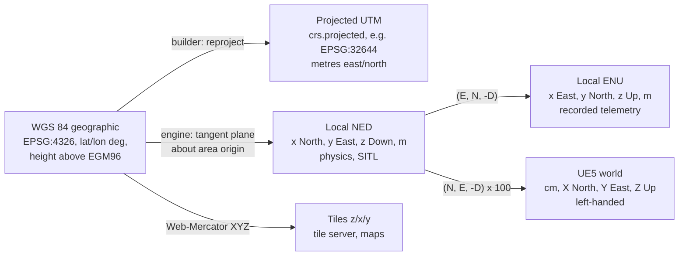
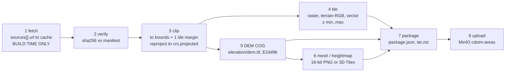

# 03 — Digital Terrain Twins

> **Audience:** engineers building, serving or consuming area packages;
> anyone adding a new area of operations.
>
> **Maturity:** under build. RAVEN is CDPL's only delivered programme. In
> Phase 0 the area manifest format, its validation, the build *planner* and
> the four offline serving services exist and are tested; the package
> *builder* (fetch → package) and UE5 terrain rendering are Phase 2. See
> [Status (Phase 0)](#status-phase-0).

Related: [ADR 0004](ADR/0004-offline-terrain-twins-in-docker.md) ·
[ADR 0017](ADR/0017-own-lightweight-terrain-services.md) ·
[ADR 0007](ADR/0007-minio-object-storage.md) ·
[02 Architecture](02_ARCHITECTURE.md) ·
[05 SITL integration](05_SITL_INTEGRATION.md) ·
[09 Offline deployment](09_DEPLOYMENT_OFFLINE.md)

---

## 1. What a digital terrain twin is

A **digital terrain twin** is a self-contained, versioned package describing
one **area of operations**: terrain elevation, imagery, vector features,
optional 3D mesh, no-fly volumes, named landing pads and targets, and
default weather. Everything a session needs about "where" comes from it.

Terrain twins are the foundation of mission rehearsal (use case 4) and give
every other use case a realistic world. Three properties are non-negotiable:

1. **Offline.** A built package is served by local Docker containers; a
   deployed box never fetches terrain data. Source URLs in a manifest are
   used **only at build time**.
2. **Reproducible.** Building the same manifest version with the same pinned
   sources yields the same package (checksums pinned, tool versions
   recorded).
3. **Data, not code.** Adding an area is writing a manifest and running the
   builder; no core change.

An area has two forms:

| Form | Location | In git? |
|---|---|---|
| **Manifest** `area.yaml` | `terrain/areas/<id>/area.yaml` | yes (small text) |
| **Built package** | tarball `<id>-<version>.tar.zst` in MinIO bucket `cdsim-areas`; unpacked at `terrain/areas/<id>/build/` for serving | **no** (gitignored / object store) |

## 2. `area.yaml` reference

Schema: `schemas/json/area.schema.json`. Examples:
`terrain/areas/hyd_demo_01/area.yaml`, `terrain/areas/flat_test/area.yaml`.
Unknown keys are errors (`additionalProperties: false`).

### 2.1 Top-level fields

| Field | Type | Units | Req. | Meaning |
|---|---|---|---|---|
| `schema_version` | const `1` | — | yes | Manifest format version. |
| `id` | string `^[a-z][a-z0-9_]*$` | — | yes | Area key; must equal the directory name. Used by scenarios (`area_id`), sessions (`SessionManifest.area_id`), services' URLs. |
| `name` | string | — | yes | Display name. |
| `version` | semver | — | yes | Version of the area definition *and* the built package (§5). |
| `description` | string | — | no | Purpose of the area. |
| `classification` | `public` \| `restricted` | — | no (default `public`) | `public` = built only from open data. `restricted` = contains CDPL/customer-supplied data (photogrammetry, surveys, sensitive annotations); handling rules §9. |
| `bounds.min_lat`, `min_lon`, `max_lat`, `max_lon` | number | degrees WGS 84 | yes | Axis-aligned geographic box of the area. All pads, targets and the origin must lie inside. Keep areas smaller than ~20 km across (§3.4). |
| `origin.lat_deg`, `lon_deg` | number | degrees WGS 84 | yes | **Local tangent-plane origin** of the area: UE5 world origin, origin of recorded local positions, and SITL `--home` ([05 §7](05_SITL_INTEGRATION.md#7-home-location)). |
| `origin.alt_msl_m` | number | m above mean sea level (vertical datum) | no | Height of the origin. Set to ground elevation at the origin (refined from the DEM at build). |
| `crs.geographic` | `EPSG:n` | — | yes | Geographic CRS of all lat/lon in the manifest. Always `EPSG:4326` (WGS 84). |
| `crs.projected` | `EPSG:n` | — | yes | Projected CRS used by the builder for metric processing, e.g. `EPSG:32644` (WGS 84 / UTM zone 44N, which covers Hyderabad). Pick the UTM zone containing the area. |
| `crs.vertical_datum` | string | — | no (default `EGM96`) | Datum for all heights (`alt_msl_m`, DEM). `EGM96` geoid heights ≈ MSL. |
| `sources[]` | array | — | yes (≥ 1) | Input datasets (§2.2). |
| `tile_layers[]` | array | — | yes (may be empty) | Map tile pyramids to produce (§2.3). |
| `elevation` | object | — | yes | Height model (§2.4). |
| `mesh` | object | — | no | 3D representation for UE5 (§2.5). Default `kind: none`. |
| `no_fly_volumes[]` | array | — | no | Restricted airspace (§2.6). |
| `landing_pads[]` | array | — | no | Named pads (§2.7). |
| `targets[]` | array | — | no | Named training targets (§2.8). |
| `weather` | object | — | yes | Default weather (§2.9). |

### 2.2 `sources[]`

| Field | Type | Units | Req. | Meaning |
|---|---|---|---|---|
| `id` | id string | — | yes | Referenced by `tile_layers[].source`, `elevation.source`, `mesh.source`. |
| `kind` | `dem` \| `imagery` \| `vector` \| `photogrammetry` \| `flat` | — | yes | `flat` = synthetic plane, no data fetched. |
| `name` | string | — | yes | Dataset name, e.g. "Copernicus DEM GLO-30". |
| `url` | string | — | no | Build-time fetch location. **Never contacted at runtime.** Omit for data delivered by hand (photogrammetry, restricted). |
| `licence` | string | — | yes | Licence / terms; drives attribution in `docs/THIRD_PARTY.md` and the console's attribution footer. |
| `resolution_m` | number > 0 | m | no | Native ground resolution. |
| `sha256` | hex string | — | no (required before a release build, §5) | Checksum of the fetched artefact, pinned for reproducibility. |

### 2.3 `tile_layers[]`

| Field | Type | Units | Req. | Meaning |
|---|---|---|---|---|
| `id` | id string | — | yes | Layer name in tile URLs (`/v1/tiles/<area>/<layer>/…`). |
| `kind` | `raster` \| `terrain_rgb` \| `vector` | — | yes | `raster`: imagery. `terrain_rgb`: elevation encoded in RGB (the common terrain-RGB encoding: `h = −10000 + (R·65536 + G·256 + B) × 0.1` m). `vector`: vector tiles (MVT, protobuf). |
| `source` | source id | — | yes | Input dataset. |
| `min_zoom`, `max_zoom` | int 0–22 | XYZ zoom | yes | Pyramid range (Web-Mercator "slippy map" scheme). `min_zoom ≤ max_zoom`. |
| `format` | `png` \| `webp` \| `jpg` \| `pbf` | — | no (png) | Tile encoding. Use `png` for `terrain_rgb` (lossless), `webp`/`jpg` for imagery, `pbf` for vectors. |

### 2.4 `elevation`

| Field | Type | Units | Meaning |
|---|---|---|---|
| `source` | source id (req.) | — | DEM or `flat` source. |
| `resolution_m` | number | m | Output grid spacing of `elevation/dem.tif`. |
| `flat_elevation_m` | number | m (vertical datum) | Required when the source kind is `flat`. |

### 2.5 `mesh`

| Field | Type | Units | Meaning |
|---|---|---|---|
| `kind` | `none` \| `3d_tiles` \| `heightmap_landscape` | — | `heightmap_landscape`: 16-bit heightmap for a UE5 Landscape (DEM areas). `3d_tiles`: OGC 3D Tiles tileset (photogrammetry, §8). `none`: flat plane or no 3D. |
| `source` | source id | — | Input for the mesh. |
| `geometric_error_m` | number ≥ 0 | m | Root geometric error for 3D Tiles LOD selection. |

### 2.6 `no_fly_volumes[]`

| Field | Type | Units | Meaning |
|---|---|---|---|
| `id`, `name` | strings | — | Volume key and label. |
| `polygon` | ≥ 3 × `[lat_deg, lon_deg]` | degrees WGS 84 | Horizontal outline (implicitly closed). Note order **lat, lon**. |
| `floor_msl_m`, `ceiling_msl_m` | number | m (vertical datum) | Vertical extent; floor < ceiling. |

Used by the world (visualised volumes), the geofence-breach outcome
(`Outcome.geofence_breach`) and optionally the autopilot fence (exported as a
MAVLink fence, Phase 4). These are **training** restrictions; they are not
real airspace data.

### 2.7 `landing_pads[]`

| Field | Type | Units | Meaning |
|---|---|---|---|
| `id`, `name` | strings | — | Pad key (used by scenarios' `spawn.pad_id` and by `LandingTouchdown.pad_id`) and label. |
| `position.lat_deg`, `lon_deg` | number | degrees | Pad centre. |
| `position.alt_msl_m` | number | m | Optional; default = terrain height at the pad. |
| `heading_deg` | 0–360 | degrees true | Pad orientation (marker "up" direction). |
| `size_m` | number > 0 | m | Side length of the square pad. |
| `marker` | `h` \| `apriltag` \| `aruco` \| `none` | — | Visual marker (precision landing uses AprilTags). |
| `marker_id` | int ≥ 0 | — | Tag id for `apriltag` / `aruco`. |

### 2.8 `targets[]`

`id`, `name`, `position` (geopoint), `kind` (free string, e.g. `vehicle`).
Spawned as target actors; `Stimulus` kind `target_appearance` refers to them
by id.

### 2.9 `weather`

| Field | Type | Units | Meaning |
|---|---|---|---|
| `wind_speed_mps` | ≥ 0 (req.) | m/s | Mean wind speed. |
| `wind_from_deg` | 0–360 (req.) | degrees true | Direction the wind blows **from** (meteorological convention). |
| `gust_mps` | ≥ 0 | m/s | Gust amplitude above mean. |
| `turbulence` | `none` \| `light` \| `moderate` \| `severe` | — | Turbulence class. |
| `temperature_c` | number | °C | Air temperature (air density). |
| `visibility_m` | ≥ 0 | m | Fog / haze distance. |
| `cloud_cover_frac` | 0–1 | fraction | Cloud cover. |
| `time_of_day_local` | `HH:MM` | local time | Sun position. |

Scenarios can override weather (`weather_override`). The weather store
serves the default (§6).

### 2.10 Semantic checks

`make schemas` and `cdsim-area validate` run the JSON Schema and then
`area_semantic_errors` (`services/common/src/cdsim_common/manifests.py`):

1. `id` equals the directory name.
2. `bounds` min < max for latitude and longitude.
3. `origin` lies inside `bounds`.
4. Every `tile_layers[].source` is a declared source; `min_zoom ≤ max_zoom`.
5. `elevation.source` is declared; a `flat` source requires `flat_elevation_m`.
6. Every landing pad lies inside `bounds`; pad ids are unique.
7. Every no-fly volume has floor below ceiling.

Scenario validation additionally checks that `spawn.pad_id` exists in the
scenario's area.

## 3. Coordinate frames



| Frame | Used by | Definition |
|---|---|---|
| **WGS 84 (EPSG:4326)** | manifests, GPS sensor, `VehicleState.position`, GCS | lat/lon degrees; heights in the manifest's vertical datum (EGM96 ≈ MSL) |
| **UTM (`crs.projected`)** | builder (clip, resample, heightmap grid) | metres; zone chosen to contain the area |
| **Local NED** | UE5 physics, SITL JSON | origin = `area.origin`; x North, y East, z Down, metres |
| **Local ENU** | recorded telemetry (`VehicleState.position_local_m`, `velocity_enu_mps`), RL actions | same origin; x East, y North, z Up |
| **UE5 world** | rendering, actors | origin = `area.origin`; UE +X = North, +Y = East, +Z = Up; centimetres; left-handed |
| **Web-Mercator XYZ tiles** | tile server, console maps, GCS maps | standard slippy-map tiling (`terrain/builder/src/cdsim_terrain_builder/tiles.py`) |

### 3.1 Conversions

- NED → UE cm: `(N, E, −D) × 100`. UE cm → NED: `(X, Y, −Z) / 100`
  (`sim/Source/CDSim/Core/CDSimFrames.h`).
- NED → ENU: `(E, N, −D)`.
- Heights: `Down = origin.alt_msl_m − alt_msl`, so a point at the origin's
  altitude has D = 0 and UE Z = 0.

### 3.2 Geodetic → local (Phase 0/1: equirectangular)

`sim/Source/CDSim/World/CDSimGeo.h` uses a flat-earth (equirectangular)
approximation about the origin:

```
North = R · (lat − lat0)
East  = R · (lon − lon0) · cos(lat0)        R = 6 378 137 m, angles in radians
Down  = alt0 − alt
```

### 3.3 Limits of the approximation

It ignores ellipsoid flattening, meridian convergence and Earth curvature.
Horizontal error grows roughly with the square of distance from the origin:
well under 1 m within ~2 km (all of `hyd_demo_01` and `flat_test`), of order
metres at 10–20 km, worse at high latitudes. The curvature drop
(`d²/2R`, ~31 m at 20 km) is ignored because terrain height comes from the
elevation data, not from this formula.

### 3.4 Rules that follow

- **Areas must be smaller than ~20 km across**, origin near the centre.
  Larger regions are split into several areas.
- Phase 2 replaces the approximation with a proper projection (UTM from
  `crs.projected`, or an exact ENU transform) inside the engine once the
  terrain pipeline supplies it; recorded data keeps the same frames, so
  recordings stay comparable.
- The builder always works in the projected CRS, so its outputs (DEM,
  heightmap) are metrically correct regardless.

## 4. Build pipeline (Phase 2)

`cdsim-area` (package `terrain/builder`, entry `cdsim_terrain_builder.cli`):

```bash
cdsim-area validate terrain/areas/hyd_demo_01/area.yaml   # works now
cdsim-area plan     terrain/areas/hyd_demo_01/area.yaml   # works now: steps, tile counts, outputs
cdsim-area package  terrain/areas/hyd_demo_01/area.yaml   # Phase 2 — exits 3 "not implemented" today
```

Exit codes: 0 ok, 1 invalid manifest, 3 not implemented.



| # | Stage | Input → output | Planned open-source tooling |
|---|---|---|---|
| 1 | **fetch** | `sources[].url` → local cache (`~/.cache/cdsim/areas/…`) | Python HTTP client; resumable downloads. Needs internet — **build machine only**. |
| 2 | **verify** | cached files → pass/fail | `hashlib` sha256 against `sources[].sha256`; first fetch prints the hash to pin (§5). |
| 3 | **clip** | sources → clipped, reprojected rasters/vectors | GDAL (`gdalwarp` to `crs.projected`, cutline to bounds + one-tile margin), OGR (`ogr2ogr -clipsrc`) for OSM extracts (`osmium` for PBF extracts). |
| 4 | **tile** | clipped data → `tiles/<layer>/{z}/{x}/{y}.<fmt>` | GDAL (`gdal2tiles`-style XYZ pyramid or `gdalwarp` per tile to EPSG:3857); a small Python encoder for terrain-RGB; `tippecanoe` for vector tiles. |
| 5 | **DEM COG** | DEM → `elevation/dem.tif` | `gdalwarp -r bilinear -tr <resolution_m>` then `gdal_translate -of COG`; vertical datum conversion to EGM96 if the source differs. |
| 6 | **mesh / heightmap** | DEM → `mesh/heightmap.png`; photogrammetry → `mesh/tileset.json` + tiles | GDAL (`gdal_translate -ot UInt16 -scale`) to a UE-Landscape-compatible size (e.g. 1009 / 2017 / 4033 px square); for 3D Tiles, open-source photogrammetry/tiling tools (§8). |
| 7 | **package** | all outputs + `area.yaml` + `package.json` + `weather/default.json` → `<id>-<version>.tar.zst` | `tar` + `zstd`. |
| 8 | **upload** | tarball → MinIO `cdsim-areas/<id>/<id>-<version>.tar.zst` | MinIO Python client (as used by `cdsim_common.bootstrap`). |

`plan` is implemented today (`terrain/builder/src/cdsim_terrain_builder/plan.py`)
and is pure: it computes tile counts per layer from the bounds and zoom range
(e.g. ground resolution at max zoom) without touching the network — use it to
size an area before building.

Builder dependencies (GDAL etc.) will be packaged in a dedicated builder
container image so every engineer builds with the same versions; the image
version is recorded in `package.json`.

## 5. Package layout, versioning and reproducibility

### 5.1 Layout

```
<id>/                                 unpacked at terrain/areas/<id>/build/ for serving
├── area.yaml                         manifest, copied verbatim
├── package.json                      build metadata (marker that the package is built)
├── tiles/<layer>/{z}/{x}/{y}.<fmt>   one directory per tile_layers[].id
├── elevation/dem.tif                 Cloud-Optimised GeoTIFF, heights in vertical_datum
├── mesh/heightmap.png                if mesh.kind == heightmap_landscape (16-bit)
├── mesh/tileset.json (+ tiles)       if mesh.kind == 3d_tiles
└── weather/default.json              default weather from the manifest
```

Tarball name: `<id>-<version>.tar.zst`. Flat areas produce only
`area.yaml`, `package.json` and `weather/default.json`.

### 5.2 `package.json` (planned content)

```json
{
  "area_id": "hyd_demo_01",
  "area_version": "0.1.0",
  "format_version": 1,
  "built_at_utc": "2026-10-01T10:00:00Z",
  "builder": {"cdsim_terrain_builder": "0.2.0", "image": "cdsim/area-builder@sha256:…",
              "gdal": "3.x.y"},
  "manifest_sha256": "…",
  "sources": [{"id": "dem_cop30", "sha256": "…", "licence": "…"}],
  "outputs": {"elevation/dem.tif": {"sha256": "…"}, "tiles/imagery": {"count": 1234}},
  "bounds": {"min_lat": 17.37, "min_lon": 78.29, "max_lat": 17.39, "max_lon": 78.311},
  "origin": {"lat_deg": 17.38, "lon_deg": 78.3005, "alt_msl_m": 560.4}
}
```

The terrain services treat the presence of `build/package.json` as "built".

### 5.3 Versioning rules

- `version` in `area.yaml` is the package version. Bump **PATCH** for
  metadata-only changes (names, weather defaults), **MINOR** for new
  pads/targets/no-fly volumes or new layers, **MAJOR** when the origin,
  bounds or source data change (recorded positions would no longer line up).
- Every session records `area_id` and `area_version`; replays use the same
  package version (keep old tarballs in MinIO).
- A release build requires every non-`flat` source to have `sha256` pinned.
  Open-data providers republish; pinning detects silent changes.
- Same manifest + same pinned sources + same builder image ⇒ byte-identical
  outputs is the goal; any nondeterministic tool step must be made
  deterministic or its outputs checksummed and recorded.

## 6. Serving (the four terrain services)

One image (`cdsim/terrain`, package `terrain/services`), four FastAPI apps
(`cdsim_terrain.apps`), `terrain` compose profile. Each mounts
`terrain/areas/` **read-only**, discovers valid manifests at start-up, and
never fetches anything. Decision: [ADR 0017](ADR/0017-own-lightweight-terrain-services.md).

| Service | Port | Endpoints | Behaviour |
|---|---|---|---|
| **tile-server** | 8101 | `GET /v1/tiles/{area}/{layer}/{z}/{x}/{y}.{ext}` (`ext` ∈ png, webp, jpg, pbf) | Serves files from `build/tiles/`. 404 if area unknown, **declared but not built**, or tile absent; 400 for bad ids/negative indices. |
| **mesh-server** | 8102 | `GET /v1/mesh/{area}/{path}` | Serves any file under `build/mesh/` (tileset JSON, tiles, heightmap). Path traversal outside `mesh/` is refused. |
| **elevation-api** | 8103 | `GET /v1/elevation?lat=&lon=` | Finds the area containing the point. Flat areas: returns `flat_elevation_m`. DEM areas: **501 until Phase 2** (then bilinear sample of `dem.tif`). 404 if no area covers the point. |
| **weather-store** | 8104 | `GET /v1/weather/{area}` | Returns the manifest's default weather with `source: area_default`. Scenario/session weather storage arrives with the scenario runner (Phase 4). |

All four also serve:

- `GET /v1/areas` → `[{id, version, built}]` — the **built flag** is true
  when `terrain/areas/<id>/build/package.json` exists.
- `GET /health`, `GET /ready` (checks: areas directory mounted, all
  manifests valid).
- `GET /openapi.json` (interactive docs disabled — they would load a CDN).

Getting a built package onto a box (Phase 2/8): download
`<id>-<version>.tar.zst` from MinIO (or from the air-gap bundle) and unpack
it to `terrain/areas/<id>/build/`; restart the terrain services (they scan at
start-up). A `make area-install id=<id> version=<v>` helper is planned.

## 7. UE5 consumption (Phase 2)

Today (`sim/Source/CDSim/World/CDSimAreaLoader.*`, uncompiled):
`-Area=<id>` loads `sim/Config/Areas/<id>.json` (the manifest exported to
JSON by `scripts/ue5/export_platform_json.py`, since UE has no YAML parser), fixes the UE
origin at `origin`, spawns a flat ground plane for `flat` areas and one
`ACDSimLandingPadActor` per pad.

Phase 2 design:

1. The client asks the api which package version the session uses, then
   reads it from the terrain services on the LAN (or a local unpacked copy
   for single-PC setups).
2. **Heightmap areas:** `mesh/heightmap.png` is imported as a UE Landscape
   (scale from the heightmap's metres-per-pixel and height range in
   `package.json`), positioned so the area origin is UE (0,0,0) and its
   height `origin.alt_msl_m` is Z = 0. Imagery tiles are draped as the
   landscape material (runtime virtual texture fed from the tile server).
3. **3D Tiles areas:** streamed from the mesh server by an open-source UE
   3D Tiles runtime plugin configured to use only the local URL (any such
   plugin must be verified to make no external requests).
4. **Physics ground height:** `UCDSimAreaLoader::GetGroundDownM` samples the
   DEM (via the elevation API or the local COG) so the rigid body's ground
   contact matches what is rendered.
5. **Pads, targets, no-fly volumes** are spawned at their geodetic positions
   converted to NED/UE and placed on the terrain surface.
6. **Weather** from the weather store sets wind (physics), fog, sun
   position, clouds.

Phase 2 acceptance ([10](10_ROADMAP.md)): `hyd_demo_01` renders in UE5 with
correct elevation (spot-checked against the DEM at the pads), and its
landing pads appear in-world at the manifest positions.

## 8. CDPL photogrammetry ingest (3D Tiles)

For high-fidelity mission rehearsal, CDPL can fly an area and produce
photogrammetry. Ingest path:

1. Process imagery into a textured mesh and orthomosaic with open-source
   photogrammetry tools (or CDPL's existing processing chain), georeferenced
   in WGS 84 / the area's UTM zone.
2. Convert the mesh to **OGC 3D Tiles** (tileset.json + b3dm/glTF tiles)
   with an open-source tiler; set `geometric_error_m`.
3. Declare it in `area.yaml`: a source with `kind: photogrammetry`, no
   `url` (delivered by hand), `licence: CDPL proprietary`, `sha256` of the
   delivered archive; `mesh: {kind: 3d_tiles, source: <that id>}`. Add the
   orthomosaic as an `imagery` source for map tiles.
4. Set `classification: restricted` (§9).
5. `cdsim-area package` copies the tileset under `mesh/`, checksums it, and
   packages as usual.

Mixed areas are normal: DEM heightmap for the wide area, 3D Tiles for the
flown patch.

## 9. Classification and handling

| | `public` | `restricted` |
|---|---|---|
| Data | Open data only (Copernicus DEM, SRTM, Sentinel-2, OpenStreetMap…) | Any CDPL-flown, customer-supplied or sensitive data; any annotation revealing sensitive sites |
| Manifest in git | yes | The manifest may be in git only if it reveals nothing sensitive; otherwise keep it in a restricted repository or on the build machine |
| Package storage | `cdsim-areas` bucket | Separate restricted storage / bucket with access control; never in a public bundle |
| Air-gap bundle | may be included in any bundle | only in bundles for the specific authorised box, listed in the bundle manifest |
| Demo / onboarding use | yes | no |

Rules:

- Demo and onboarding areas must be `public` and chosen away from airports
  and defence establishments (as `hyd_demo_01` is).
- A no-fly volume in a demo area is a **simulation exercise**, not real
  airspace data. Manifests say so in comments; real flights require checking
  the national UAS airspace map and local rules.
- Attribution for open data (`licence` field) must be shown in the console
  and listed in `docs/THIRD_PARTY.md`.

## 10. How to add an area

1. **Scaffold:**
   ```bash
   make new-area id=my_area                                  # centre defaults to the flat_test origin
   .venv/bin/python scripts/new_area.py my_area --lat 17.45 --lon 78.36 --half-size-deg 0.01
   ```
   Creates `terrain/areas/my_area/area.yaml` with a box around the centre,
   Copernicus DEM + Sentinel-2 sources, imagery and terrain layers, a
   heightmap mesh and one pad, then validates it. Refuses to overwrite.
2. **Edit** every value: name, description, `classification`, `bounds`
   (keep < 20 km), `origin` near the centre (altitude from a DEM lookup),
   `crs.projected` (UTM zone of the area), `sources` (add OSM, fallback DEM,
   photogrammetry), `tile_layers` zooms, `landing_pads`, `targets`,
   `no_fly_volumes`, `weather`.
3. **Validate and plan:**
   ```bash
   make schemas
   .venv/bin/cdsim-area validate terrain/areas/my_area/area.yaml
   .venv/bin/cdsim-area plan     terrain/areas/my_area/area.yaml   # check tile counts
   ```
   If tile counts are large, reduce `max_zoom` or the bounds.
4. **Build (Phase 2):** on a machine with internet,
   `cdsim-area package …`; pin the printed `sha256` values into `sources`;
   rebuild; confirm the package checksum is stable.
5. **Install and serve:** unpack to `terrain/areas/my_area/build/`,
   `docker compose --profile terrain up -d`; check `GET :8101/v1/areas`
   shows `built: true`.
6. **Use it:** reference `area_id: my_area` in a scenario; SITL
   `HOME_LOC` = the origin ([05 §7](05_SITL_INTEGRATION.md#7-home-location)).
7. **Docs/PR:** CHANGELOG entry, attribution added, classification stated.

## 11. The included areas

| | `flat_test` | `hyd_demo_01` |
|---|---|---|
| Purpose | Phase 1 core loop, CI, deterministic replay | Onboarding, UI development, Phase 2 acceptance |
| Extent | ~1 km square (bounds ±0.0045° lat, ±0.0047° lon) | ~2.2 km × 2.2 km, reservoir-edge farmland on the western outskirts of Hyderabad |
| Origin | 17.4000 N, 78.5000 E, 500 m | 17.3800 N, 78.3005 E, 560 m (refined from DEM at build) |
| Elevation | flat, 500 m (`kind: flat`) | Copernicus DEM GLO-30 (SRTM 1″ fallback), 30 m |
| Imagery / vectors | none | Sentinel-2 L2A 10 m (z10–16 webp), terrain-RGB (z8–14), OSM vectors (z10–16) |
| Mesh | none | UE5 heightmap landscape |
| Pads | `pad_home` (origin), `pad_target` (50 m north); AprilTag 0 and 1, 2 m | `pad_alpha` (home, tag 0), `pad_bravo` (tag 1, heading 90°), `pad_charlie` (1 m, H marker) |
| Other | calm weather, noon | no-fly volume `reservoir_bund` (demo only), target `tgt_vehicle_1`, wind 3 m/s from 250°, gusts 5 m/s |
| State | manifest valid; served by elevation/weather now | manifest valid, **not built**; source URLs and sha256 to be added in Phase 2 |

## Status (Phase 0)

**Implemented and tested (run in Phase 0):** area JSON Schema and semantic
validation; `make new-area`; `cdsim-area validate` and `plan` (tile maths
unit-tested); the four terrain services with `/v1/areas` built flags, tile
and mesh file serving from built packages, flat-area elevation, default
weather, `/health` and `/ready` — all containers healthy under `make dev`.

**Not implemented:** `cdsim-area package` (fetch → upload) and the builder
image (Phase 2); DEM elevation sampling (501, Phase 2); UE5 terrain
rendering, landscape import, 3D Tiles streaming (Phase 2); scenario weather
storage (Phase 4); photogrammetry ingest (when data is supplied). No area
package has been built yet. UE5 area loading code is an uncompiled skeleton.
