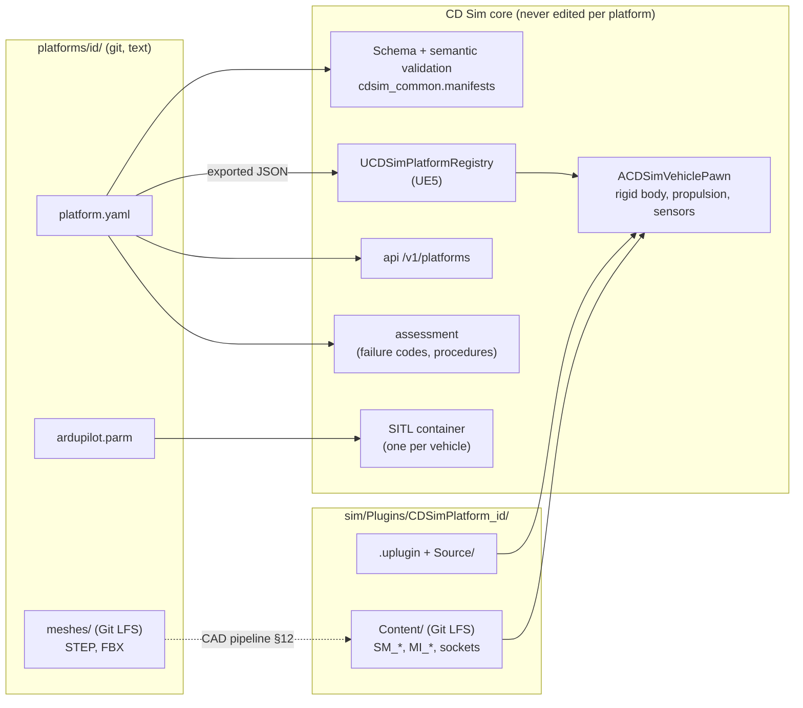
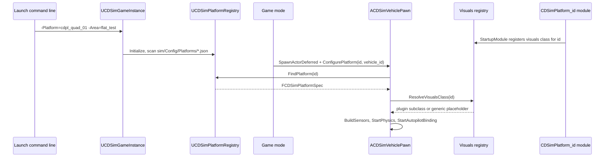
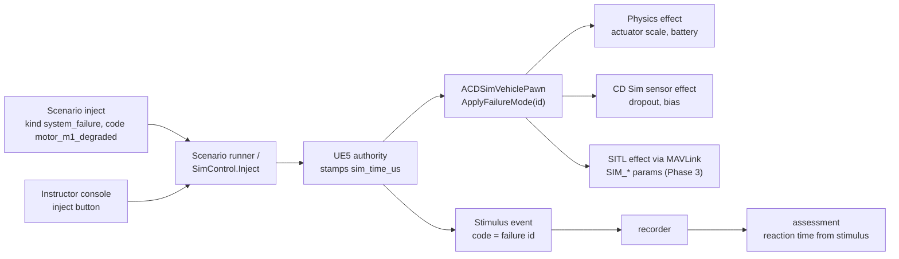
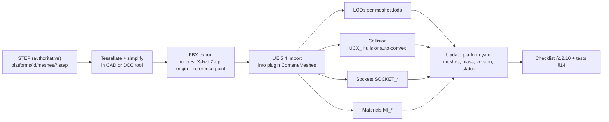

# 04 — Platform Plugin Specification

> **Audience:** any engineer adding a vehicle to CD Sim or replacing a
> placeholder airframe with real CAD. **This is the most important document in
> the repository**: if you follow it, a new platform needs no changes to the
> core. If you find you *do* need a core change, that is a core bug — fix the
> core generically, never special-case a platform id.
>
> **Maturity:** CD Sim is under build. RAVEN is CDPL's only delivered
> programme; nothing described here is fielded or validated. The only platform
> today is `cdpl_quad_01`, whose geometry and mass are **placeholders**. See
> [Status (Phase 0)](#status-phase-0).

Related: [02 Architecture](02_ARCHITECTURE.md) ·
[05 SITL integration](05_SITL_INTEGRATION.md) ·
[06 Assessment engine](06_ASSESSMENT_ENGINE.md) ·
[07 Training modes](07_TRAINING_MODES.md) (maintainer module) ·
[BUILDING_UE5](BUILDING_UE5.md) ·
[ADR 0002](ADR/0002-unreal-engine-5-4-and-git-lfs.md) ·
[ADR 0003](ADR/0003-ardupilot-sitl-json-physics.md) ·
[ADR 0016](ADR/0016-schema-contracts-protobuf-and-json-schema.md)

---

## Contents

1. [Concept](#1-concept)
2. [The load-by-id contract](#2-the-load-by-id-contract)
3. [Frames and units](#3-frames-and-units)
4. [`platform.yaml` field reference](#4-platformyaml-field-reference)
5. [How each section is consumed](#5-how-each-section-is-consumed)
6. [Validation](#6-validation)
7. [Walkthrough: add a new platform](#7-walkthrough-add-a-new-platform)
8. [Per-class guidance](#8-per-class-guidance)
9. [ArduPilot parameter file](#9-ardupilot-parameter-file)
10. [Failure modes design](#10-failure-modes-design)
11. [Maintenance procedures design](#11-maintenance-procedures-design)
12. [Swapping in real CAD (CAD → FBX → UE5)](#12-swapping-in-real-cad)
13. [Versioning and status](#13-versioning-and-status)
14. [Testing a platform](#14-testing-a-platform)
15. [What must never require core changes](#15-what-must-never-require-core-changes)
16. [Status (Phase 0)](#status-phase-0)

---

## 1. Concept

A **platform** is one vehicle type: a drone, rover, helicopter, fixed-wing,
VTOL or a weapon system (e.g. a mortar). It is made of exactly two things:

| Part | Location | What it holds | Who edits it |
|---|---|---|---|
| **Data** | `platforms/<id>/platform.yaml` (+ `ardupilot.parm`, `meshes/`) | identity, class, mass properties, propulsion map, aero, sensors, autopilot binding, failure modes, maintenance procedures, mesh references | platform engineer (no C++ needed) |
| **UE5 plugin** | `sim/Plugins/CDSimPlatform_<id>/` | meshes, materials, sockets, optionally a visuals-component subclass | technical artist / UE engineer |

Everything *behavioural* is data. The plugin contributes only *look*
(geometry, materials, part sockets) and, when strictly necessary, a small
platform-specific visual component. Physics, sensors, the autopilot binding,
failure injection, recording and assessment are all generic core code that
reads the YAML.



The **id** (`identity.id`) is the single key that ties it together: it is the
directory name, the plugin suffix, the value scenarios put in
`vehicles[].platform_id`, and the value recorded in every
`VehicleState.platform_id`.

## 2. The load-by-id contract

The core loads *any* platform given only its id. The contract, which both
sides must honour:

1. `platforms/<id>/platform.yaml` exists, passes schema + semantic
   validation, and `identity.id == <id>`.
2. `ue_plugin == "CDSimPlatform_<id>"` and a plugin of that name exists under
   `sim/Plugins/` and is enabled in `sim/CDSim.uproject`.
3. Every UE object path in `meshes.*.ue_asset` resolves inside that plugin's
   content (or, for placeholders, may be absent — see below).
4. Every `maintenance.parts[].anchor.socket` names a socket (or, in
   placeholder mode, a named anchor component) that exists on the platform's
   visual representation.
5. Every actuator `output_channel` matches the autopilot's servo output
   numbering in `ardupilot.parm` (`SERVOn_FUNCTION`, or the frame's default
   motor order).

Load sequence in UE5 (from the skeleton under `sim/Source/CDSim/`):



UE has no YAML parser, so `scripts/ue5/export_platform_json.py` exports
each `platform.yaml` to `sim/Config/Platforms/<id>.json` (and each
`area.yaml` to `sim/Config/Areas/<id>.json`) — a 1:1 copy of the YAML tree —
before the editor or a packaged build runs. `scripts/ue5/build.sh` /
`build.ps1` run it automatically; `--check` exits non-zero when the JSON is
stale ([BUILDING_UE5 §4](BUILDING_UE5.md)). The output is gitignored. The
YAML remains the only source of truth; never hand-edit the JSON.

If a platform has **no** registered visuals subclass, the core still spawns it
with a generic placeholder (a box body plus one disc per actuator) built by
`UCDSimPlatformVisualsComponent`. So a brand-new platform can fly in SITL
before any art exists.

On the Python side, services discover platforms at start-up via
`cdsim_common.manifests.discover()`; an invalid manifest makes the API's
`/ready` report `manifests` as failed (HTTP 503), so a bad platform is
visible immediately rather than at session time.

## 3. Frames and units

**All platform data is SI, in the aerospace body frame FRD.** This matches
ArduPilot and avoids conversion errors at the autopilot boundary.

| Quantity | Frame / unit | Notes |
|---|---|---|
| Positions (`position_m`, `cg_m`, `mount.position_m`, `anchor.offset_m`) | **FRD body**: x forward, y right, z **down**; metres | Origin = the platform **reference point** (for `cdpl_quad_01`: geometric centre of the frame plate). The CAD export origin must be this same point (§12). |
| Rotations (`mount.rotation_deg`) | roll, pitch, yaw in degrees, relative to body FRD | Downward camera = pitch −90°. |
| Mass | kg | |
| Inertia | kg·m², about the CG, body FRD axes | Products of inertia default 0. |
| Force / thrust | N | |
| Torque | N·m | |
| Time | s | |
| Drag coefficients (linear model) | N/(m/s) per body axis | |
| PWM | µs | |
| World (physics) | local **NED** about the area origin, metres | Area origin from `area.yaml` (see [03](03_DIGITAL_TERRAIN_TWINS.md)). |
| Recorded telemetry | local **ENU** about the area origin | `VehicleState.position_local_m`, `velocity_enu_mps` — converted by the recorder component. |
| UE5 world / mesh | centimetres, left-handed, X forward, Y right, Z up | UE +X = North, +Y = East at the area origin. |

Conversions (implemented in `sim/Source/CDSim/Core/CDSimFrames.h`):

| From | To | Formula |
|---|---|---|
| FRD body metres | UE body-relative cm | `(F, R, −D) × 100` |
| NED world metres | UE world cm | `(N, E, −D) × 100` |
| NED world | ENU world | `(E, N, −D)` |
| Quaternion FRD→NED `(w,x,y,z)` | UE rotation | `(w, −x, −y, z)` |
| `mount.rotation_deg [r,p,y]` | UE `FRotator(Pitch, Yaw, Roll)` | `FRotator(p, y, r)` |

**Worked example.** `cdpl_quad_01` motor `m1` has
`position_m: [0.159, 0.159, 0.0]` — 159 mm forward, 159 mm right, in the
rotor plane. In UE that is `(15.9, 15.9, 0)` cm relative to the actor. The
GPS mast at `[0, 0, −0.08]` (80 mm **above** the reference point, because z
is down) is at `(0, 0, +8)` cm in UE.

## 4. `platform.yaml` field reference

Schema: `schemas/json/platform.schema.json` (JSON Schema 2020-12,
`additionalProperties: false` everywhere — unknown keys are errors).
Reference instance: `platforms/cdpl_quad_01/platform.yaml`. Template:
`platforms/_template/platform.yaml`.

"Req." = required by the schema. "Consumed by" uses these abbreviations:
**PHY** UE5 physics, **SEN** UE5 sensors, **SITL** autopilot container,
**VIS** UE5 visuals, **FAIL** failure injection, **MNT** maintainer module,
**ASM** assessment engine, **API** catalogue / console, **VAL** validation
only.

### 4.1 Top level

| Field | Type | Req. | Meaning | Consumed by |
|---|---|---|---|---|
| `schema_version` | const `1` | yes | Manifest format version. Bumped only with a migration note. | VAL |
| `identity` | object | yes | §4.2 | all |
| `class` | enum `multirotor` \| `fixed_wing` \| `vtol` \| `rover` \| `helicopter` \| `weapon` | yes | Selects the dynamics model. Only `multirotor` has a model today (§8). | PHY, API |
| `mass_properties` | object | yes | §4.3 | PHY |
| `propulsion` | object | yes | §4.4 | PHY, SITL, FAIL |
| `aero` | object | no | §4.5 | PHY |
| `sensors` | array | yes | §4.6 | SEN, FAIL |
| `autopilot` | object | yes | §4.7 | SITL |
| `failure_modes` | array | yes (may be empty) | §4.8 | FAIL, ASM, API |
| `maintenance` | object | yes | §4.9 | MNT, ASM |
| `meshes` | object | yes | §4.10 | VIS |
| `ue_plugin` | string, pattern `^CDSimPlatform_[a-z0-9_]+$` | yes | Name of the UE5 plugin; must equal `CDSimPlatform_<identity.id>`. | VIS, VAL |

### 4.2 `identity`

| Field | Type | Req. | Meaning |
|---|---|---|---|
| `id` | string `^[a-z][a-z0-9_]*$` | yes | Stable platform key. Must equal the directory name. Never reuse an id for a different vehicle; never rename one that has recordings (recordings reference it). |
| `name` | string | yes | Human-readable name shown in the console. |
| `version` | semver `MAJOR.MINOR.PATCH` | yes | Version of *this platform definition* (§13). Recorded with sessions so a replay knows which definition flew. |
| `status` | enum `placeholder` \| `engineering` \| `validated` | yes | `placeholder`: geometry/mass not from real CAD. `engineering`: from CAD and bench data, not yet matched to flight logs. `validated`: dynamics matched to real flight data under a documented test. **No platform is `validated` today.** |
| `description` | string | no | Free text. |

### 4.3 `mass_properties`

| Field | Type / unit | Req. | Meaning |
|---|---|---|---|
| `mass_kg` | number > 0, kg | yes | All-up mass in the configuration being simulated (with battery and payload). |
| `cg_m` | `[x, y, z]`, m, FRD | yes | CG relative to the reference point. Actuator lever arms are computed as `position_m − cg_m`. |
| `inertia_kgm2.ixx`, `iyy`, `izz` | number > 0, kg·m² | yes | Principal moments about the CG in body axes. |
| `inertia_kgm2.ixy`, `ixz`, `iyz` | number, kg·m² | no (default 0) | Products of inertia. **Not used by the Phase 0/1 integrator** (diagonal inertia only); record them anyway when CAD provides them. |

Sources, best first: CAD mass properties with the as-built component masses →
bifilar/trifilar pendulum measurement → point-mass estimate (what
`cdpl_quad_01` uses; the calculation is in a comment in its YAML).

### 4.4 `propulsion`

`propulsion.actuators[]` — one entry per motor, servo, engine or driven wheel:

| Field | Type / unit | Req. | Meaning |
|---|---|---|---|
| `id` | id string | yes | Unique within the platform (e.g. `m1`, `aileron_l`). Referenced by failure modes. |
| `type` | enum `motor` \| `servo` \| `engine` \| `wheel` | yes | Actuator kind. Multirotor model uses `motor`. |
| `output_channel` | int 1–32 | yes | **1-based** autopilot servo output (`SERVOn`). Unique within the platform. The JSON physics servo packet index is `output_channel − 1`. |
| `position_m` | `[x,y,z]`, m, FRD | yes | Point where thrust/force is applied (rotor hub). |
| `axis` | `[x,y,z]`, unit vector, FRD | no (default `[0,0,−1]`, i.e. up) | Thrust direction. Needed for tilted rotors, pushers, tilt-rotor VTOL. **Not yet read by the multirotor model** (always body −Z); honour it when adding a class that needs it. |
| `direction` | enum `cw` \| `ccw` \| `none` | no | Spin direction seen **from above**. Sets the sign of the reaction (yaw) torque: a CCW rotor pushes the body yaw-right (+Z FRD torque), matching ArduPilot's quad-X convention. |
| `max_thrust_n` | N ≥ 0 | no | Static thrust at full command. |
| `max_torque_nm` | N·m ≥ 0 | no | Reaction torque at full command. |
| `time_constant_s` | s ≥ 0 | no | First-order motor/ESC lag (command → output). 0 = instantaneous. |
| `pwm_min_us`, `pwm_max_us` | int µs | no (1000 / 2000) | PWM range mapped to command 0..1. **Today the ArduPilot binding uses fixed 1000/2000** (`UArduPilotJsonBinding::PwmMin/PwmMax`); per-actuator ranges are a Phase 1 task. Keep them consistent with `MOT_PWM_MIN/MAX` in the param file. |
| `thrust_curve` | `[[command, thrust_fraction], …]`, both 0..1 | no | Piecewise-linear map from normalised command to fraction of `max_thrust_n`, ascending in command. Absent = linear. Measure on a thrust stand; the placeholder curve is roughly quadratic. |

`propulsion.battery` (optional):

| Field | Type / unit | Meaning |
|---|---|---|
| `cells_series` | int ≥ 1 | Cells in series (4 = 4S). |
| `capacity_mah` | mAh | Rated capacity. |
| `nominal_voltage_v` | V | Nominal pack voltage. |
| `internal_resistance_ohm` | Ω | Pack internal resistance, for voltage sag under load. |

The battery block is **not consumed by the UE5 skeleton yet**. Planned use
(Phase 3): a simple equivalent-circuit model producing
`VehicleState.battery_voltage_v` / `battery_remaining_frac` and driving the
`battery_sag` failure effect; until then ArduPilot SITL's own battery
simulation (from `BATT_*` params) is what the autopilot sees.

### 4.5 `aero`

| Field | Type / unit | Meaning |
|---|---|---|
| `model` | enum `linear_drag` \| `coefficient_table` | `linear_drag`: force = −k ⊙ v_air (body axes). `coefficient_table`: lift/drag/moment tables (fixed-wing / VTOL; not implemented). |
| `drag_coefficients` | `[kx, ky, kz]`, N/(m/s), FRD | Linear drag per body axis (used by `linear_drag`). |
| `reference_area_m2` | m² | Reference area for coefficient-based models; informational for `linear_drag`. |
| `coefficient_table` | string, path relative to platform dir | CSV of aero coefficients for `coefficient_table` (format to be fixed with the first fixed-wing platform — see §8). |

If `aero` is omitted the body has no aerodynamic drag, which is only
acceptable for ground vehicles and quick tests.

### 4.6 `sensors[]`

| Field | Type / unit | Req. | Meaning |
|---|---|---|---|
| `id` | id string | yes | Unique within the platform, e.g. `imu0`, `cam_down`. Referenced by failure modes. |
| `type` | enum `imu` \| `gps` \| `baro` \| `mag` \| `camera` \| `rangefinder` \| `optical_flow` \| `airspeed` | yes | Sensor model to instantiate. |
| `rate_hz` | Hz > 0 | yes | Sample rate. Sampled on the 400 Hz physics step, so effective rates are 400/n Hz; choose divisors of 400 (400, 200, 100, 50, 40, 20, 10, 8, 5…) to avoid jitter. |
| `mount.position_m` | `[x,y,z]`, m, FRD | no | Sensor location (lever-arm effects, camera viewpoint, GPS antenna offset). |
| `mount.rotation_deg` | `[roll, pitch, yaw]`, deg | no | Orientation relative to body. |
| `noise` | map name → number | no | Type-specific noise parameters (below). Units are in the key name. |
| `params` | map | no | Type-specific parameters (below). |

Recognised `noise` / `params` keys (unknown keys are allowed by the schema and
ignored by the engine — prefer the names below so they are picked up):

| `type` | `noise` keys | `params` keys | In-engine component (Phase 0 skeleton) |
|---|---|---|---|
| `imu` | `gyro_noise_radps`, `accel_noise_mps2` (1σ white) | — | `UCDSimImuComponent` |
| `gps` | `horizontal_m`, `vertical_m` (1σ) | — | `UCDSimGpsComponent` |
| `camera` | — | `width_px`, `height_px`, `hfov_deg` | `UCDSimDownCameraComponent` |
| `baro` | `pressure_noise_pa` | — | not yet (Phase 1) |
| `mag` | `field_noise_gauss` | — | not yet (Phase 1) |
| `rangefinder` | — | `max_range_m` | not yet (Phase 1) |
| `optical_flow`, `airspeed` | — | — | not yet |

Important: **what the autopilot sees is not these components.** Under the
ArduPilot JSON interface CD Sim sends *truth* (IMU specific force, gyro,
position, attitude, velocity) and ArduPilot synthesises its own sensor
readings and noise from its `SIM_*` parameters. The CD Sim sensor components
exist for recording, the camera view, RL observations and the instructor's
picture. Keep the YAML noise figures and the SITL `SIM_*` noise parameters
consistent by hand (§9). See [05 SITL integration](05_SITL_INTEGRATION.md).

Sensor noise is drawn from a random stream seeded from the session id and the
sensor id, so a replay with the same seed reproduces the same noise.

### 4.7 `autopilot`

| Field | Type | Req. | Meaning |
|---|---|---|---|
| `type` | enum `ardupilot` \| `px4` \| `none` | yes | Selects the physics binding. `ardupilot` → `UArduPilotJsonBinding`. `px4` → not implemented (§8 of [05](05_SITL_INTEGRATION.md)). `none` → no autopilot (weapons, scripted or manually driven entities). |
| `vehicle` | string | no | ArduPilot firmware: `ArduCopter`, `ArduPlane`, `Rover`, `ArduSub`… Selects the SITL image. Only an ArduCopter image exists today (`services/sitl/docker/Dockerfile`). |
| `sitl_model` | string | no | SITL `--model` argument. Must be `JSON` for the UE5 physics interface. |
| `frame_class` | int | no | ArduPilot `FRAME_CLASS` (1 = Quad, 2 = Hexa, …). Must match the param file. |
| `frame_type` | int | no | ArduPilot `FRAME_TYPE` (1 = X, 0 = Plus, …). Must match the param file. |
| `param_file` | string, relative to platform dir | no | Parameter defaults passed to SITL as `--defaults` (§9). |

### 4.8 `failure_modes[]`

| Field | Type / unit | Req. | Meaning |
|---|---|---|---|
| `id` | id string | yes | Unique. **This is the stimulus `code`** used by scenario injects (`kind: system_failure`) and recorded in `Stimulus.code` and `VehicleState.active_failures`. Treat as a stable public identifier. |
| `name` | string | yes | Shown to the instructor. |
| `description` | string | no | |
| `effect.type` | enum, see §10 | yes | What the failure does. |
| `effect.target` | string | depends | Actuator id (`actuator_scale`) or sensor id (`sensor_dropout`, `sensor_bias`). |
| `effect.value` | number | depends | Magnitude; meaning per type (§10). |
| `effect.ramp_s` | s ≥ 0 | no | Time to ramp linearly from nominal to `value` (0 = step). |

### 4.9 `maintenance`

| Field | Type | Req. | Meaning |
|---|---|---|---|
| `parts[].id` | id string | yes | Part key, referenced by steps. |
| `parts[].name` | string | yes | Shown in Explore mode. |
| `parts[].part_number` | string | no | CDPL part number, when known. |
| `parts[].anchor` | object: `socket` and/or `offset_m` | yes | Where the part is on the 3D model: a UE socket name (`SOCKET_*`, preferred) or a body-FRD offset in metres. At least one. |
| `tools[].id`, `tools[].name` | strings | yes | Tools the trainee can select. |
| `procedures[].id` | id string | yes | Procedure key; appears in `ProcedureStep.procedure_id` outcomes. |
| `procedures[].name`, `description` | string | name yes | |
| `procedures[].ordered` | bool (default `true`) | no | If true, steps must be done in list order; out-of-order completion counts against adherence. |
| `procedures[].steps[].id` | id string | yes | Unique within the procedure; `ProcedureStep.step_id`. |
| `steps[].instruction` | string | yes | Text shown in Rehearse mode. |
| `steps[].part_id` | part id | one of `part_id`/`anchor` | Part highlighted for this step (its anchor is used). |
| `steps[].anchor` | anchor object | one of `part_id`/`anchor` | Step-specific anchor (overrides part). |
| `steps[].tool_id` | tool id | no | Correct tool; selecting a different tool is recorded. |
| `steps[].expected_duration_s` | s ≥ 0 | no | Nominal time; the `procedure_step_time_s` metric normalises by it. |
| `steps[].critical` | bool (default `false`) | no | Safety-critical step: skipping or failing it fails the procedure regardless of score. |

### 4.10 `meshes`

| Field | Type | Req. | Meaning |
|---|---|---|---|
| `visual` | meshref | yes | Render mesh. |
| `collision` | meshref | no | Collision representation (§12.6). Defaults to the visual asset's simple collision. |
| `lods[]` | `{screen_size, reduction_pct}` | no | LOD chain: LOD *n* is shown when the mesh covers less than `screen_size` of the screen and keeps `reduction_pct` % of LOD0's triangles. First entry is LOD0 (`screen_size: 1.0, reduction_pct: 100`). |

A **meshref** is:

| Field | Type | Meaning |
|---|---|---|
| `source_cad` | path (repo-relative, Git LFS) | Authoritative CAD, normally STEP. |
| `fbx` | path (repo-relative, Git LFS) | Exported FBX that was imported into UE. |
| `ue_asset` | UE object path, e.g. `/CDSimPlatform_x/Meshes/SM_Body` | The imported asset. Plugin content mounts at `/<PluginName>/`. |
| `placeholder` | bool (default `false`) | `true` = not derived from real CAD. Must be `true` while `identity.status` is `placeholder`. |

## 5. How each section is consumed

| Section | Consumer | How (Phase in which it becomes live) |
|---|---|---|
| `identity` | API catalogue (`GET /v1/platforms`), console, recorder | Listed in the console; `id` recorded in every `VehicleState.platform_id`; `version` goes into the session record for replay checks (Phase 1). |
| `class` | `ACDSimVehiclePawn::StartPhysics` | Selects dynamics. Non-`multirotor` logs an error and does not fly (skeleton). |
| `mass_properties` | `FCDSimRigidBody::Configure` | Mass, diagonal inertia, CG offset for lever arms. |
| `propulsion.actuators` | `FCDSimMultirotorModel::Configure`, `ApplyAutopilotCommands` | Servo packet channel `output_channel−1` → command → lag → thrust curve → force at `position_m − cg_m` plus reaction torque. |
| `propulsion.battery` | (Phase 3) battery model; SITL `BATT_*` params meanwhile | |
| `aero` | `FCDSimRigidBody` | Linear drag in body axes. |
| `sensors` | `ACDSimVehiclePawn::BuildSensors` | One component per recognised type, mounted per `mount`, sampled at `rate_hz` on the physics step, seeded noise. |
| `autopilot` | SITL container env + UE binding choice | `type` picks the UE binding; `param_file` is mounted as `/platform/ardupilot.parm`; `vehicle` picks the SITL image. |
| `failure_modes` | `ACDSimVehiclePawn::ApplyFailureMode`, scenario validation, assessment | Physics/sensor effect in UE; SITL parameter effect over MAVLink (Phase 3); `id` = stimulus code for reaction-time metrics. |
| `maintenance` | Maintainer module (Phase 6), `maintainer_procedure_v1` rubric | Explore highlights parts at anchors; Rehearse walks steps, records `ProcedureStep` outcomes with `tool_id`; Improve scores via the assessment engine. |
| `meshes` | `UCDSimPlatformVisualsComponent` subclass in the plugin | Loads `ue_asset`; LODs configured on the asset (§12.5). |
| `ue_plugin` | Validation; `.uproject` plugin list | Must exist and be enabled. |

## 6. Validation

`make schemas` runs `scripts/validate_manifests.py`, which validates every
manifest in the repo in two layers (`services/common/src/cdsim_common/manifests.py`).
The scaffolder runs the same validation on the file it creates. Services run
it at start-up (a failure shows as `manifests` in `/ready`).

**Layer 1 — JSON Schema** (`schemas/json/platform.schema.json`): types,
enums, required fields, id patterns, ranges (`output_channel` 1–32,
`thrust_curve` points in 0..1, positive mass and inertia, semver version),
`additionalProperties: false`.

**Layer 2 — semantic rules** (`platform_semantic_errors`):

1. `identity.id` equals the directory name.
2. `ue_plugin` equals `CDSimPlatform_<identity.id>`.
3. Actuator ids are unique.
4. Sensor ids are unique.
5. Actuator `output_channel` values are unique.
6. `actuator_scale` failure targets are declared actuator ids.
7. `sensor_dropout` / `sensor_bias` failure targets are declared sensor ids.
8. Failure-mode ids are unique.
9. Step ids are unique within each procedure.
10. Every step's `part_id` is a declared part.
11. Every step's `tool_id` is a declared tool.
12. Every step has a `part_id` or an `anchor` (the maintainer module needs somewhere to point).

Cross-manifest rules (`scenario_semantic_errors`) also protect platforms:
a scenario's `vehicles[].platform_id` must exist, and a `system_failure`
inject's `code` must be a failure-mode id on one of the scenario's platforms.

Rules **not yet automated** — check them by hand in review until they are
(candidates for the next validator change):

- `thrust_curve` is monotonic non-decreasing and starts at `[0, 0]`, ends at `[1, 1]`.
- `meshes.*.placeholder` is `true` whenever `identity.status == placeholder`.
- `frame_class` / `frame_type` match `FRAME_CLASS` / `FRAME_TYPE` in the param file.
- Total `max_thrust_n` ≥ 2 × `mass_kg` × 9.81 for multirotors (thrust-to-weight ≥ 2).
- Every `anchor.socket` exists on the imported UE mesh (needs the editor; see §14).
- `rate_hz` divides 400.

## 7. Walkthrough: add a new platform

Example: adding a hexacopter `cdpl_hex_01`.

**Step 1 — Scaffold.**

```bash
make new-platform id=cdpl_hex_01
```

`scripts/new_platform.py` refuses to overwrite anything, then creates:

```
platforms/cdpl_hex_01/
  platform.yaml          # from platforms/_template, id and name substituted
  ardupilot.parm         # from platforms/_template
  meshes/README.md
sim/Plugins/CDSimPlatform_cdpl_hex_01/
  CDSimPlatform_cdpl_hex_01.uplugin
  Content/README.md
  Source/CDSimPlatform_cdpl_hex_01/
    CDSimPlatform_cdpl_hex_01.Build.cs     # depends on the CDSim module
    CDSimPlatform_cdpl_hex_01.h / .cpp     # empty StartupModule / ShutdownModule
```

and validates the new `platform.yaml`. Ids must be 3–41 characters of
lowercase letters, digits and underscores, starting with a letter.

**Step 2 — Enable the plugin.** Add
`{"Name": "CDSimPlatform_cdpl_hex_01", "Enabled": true}` to the `Plugins`
list in `sim/CDSim.uproject` (the scaffolder prints this reminder). This is a
project *configuration* entry, not a core code change.

**Step 3 — Fill in `platform.yaml`.** Work top to bottom:

1. `identity`: name, description; leave `version: 0.1.0`, `status: placeholder`.
2. `class: multirotor`.
3. `mass_properties` from CAD or measurement (§4.3).
4. `propulsion.actuators`: one entry per motor, in **ArduPilot's motor
   order for the frame** (for a hex-X, motors 1–6 per ArduPilot's motor
   layout documentation). Positions in FRD metres from the reference point;
   `direction` from the frame diagram; thrust/torque/time constant from
   thrust-stand data.
5. `aero.drag_coefficients`: start from the quad's values scaled by frontal
   area; refine against flight logs later.
6. `sensors`: what the real vehicle carries, with realistic noise.
7. `autopilot`: `vehicle: ArduCopter`, `sitl_model: JSON`,
   `frame_class: 2` (Hexa), `frame_type: 1` (X), `param_file: ardupilot.parm`.
8. `failure_modes`: at minimum one motor-out, GPS loss and comms loss —
   these are what instructors inject.
9. `maintenance`: parts with anchors, tools, and at least a pre-flight
   inspection procedure.
10. `meshes.visual: {placeholder: true}` until CAD exists.

**Step 4 — Fill in `ardupilot.parm`** (§9): `FRAME_CLASS 2`, `FRAME_TYPE 1`,
motor PWM range, hover throttle estimate, battery, failsafes.

**Step 5 — Validate.**

```bash
make schemas        # schema + semantic validation of every manifest
make test           # unit tests, including the scaffolder test
```

**Step 6 — (Optional) visuals subclass.** The generic placeholder draws one
disc per actuator, which is enough to fly. To add named part anchors before
CAD exists, add a `UCDSimPlatformVisualsComponent` subclass to the plugin
that calls `AddPartAnchor(TEXT("SOCKET_..."), LocationCm)` for every socket
named in `maintenance.parts`, and register it in `StartupModule()`:

```cpp
// sim/Plugins/CDSimPlatform_cdpl_hex_01/Source/.../CDSimPlatform_cdpl_hex_01.cpp
void FCDSimPlatform_cdpl_hex_01Module::StartupModule()
{
	FCDSimPlatformVisualsRegistry::Register(
		TEXT("cdpl_hex_01"),
		FSoftClassPath(TEXT("/Script/CDSimPlatform_cdpl_hex_01.CDSimHex01VisualsComponent")));
}

void FCDSimPlatform_cdpl_hex_01Module::ShutdownModule()
{
	FCDSimPlatformVisualsRegistry::Unregister(TEXT("cdpl_hex_01"));
}
```

Convert anchor positions with `CDSimFrames::FrdToUeBodyCm`. Do not add
physics, sensor or autopilot code to the plugin. The reference example is
`UCDSimQuad01Visuals` in
`sim/Plugins/CDSimPlatform_cdpl_quad_01/Source/CDSimPlatform_cdpl_quad_01/`,
which builds the placeholder quad and its `SOCKET_Battery`,
`SOCKET_Motor_*` and `SOCKET_Prop_*` anchors.

**Step 7 — Fly it in SITL** (Phase 1 onward): point the `sitl` compose
service's `platforms/<id>` volume at the new directory, launch the UE5 client
with `-Platform=cdpl_hex_01 -Area=flat_test`, and run the core-loop scenario
with `platform_id` changed. See [05 SITL integration](05_SITL_INTEGRATION.md).

**Step 8 — Add a scenario** referencing it (`scenarios/*.yaml`,
`vehicles[].platform_id: cdpl_hex_01`) and run `make schemas` again.

**Step 9 — Docs and PR.** Add a row to `platforms/README.md`, a
`docs/CHANGELOG.md` entry, and state in the PR what was and was not run
(CLAUDE.md "Never invent test results").

## 8. Per-class guidance

| Class | Status | What exists | What a first platform of this class needs |
|---|---|---|---|
| `multirotor` | **Model exists (skeleton, uncompiled)** | `FCDSimMultirotorModel`: per-rotor first-order lag, thrust curve, reaction torque, lever arms about the CG; `FCDSimRigidBody`: 6-DOF semi-implicit Euler at 400 Hz with linear drag and a flat ground contact. | Quad/hex/octo in X or plus: data only. Coaxial layouts: data only (two actuators at the same `position_m`, opposite `direction`). Not modelled: blade flapping, ground effect, rotor inflow vs airspeed, prop-wash on the body. Add them in the generic model, gated by optional YAML fields. |
| `fixed_wing` | Not started | Schema has `aero.model: coefficient_table`, `airspeed` sensor type, `servo`/`engine` actuators. | A `coefficient_table` aero model (lift/drag/side force and moments vs α, β, control deflections), control-surface servos (`type: servo` with deflection range — needs new optional fields), ArduPlane SITL image, airspeed sensor, a runway or launch model in the area. Define the CSV format in an ADR when implemented. |
| `vtol` | Not started | As fixed-wing plus multirotor. | Composite model: multirotor lift motors + fixed-wing aero + transition logic handled by ArduPlane `Q_*` params. Needs the `axis` field honoured for tilt-rotors, and a servo-driven tilt. |
| `rover` | Not started | `wheel` actuator type, `Rover` SITL vehicle. | Ground-vehicle model: wheel/track forces, steering, terrain contact from the elevation service (Phase 2). ArduPilot Rover over the same JSON interface. |
| `helicopter` | Not started | — | Single main rotor + tail rotor or swashplate model; ArduCopter heli frame (`FRAME_CLASS` for heli) and a heli-capable SITL build. |
| `weapon` | Not started | `autopilot.type: none`. | For indirect-fire systems (e.g. mortar): ballistic trajectory model (drag, wind from the weather store, charge/elevation/azimuth as "actuators"), impact outcome events, a crew-procedure set under `maintenance.procedures` for drills. No autopilot binding. Treat as a training aid only; any real-world ballistic data would make the platform `restricted` (handle as for restricted areas, [03](03_DIGITAL_TERRAIN_TWINS.md)). |

Adding a class means adding a **generic** model selected by `class` — never a
model selected by platform id.

## 9. ArduPilot parameter file

`platforms/<id>/ardupilot.parm` is passed to unmodified ArduPilot SITL as
`--defaults /platform/ardupilot.parm` (`services/sitl/docker/entrypoint.sh`).
Format: one `NAME VALUE` per line, `#` comments.

Guidance:

1. **Start from the real vehicle.** When a real vehicle exists, start from its
   parameter dump (downloaded with any MAVLink GCS) and remove
   hardware-specific entries (serial port assignments, sensor driver IDs,
   calibration offsets, `INS_*_ID`, `COMPASS_DEV_ID*`) that do not apply to
   SITL. Keep tuning (`ATC_*`, `PSC_*`), motor (`MOT_*`), failsafe (`FS_*`,
   `BATT_FS_*`), fence and mode parameters.
2. **Frame must match YAML:** `FRAME_CLASS` / `FRAME_TYPE` equal
   `autopilot.frame_class` / `frame_type`.
3. **Motor order must match `output_channel`.** For standard frames ArduPilot
   assigns motor *n* to `SERVOn`; for anything non-standard set
   `SERVOn_FUNCTION` explicitly and mirror it in `output_channel`.
4. **PWM range** (`MOT_PWM_MIN/MAX`) equals the actuators' `pwm_min_us/max_us`.
5. **Hover throttle** (`MOT_THST_HOVER`) ≈ the command at which total thrust
   equals weight on the YAML thrust curve. For `cdpl_quad_01`: weight 24.5 N,
   four motors → 6.1 N each → 0.41 of 15 N → command ≈ 0.6 on the placeholder
   curve before `MOT_THST_EXPO` linearisation; the file uses 0.35 as a
   placeholder. Recompute when real data arrives.
6. **Sensor simulation:** under the JSON backend ArduPilot generates the
   sensor readings it uses. Set `SIM_*` noise/offset parameters to match the
   YAML `noise` values where an equivalent exists, and note any that differ.
7. **SITL-only relaxations** (e.g. `ARMING_CHECK 0` in `cdpl_quad_01`) must
   carry a comment saying why. Never copy such a file back to a real vehicle.
8. **Failsafes are training content.** Leave RC/GCS/battery failsafes
   enabled so injected failures produce realistic autopilot behaviour.
9. **Placeholder marking:** the file header must state whether values are
   placeholders (as `cdpl_quad_01`'s does).

Parameter names change between ArduPilot releases. The SITL image pins a
release tag (`ARDUPILOT_REF`, currently `Copter-4.5.7`); check names against
that release's parameter documentation.

## 10. Failure modes design

A failure mode is a **named, reusable effect** declared by the platform and
triggered by id — by a scenario inject, the instructor, or the RL curriculum.
The core never hard-codes a failure.



Effect types (`effect.type`):

| Type | `target` | `value` meaning | Where it acts | Implementation state |
|---|---|---|---|---|
| `actuator_scale` | actuator id | Multiplier on that actuator's output, 0..1 (0 = dead motor) | UE5 physics (`ActuatorScales`) — the autopilot sees the consequence, as on a real vehicle | Implemented in skeleton (step change; `ramp_s` ignored until Phase 3) |
| `sensor_dropout` | sensor id | — | CD Sim sensor stops sampling **and** (Phase 3) the equivalent SITL sensor is disabled via MAVLink parameter (for GPS e.g. ArduPilot's GPS-disable simulation parameter) so the autopilot reacts | CD Sim side implemented; SITL side Phase 3 |
| `sensor_bias` | sensor id | Additive bias in the sensor's native unit (gauss for `mag`, m for `gps`, Pa for `baro`, rad/s for gyro, m/s² for accel) | CD Sim sensor + SITL offset parameters (e.g. simulated compass offsets) | Phase 3 |
| `battery_sag` | — | Fraction of nominal voltage (0.8 = 80 %) | Battery model + SITL simulated battery voltage parameter | Phase 3 |
| `comms_loss` | — (optional link name later) | — | Stops RC override / GCS link to that SITL instance so autopilot failsafes (`FS_THR_*`, `FS_GCS_*`) trigger; e.g. ArduPilot's simulated RC failure parameter | Phase 3 |

Design rules:

- **Physics-side where physics is the cause** (a motor losing thrust), so
  the autopilot must *detect* the failure from vehicle behaviour, exactly as
  on the real vehicle.
- **SITL-parameter-side where the fault is inside the avionics** (GPS
  receiver, compass, RC receiver), because under the JSON interface the
  autopilot's sensor readings are synthesised inside SITL.
- **Every activation is a recorded `Stimulus`** with
  `kind: KIND_SYSTEM_FAILURE`, `code: <failure id>`, stamped with the sim
  time of the physics step at which the effect starts. Reaction time is
  measured from this stamp ([06](06_ASSESSMENT_ENGINE.md)).
- `ramp_s` ramps linearly in sim time from nominal to `value`; the stimulus
  is stamped at ramp **start**. Rubrics decide whether reaction time counts
  from start or from a detectability threshold.
- Clearing a failure (`ClearFailureModes`) is also recorded (Phase 3,
  as an `Annotation` or a stimulus with a `*.cleared` code — to be fixed in
  [06](06_ASSESSMENT_ENGINE.md)).
- Fleet mode: a shared inject carries a `broadcast_id` so every trainee's
  stimulus can be compared ([07](07_TRAINING_MODES.md)).

## 11. Maintenance procedures design

The maintainer module (Fleet Focus; Phase 6) is driven entirely by
`maintenance` in `platform.yaml`:

| Mode | Uses | Records |
|---|---|---|
| **Explore** | `parts[]` names, part numbers and anchors — trainee walks around / orbits the twin, clicks parts, gets names | `Response(kind: MENU_ACTION, code: part.<id>.identify)` |
| **Rehearse** | `procedures[].steps[]` in order: highlight the step's anchor, show `instruction`, offer `tools[]`, time the step | `Outcome.procedure_step{procedure_id, step_id, result STARTED/COMPLETED/FAILED/SKIPPED, tool_id}` |
| **Improve** | the recorded steps scored by `services/assessment/rubrics/maintainer_procedure_v1.yaml` (adherence, step time vs `expected_duration_s`) | Report ([06](06_ASSESSMENT_ENGINE.md)) |

**Anchors.** Each part (and optionally each step) has an anchor:

- `anchor.socket: SOCKET_<Name>` — **preferred**. A named socket on the
  platform's UE static mesh. Naming rule: prefix `SOCKET_`, then
  PascalCase part description with an index where there are several
  (`SOCKET_Prop_M1`, `SOCKET_Motor_M2`, `SOCKET_Battery`). The socket's
  transform should sit at the point a technician would look at or touch
  (prop nut, motor mount screws, battery connector), with +X pointing away
  from the airframe so the UI callout can be offset along it.
- `anchor.offset_m: [x, y, z]` — body-FRD offset from the reference point.
  Use only when no mesh socket exists yet (e.g. `gps_mast` on
  `cdpl_quad_01`); replace with a socket when CAD arrives.

While a platform is a placeholder, sockets are stand-in named scene
components created by the plugin's visuals subclass (`AddPartAnchor`). When
real CAD arrives, the same names become real mesh sockets and
`UCDSimPlatformVisualsComponent::FindPartAnchor` keeps working, so
procedures do not change.

**Writing procedures.** One step = one observable action. Mark as `critical`
anything whose omission could hurt someone or damage the vehicle (battery
disconnect, correct propeller direction, threadlocker). Take
`expected_duration_s` from timed demonstrations by a qualified technician,
not guesses — until then, say in a comment that they are placeholders.
Procedures here are **training material derived from CDPL's maintenance
documentation**; the authoritative procedure remains the controlled
maintenance document for the vehicle.

## 12. Swapping in real CAD

This section is the procedure for replacing a placeholder airframe (starting
with `cdpl_quad_01`) with CDPL's real CAD. It is written so a technical artist
can execute it without the founder. Nothing in `sim/Source/CDSim/` changes.



### 12.1 Inputs and where they live

| File | Location | Storage |
|---|---|---|
| Authoritative CAD (STEP AP214/AP242) | `platforms/<id>/meshes/<id>.step` | Git LFS (`.gitattributes` already tracks `*.step`, `*.fbx`) |
| Exported body FBX (LOD0) | `platforms/<id>/meshes/SM_<Name>.fbx` | Git LFS |
| Exported propeller FBX(s) | `platforms/<id>/meshes/SM_<Name>_Prop_CW.fbx`, `..._Prop_CCW.fbx` | Git LFS |
| Optional collision hulls | inside the body FBX as `UCX_` meshes, or `UCX_SM_<Name>.fbx` | Git LFS |
| Imported UE assets | `sim/Plugins/CDSimPlatform_<id>/Content/Meshes/`, `.../Materials/` | Git LFS (`.uasset`) |

**The STEP file is the source of truth.** FBX and `.uasset` files are
derived artefacts; if they disagree with the STEP, re-export. Record the CAD
revision (CDPL drawing/revision number) in the platform `description` and in
the commit message. CAD may be commercially sensitive: it is proprietary CDPL
data and must not leave CDPL systems; do not attach it to issues or chats.

### 12.2 Prepare the CAD

1. **Reference point.** Agree the platform reference point with the
   airframe engineer (for multirotors: geometric centre of the frame plate,
   in the rotor-arm plane). All `position_m` values in `platform.yaml` are
   relative to it. Move the assembly so this point is at the CAD origin.
2. **Orientation.** Nose along +X. Up along +Z. (The CAD's +Y is then to the
   *left* — right-handed. That is correct; see §12.4.)
3. **Split into export groups:**
   - `Body` — everything rigidly attached to the airframe.
   - One group per **propeller type** (CW and CCW), each with its origin
     at the hub centre and spin axis along Z. Props are separate meshes so
     they can spin independently and be removed in maintainer procedures.
   - Any other part a procedure removes/replaces (battery, motor 2,
     GPS mast…) as its own group with origin at its attachment point.
4. **Defeature.** Remove internal detail invisible from outside (fasteners
   inside housings, PCB components) unless a maintenance procedure needs it.
5. **Tessellate** to a target of roughly **50–150 k triangles** for the
   whole LOD0 of a small UAV (recommended starting budget, not a measured
   limit — revise after profiling in VR at Phase 5). Chordal tolerance
   ~0.1 mm, angular ~5–10° is a sensible start.
6. **Mass properties.** While in CAD, export mass, CG and inertia tensor
   about the CG in the reference frame (convert to FRD: x fwd, y right,
   z down — i.e. negate the CAD Y and Z axes if the CAD is X-fwd/Y-left/Z-up).
   These go into `mass_properties` (§12.8).

### 12.3 Export FBX

Use any CAD or DCC tool that exports FBX (for example the open-source
Blender, or the CAD package's own exporter). Settings:

| Setting | Value | Why |
|---|---|---|
| Units | **metres** (unit scale 1.0 m) | UE reads the FBX unit and converts to cm; exporting in mm or cm without the unit tag is the most common error (100× or 1000× scale). |
| Axes | **X forward, Z up** (right-handed) | Matches UE's X-forward, Z-up; UE's importer handles handedness. |
| Origin | platform reference point (body) / hub centre (props) / attachment point (removable parts) | Positions in YAML and sockets line up without offsets. |
| Geometry | triangulated, smoothing groups / normals exported, tangents optional | Predictable shading. |
| Hierarchy | one mesh node per export group; **no** animation, cameras, lights | |
| Sockets | optional: empty nodes named `SOCKET_<Name>`, parented to the body mesh | UE turns them into mesh sockets on import (§12.7). |
| Collision | optional: convex meshes named `UCX_SM_<Name>_NN` in the same file | §12.6. |
| Materials | one material slot per visually distinct surface, named `M_<Surface>` | Map to UE material instances (§12.9). |
| FBX version | FBX 2018 or newer, binary | |

### 12.4 Import into UE 5.4

Open `sim/CDSim.uproject` in the editor ([BUILDING_UE5](BUILDING_UE5.md)).
In the Content Browser, enable *Show Plugin Content*, go to
`CDSimPlatform_<id> Content/Meshes/`, and import each FBX with:

| FBX import option | Value |
|---|---|
| Import as | Static Mesh (not Skeletal — props are separate static meshes rotated by code) |
| Combine Meshes | **off** for the file containing multiple parts; **on** for a single-part file |
| Convert Scene | **on** |
| Force Front XAxis | **off** (already X-forward) |
| Convert Scene Unit | **on** |
| Import Uniform Scale | 1.0 |
| Transform Vertex to Absolute | on |
| Auto Generate Collision | **off** if the FBX contains `UCX_` hulls; otherwise see §12.6 |
| Normal Import Method | Import Normals and Tangents (or Import Normals + compute tangents) |
| Generate Lightmap UVs | off (Lumen / dynamic lighting) |
| Material Import Method | Do Not Create Material (assign `MI_*` afterwards, §12.9) |
| Import Textures | off |
| Build Nanite | **off** (recommended default for platform meshes: explicit LODs and sockets, predictable cost in the forward-rendered VR configuration; revisit by ADR if profiling says otherwise) |

UE converts the right-handed Z-up FBX into its left-handed frame by mirroring
the Y axis; with X-forward/Z-up input, the nose stays at +X and the vehicle's
right side ends up at UE +Y, which is exactly FRD's +y. **Check it:** place
the mesh in a level with the placeholder; motor M1 (front-right) must be at
positive X and positive Y.

Asset naming: `SM_<Name>` (body), `SM_<Name>_Prop_CW`, `SM_<Name>_Prop_CCW`,
`SM_<Name>_<Part>` (removable parts), `MI_<Name>_<Surface>`.

A scripted, repeatable import (UE editor Python, `unreal.AssetImportTask`
with the options above) is planned for Phase 6 under `scripts/ue5/` so
re-imports are reproducible; until it exists, follow this table exactly and
note the settings in the PR.

### 12.5 LODs

Generate LODs with UE's built-in mesh reduction, driven by `meshes.lods` in
`platform.yaml`:

1. Open the static mesh → *LOD Settings* → set *Number of LODs* to
   `len(meshes.lods)`, turn off *Auto Compute LOD Distances*.
2. For LOD *n* (n ≥ 1): *Reduction Settings → Percent Triangles* =
   `reduction_pct / 100`; *Screen Size* = `screen_size`.
3. LOD0 is the imported mesh (`reduction_pct: 100`, `screen_size: 1.0`).
4. Apply changes; inspect each LOD (*LOD* dropdown in the viewport) for
   broken silhouettes — propellers and thin arms degrade first. If a LOD is
   unacceptable, lower its reduction rather than hand-editing.

`cdpl_quad_01` uses `[1.0/100 %, 0.3/50 %, 0.1/15 %]`. Keep the YAML and the
asset in sync; the YAML is the record of intent.

### 12.6 Collision

CD Sim's flight dynamics do **not** use Chaos (the vehicle is integrated by
`FCDSimRigidBody` for determinism). Mesh collision on the platform is used
for scene queries — collision-outcome detection against the world, and
line-trace picking of parts in the maintainer module. Two options:

| Option | When | How |
|---|---|---|
| **`UCX_` convex hulls authored in the FBX** (preferred for real CAD) | Always for the body | Model a handful (≤ 8) of simple convex hulls around the frame, arms and battery; name them `UCX_SM_<Name>_00`, `_01`, … matching the render mesh name; import with *Auto Generate Collision* off. UE uses them as simple collision. |
| **Auto-convex in UE** | Quick start, removable parts | Static Mesh Editor → *Collision → Auto Convex Collision*; hull count 4–8, max hull verts 16–32; apply. |

Set the collision preset on the asset to *BlockAllDynamic* for the body and
*NoCollision* for propellers (a spinning prop is a disc, not a collider).
Record the chosen asset in `meshes.collision.ue_asset` (it can be the same
asset as `visual` when the hulls live on it).

### 12.7 Sockets

Every `maintenance.parts[].anchor.socket` must exist on the body mesh with
**exactly** that name (case-sensitive).

- If the FBX carries `SOCKET_*` empty nodes, UE creates sockets on import.
  Open *Socket Manager* and **verify the resulting names** equal the YAML
  strings (UE versions differ in whether the `SOCKET_` prefix is kept); rename
  if necessary.
- Otherwise add them in the Static Mesh Editor → *Socket Manager → Create
  Socket*, positioned at the part (convert YAML FRD metres to UE cm with
  `(F, R, −D) × 100` if you are copying positions from the YAML).
- Also add one socket per rotor hub, `SOCKET_Rotor_<actuator id>` (e.g.
  `SOCKET_Rotor_m1`), at the actuator's `position_m`: the visuals subclass
  attaches the spinning prop meshes there. (Convention introduced with the
  first real-CAD platform; placeholders position props from `position_m`.)
- Sensor mounts may get `SOCKET_Sensor_<sensor id>` for visual alignment;
  the sensor's authoritative mount remains `sensors[].mount` in YAML.

### 12.8 Update `platform.yaml`

```yaml
identity:
  version: 0.2.0          # MINOR bump: new geometry and mass (see §13)
  status: engineering     # was: placeholder — now from CAD + bench data

mass_properties:          # from CAD / measurement (§12.2 step 6), FRD
  mass_kg: ...
  cg_m: [...]
  inertia_kgm2: {ixx: ..., iyy: ..., izz: ..., ixy: ..., ixz: ..., iyz: ...}

propulsion:
  actuators:              # re-measure positions from CAD
    - {id: m1, ..., position_m: [...]}

meshes:
  visual:
    source_cad: platforms/cdpl_quad_01/meshes/cdpl_quad_01.step
    fbx: platforms/cdpl_quad_01/meshes/SM_Quad01.fbx
    ue_asset: /CDSimPlatform_cdpl_quad_01/Meshes/SM_Quad01
    placeholder: false
  collision:
    source_cad: platforms/cdpl_quad_01/meshes/cdpl_quad_01.step
    fbx: platforms/cdpl_quad_01/meshes/SM_Quad01.fbx     # contains UCX_ hulls
    ue_asset: /CDSimPlatform_cdpl_quad_01/Meshes/SM_Quad01
    placeholder: false
  lods:
    - {screen_size: 1.0, reduction_pct: 100}
    - {screen_size: 0.3, reduction_pct: 50}
    - {screen_size: 0.1, reduction_pct: 15}

maintenance:
  parts:
    - {id: gps_mast, name: GPS mast, anchor: {socket: SOCKET_GpsMast}}  # offset → socket
```

Then update the plugin's visuals subclass to load `ue_asset` instead of
placeholder primitives (it reads the path from the spec; no path is
hard-coded in the core). Remove the placeholder primitives from the subclass.

### 12.9 Materials

- Create (once, in the core content) a master material for vehicles; per
  platform create material instances `MI_<Name>_<Surface>` in the plugin's
  `Content/Materials/`.
- Physically based values: base colour from CDPL's paint/finish spec,
  roughness/metallic by surface (carbon fibre, anodised aluminium, plastic).
- No real-world markings, serial numbers or unit insignia on training
  models unless the programme explicitly asks; keep a neutral finish with the
  Chakravyuha Dynamics logo placeholder where branding appears.
- Textures (if any) at ≤ 2 k for a small UAV; store in LFS.

### 12.10 Commit, LFS and checklist

`git lfs track` patterns in `.gitattributes` already cover `*.step`,
`*.fbx`, `*.uasset`, `*.umap`. Before committing, run `git lfs status` and
make sure the binaries are listed as LFS objects, not as Git blobs.

**Checklist (copy into the PR):**

- [ ] STEP committed under `platforms/<id>/meshes/` (LFS), CAD revision recorded.
- [ ] FBX exported in metres, X-forward Z-up, origin at the reference point; props separate with hub origins.
- [ ] Imported with the §12.4 settings; nose at +X, M1 at +X/+Y in UE.
- [ ] Scale checked against a 1 m reference cube (arm-to-arm span matches CAD).
- [ ] LODs match `meshes.lods`; each LOD visually checked.
- [ ] Collision: `UCX_` hulls or auto-convex; props have no collision.
- [ ] Every `anchor.socket` in YAML exists on the mesh with the exact name; rotor sockets added.
- [ ] Materials are `MI_*` instances; no stray default materials.
- [ ] `platform.yaml`: meshes paths, `placeholder: false`, mass properties and actuator positions from CAD, `version` bumped, `status` updated.
- [ ] `ardupilot.parm` reviewed for mass change (hover throttle, tuning).
- [ ] `make schemas` and `make test` green; editor test §14 run and result stated honestly in the PR.
- [ ] `platforms/README.md` status column and `docs/CHANGELOG.md` updated.
- [ ] No core file under `sim/Source/CDSim/` changed.

## 13. Versioning and status

`identity.version` is semver for the **platform definition**:

| Bump | When | Examples |
|---|---|---|
| PATCH | No behavioural change | Typo, description, material tweak, LOD tuning |
| MINOR | Behaviour changes but old recordings remain meaningful | New CAD geometry, re-measured mass, new sensor, new failure mode or procedure, param-file retune |
| MAJOR | Old recordings/scenarios become incompatible | Removing/renaming a failure-mode id, procedure/step id, actuator or sensor id; changing the reference point |

`identity.status` moves `placeholder → engineering → validated`, never
skipping. `validated` requires a written comparison of simulated and real
flight data (step responses, hover throttle, battery endurance) stored with
the platform; no platform has this today.

Session records carry the platform id and version (`SessionManifest` and the
recorded telemetry), so a replay can refuse or warn when the current
definition differs from the one that was flown.

## 14. Testing a platform

| Level | What | How | Available |
|---|---|---|---|
| Manifest | Schema + semantic rules | `make schemas` | Phase 0 (run) |
| Scaffolder | `make new-platform` output validates | `tests/test_scaffolders.py` via `make test` | Phase 0 (run) |
| Unit (Python) | Manifest loader edge cases | `services/common/tests/test_manifests.py` | Phase 0 (run) |
| Engine automation | Spec parses from exported JSON; multirotor hovers at the expected throttle with SITL absent (open-loop thrust = weight); sockets in YAML exist on the mesh | UE automation tests (`Session Frontend → Automation`, or `-ExecCmds="Automation RunTests CDSim"`) | Phase 1 (not yet written or compiled) |
| SITL | Arms, takes off, holds hover, flies the core-loop mission, lands | `scenarios/sitl_core_loop.yaml` with `platform_id` set to the new platform | Phase 1 |
| Failure modes | Each failure id can be injected; stimulus recorded; autopilot reacts plausibly | Scenario with one inject per failure | Phase 3 |
| Maintainer | Each procedure can be completed; anchors highlight the right place | Manual walk-through in Rehearse mode | Phase 6 |
| Validation | Sim vs real flight data | Documented comparison | Future; required for `validated` |

## 15. What must never require core changes

If any of these needs an edit under `sim/Source/CDSim/`, `services/`,
`schemas/` or `apps/`, the core is wrong — fix it generically:

- Adding, removing or renaming a platform of an **existing class**.
- Changing geometry, materials, LODs, collision or sockets.
- Changing mass, inertia, CG, actuator layout, count or channels, thrust
  curves, drag.
- Adding sensors of an existing type, changing rates, mounts, noise.
- Changing ArduPilot parameters or frame class/type.
- Adding failure modes of an existing effect type.
- Adding parts, tools, procedures or steps.
- Using the platform in scenarios, rubrics, fleet sessions or RL.

Legitimate core changes (reviewed as core work, with an ADR where the
decision is non-trivial): a new vehicle **class** model, a new sensor
**type**, a new failure **effect type**, a new autopilot binding (PX4), new
optional schema fields (with `schema_version` policy per
[ADR 0016](ADR/0016-schema-contracts-protobuf-and-json-schema.md)).

## Status (Phase 0)

**Implemented and tested (really run in Phase 0):**

- `schemas/json/platform.schema.json` and semantic validation in
  `cdsim_common.manifests`, exercised by `make schemas` and unit tests.
- `make new-platform` scaffolder (`scripts/new_platform.py`) and its test.
- `platforms/cdpl_quad_01/` (placeholder airframe, params, failure modes,
  procedures) validates; the API lists it at `GET /v1/platforms`.

**Written but never compiled or run (UNVERIFIED BUILD):**

- UE5 side: `UCDSimPlatformRegistry`, `FCDSimPlatformSpec`,
  `ACDSimVehiclePawn`, `FCDSimRigidBody`, `FCDSimMultirotorModel`, sensor
  components (IMU, GPS, down camera), `UCDSimPlatformVisualsComponent` with
  the visuals registry, failure application for `actuator_scale` and
  `sensor_dropout` (CD Sim side), and the `CDSimPlatform_cdpl_quad_01`
  plugin skeleton. No UE5 build has been run.
- `scripts/ue5/export_platform_json.py` (YAML → JSON for UE5) has been run and linted per [BUILDING_UE5](BUILDING_UE5.md); the engine code that reads its output has not.

**Not implemented (phase):**

- Per-actuator PWM ranges, actuator `axis`, battery model, products of
  inertia (Phase 1–3).
- baro / mag / rangefinder components (Phase 1).
- `sensor_bias`, `battery_sag`, `comms_loss`, SITL-side failure effects,
  `ramp_s` (Phase 3).
- Maintainer module (Phase 6); scripted CAD import (Phase 6).
- Any class other than multirotor.
- Real CAD for `cdpl_quad_01` has not been supplied; its mass properties
  are estimates.
