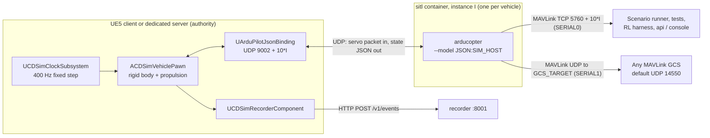
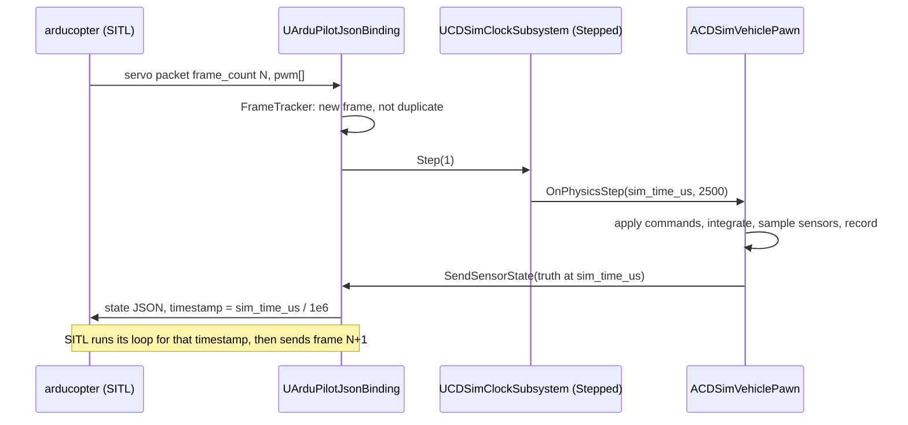

# 05 — SITL Integration

> **Audience:** engineers wiring autopilots to CD Sim, test engineers running
> SITL sessions, and anyone connecting a ground-control station.
>
> **Maturity:** under build. The ArduPilot SITL image is an **UNVERIFIED
> BUILD** (written, never built or run). The UE5 side is an uncompiled
> skeleton. The only tested piece is the Python reference codec for the wire
> protocol. RAVEN is CDPL's only delivered programme; nothing here is fielded.
> See [Status (Phase 0)](#status-phase-0).

Related: [ADR 0003](ADR/0003-ardupilot-sitl-json-physics.md) ·
[ADR 0015](ADR/0015-unified-sim-time-base.md) ·
[02 Architecture](02_ARCHITECTURE.md) ·
[04 Platform plugin spec](04_PLATFORM_PLUGIN_SPEC.md) ·
[08 Autonomy training](08_AUTONOMY_TRAINING.md) ·
[10 Roadmap](10_ROADMAP.md)

---

## 1. What SITL gives CD Sim

Software-in-the-loop (SITL) runs the **real, unmodified autopilot firmware**
(ArduPilot today, PX4 later) as a normal process, with CD Sim standing in for
the airframe, motors, sensors and world. It serves:

- **Use case 1 — SITL testing:** engineering validation of CDPL platforms and
  mission scripts before flight.
- **Use case 2 — autonomy training:** the RL policy sends velocity setpoints
  to a real autopilot in guided mode, as it would on the vehicle.
- **Use cases 3–4 — pilot training and mission rehearsal:** trainees fly a
  vehicle whose flight modes, failsafes and handling come from the same
  firmware as the real one.

Design decision ([ADR 0003](ADR/0003-ardupilot-sitl-json-physics.md)):
**UE5 owns physics.** ArduPilot's built-in physics models are not used; we
use ArduPilot's documented **JSON physics backend** (`--model JSON`), in
which SITL sends motor PWM and the external simulator replies with the
vehicle state. ArduPilot is built from an upstream release tag with no
patches.

## 2. Architecture



| Link | Transport | Direction | Purpose |
|---|---|---|---|
| JSON physics | UDP, port `9002 + 10·I` on `SIM_HOST` | SITL → UE5 servo packet; UE5 → SITL state JSON (reply to sender address) | The physics loop |
| SERIAL0 | MAVLink over TCP, `5760 + 10·I` (SITL listens) | bidirectional | Scripted tests, mission upload, arming, parameter set, RL guided commands, telemetry tap for the recorder, console (via api) |
| SERIAL1 | MAVLink over UDP, SITL sends to `GCS_TARGET` | bidirectional once the GCS replies | A ground-control station |

`I` is the SITL instance number (`INSTANCE`, passed as `-I`). The `+10·I`
offset for the MAVLink TCP port is ArduPilot's standard multi-instance
convention. For the JSON port, ArduPilot's JSON backend also offsets the
target port per instance; **confirm the exact rule against the pinned
release (`Copter-4.5.7`) during Phase 1** and record it here. The UE5 side
takes its listen port from `-SitlPort=` (default 9002).

## 3. The JSON protocol

The authoritative definition is ArduPilot's JSON backend (`SIM_JSON` in the
ArduPilot source and its "JSON interface" documentation). CD Sim's
implementations:

- UE5: `sim/Source/CDSim/Vehicle/ArduPilotJsonBinding.{h,cpp}` (uncompiled).
- Python reference codec: `services/sitl/src/cdsim_sitl_bridge/protocol.py`
  (**tested**, `services/sitl/tests/test_protocol.py`). Use it for mock
  autopilots, test harnesses and debugging captures.

### 3.1 Servo packet (SITL → CD Sim)

Binary, **little-endian**, one UDP datagram:

| Offset (bytes) | Type | Field | Meaning |
|---|---|---|---|
| 0 | `uint16` | `magic` | `18458` → 16 channels; `29569` → 32 channels. Anything else: discard. |
| 2 | `uint16` | `frame_rate` | SITL loop rate in Hz (ArduCopter default 400). |
| 4 | `uint32` | `frame_count` | Increments by 1 per packet. Used for loss / duplicate / restart detection (§4.3). |
| 8 | `uint16[16]` or `uint16[32]` | `pwm` | Servo outputs in µs, index 0 = `SERVO1`. 0 = output disabled. |

Total size: **40 bytes** (16 ch) or **72 bytes** (32 ch). Any other length is
a protocol error.

PWM → command: `c = clamp((pwm − 1000) / 1000, 0, 1)`, and `pwm == 0 → 0`.
Channel mapping: actuator with `output_channel: n` in `platform.yaml` reads
`pwm[n − 1]`. (Per-actuator `pwm_min_us/max_us` is a Phase 1 task; see
[04 §4.4](04_PLATFORM_PLUGIN_SPEC.md#44-propulsion).)

### 3.2 State reply (CD Sim → SITL)

One JSON object, **preceded and followed by `\n`**, sent back to the address
the servo packet came from:

```json
{"timestamp": 12.3425,
 "imu": {"gyro": [0.001, -0.002, 0.0], "accel_body": [0.02, -0.01, -9.80665]},
 "position": [3.20, -1.05, -10.02],
 "attitude": [0.010, -0.020, 1.571],
 "velocity": [0.10, 0.00, -0.05]}
```

| Field | Units | Frame | Required | Notes |
|---|---|---|---|---|
| `timestamp` | s (float) | — | yes | Physics time. **Must increase monotonically.** CD Sim sends `sim_time_us / 1e6`, so SITL's clock *is* the CD Sim clock. |
| `imu.gyro` | rad/s | body **FRD** | yes | Angular rate p, q, r. Truth; ArduPilot adds its own simulated noise. |
| `imu.accel_body` | m/s² | body **FRD** | yes | Specific force (what an accelerometer reads). At rest level: `[0, 0, −9.80665]`. |
| `position` | m | **NED**, relative to SITL home (§7) | yes | North, East, Down. |
| `attitude` | rad | ZYX Euler, FRD→NED | one of `attitude` / `quaternion` | roll, pitch, yaw. The UE5 binding sends this. |
| `quaternion` | — | FRD→NED, `[w, x, y, z]` | one of `attitude` / `quaternion` | The Python codec sends this. |
| `velocity` | m/s | **NED** | yes | |
| optional: `rng_1` … | m | — | no | Rangefinder distances, if the autopilot is configured for a simulated JSON rangefinder. Also `airspeed`, `windvane` — see ArduPilot's JSON documentation. |

### 3.3 Frames: aerospace vs Unreal

Physics state inside CD Sim is kept in the **same frames ArduPilot uses**
(NED world, FRD body, metres, radians), so the binding does no conversion.
Conversion to Unreal happens only when the actor is placed in the world
(`sim/Source/CDSim/Core/CDSimFrames.h`):

| Quantity | ArduPilot / physics | Unreal Engine | Conversion |
|---|---|---|---|
| World axes | NED: x North, y East, z Down (right-handed) | X North, Y East, Z Up (left-handed) | `UE = (N, E, −D)` |
| Units | metres | centimetres | × 100 |
| Body axes | FRD: x Forward, y Right, z Down | X Forward, Y Right, Z Up | `UE = (F, R, −D)` |
| Attitude | quaternion FRD→NED `(w, x, y, z)` | `FQuat` | `(w, −x, −y, z)` |
| Euler | roll, pitch, yaw (rad), ZYX | `FRotator(Pitch, Yaw, Roll)` (deg) | same signs, degrees |
| Origin | SITL home = area origin (§7) | UE world origin = area origin | identity |
| Recorded telemetry | — | — | ENU: `(E, N, −D)` (`VehicleState`) |

Sanity checks when debugging: a vehicle at rest must report
`accel_body ≈ [0, 0, −9.81]`; climbing 10 m must make `position[2]` go from
`0` to `−10`; yawing clockwise seen from above must increase `attitude[2]`.

## 4. Timing

### 4.1 Rates

| Item | Rate |
|---|---|
| CD Sim physics step | fixed **2500 µs of sim time (400 Hz)** — `UCDSimClockSubsystem::PhysicsStepUs` |
| ArduCopter main loop | 400 Hz by default (`SCHED_LOOP_RATE`), reported as `frame_rate` |
| JSON exchange | one servo packet per SITL loop, one state reply per packet |
| Recorded `VehicleState` | 50 Hz (decimated in `UCDSimRecorderComponent`) |

Keeping SITL's loop rate equal to the physics rate gives exactly one
exchange per physics step. Do not change `SCHED_LOOP_RATE` for multirotor
platforms without also changing this document and the clock.

### 4.2 Target design: lock-step, one reply per packet (Phase 1)

ArduPilot's JSON backend waits for the state reply to each servo packet and
takes its time from the reply's `timestamp`. That makes a **lock-step** loop
possible, and lock-step is what Phase 1 acceptance (deterministic replay)
requires:



Rules:

1. **Exactly one physics step and one reply per new `frame_count`.**
2. **Duplicate** `frame_count` (SITL resent because it missed our reply):
   do *not* step again; re-send the last reply.
3. **Gap** (`frame_count` jumped by k > 1): count `k − 1` lost frames, step
   once, reply. Lost frames are a health metric logged per session; a
   non-zero count in a deterministic test is a failure.
4. **Backwards** `frame_count`: SITL restarted. Log it, reset the tracker,
   and treat the session as non-deterministic from that point (annotate the
   recording).
5. **No packet** within a timeout (e.g. 1 s real time): the autopilot is
   gone. The vehicle holds its last commands and the console shows the link
   as down; physics continues in Realtime mode only.

The Python `FrameTracker` implements rules 2–4 and is unit-tested. The UE5
binding drains its socket each step and keeps the newest frame.

### 4.3 What the Phase 0 skeleton does instead

The uncompiled skeleton is **not yet lock-step**: the clock runs in Realtime
mode, the pawn polls the binding once per 400 Hz step (non-blocking, holds
the last commands if nothing arrived) and sends a state every step. That is
adequate for interactive flying but not for bit-exact replay. Converting it
to §4.2 is a Phase 1 task tracked in [10 Roadmap](10_ROADMAP.md).

### 4.4 Pause

- **CD Sim clock paused** → no physics steps → no replies → SITL blocks
  waiting, and its clock (taken from `timestamp`) does not advance. The
  autopilot therefore pauses with the world; nothing times out inside
  ArduPilot because its time stood still.
- In lock-step mode, pausing is simply "stop calling `Step`".
- MAVLink links stay open (the TCP socket is real-time), but no new
  telemetry is produced. GCS software may show a "link lost" warning during
  long pauses; that is cosmetic.
- Resuming continues from the same `sim_time_us`; there is no jump.

## 5. Sim-rate scaling (0.1× – 10×)

Sim rate is the ratio of sim time to wall time. Range **0.1–10**, enforced
by `cdsim_common.simclock` (raises) and `UCDSimClockSubsystem` (clamps and
warns). Uses: slow motion for instruction (0.1–0.5×), faster-than-real-time
soak tests and RL (2–10×).

| Where | Mechanism |
|---|---|
| UE5 clock (Realtime mode) | `SetSimRate(r)`: frame `DeltaTime × r` accumulates and is drained in whole 2500 µs steps (at most 400 per frame, to survive hitches). Rate changes never make time jump or go backwards. |
| UE5 clock (Stepped / lock-step) | Rate is simply how fast steps are requested; with SITL in the loop, the pair runs as fast as both can compute, capped by the requested rate. |
| SITL container | `SIM_RATE` env → `--speedup` (`entrypoint.sh`). Under the JSON backend the physics side paces the loop, so `--speedup` must be set **≥ the requested rate** so SITL never throttles below it. Set it equal to the session `sim_rate`. |
| Recording | `SessionManifest.sim_rate` records the rate. All stamps are sim time, so recordings at 10× replay identically at 1×. |
| Console / instructor | `SimControl.SetClock(sim_rate)` (Phase 1/4) sets the UE5 clock; the SITL `--speedup` is fixed per container start, so choose it for the maximum rate the session will use. |

Limits to check in Phase 1 (not yet measured): at 10× the loop needs 4000
exchanges per second per vehicle; whether a given machine sustains that with
rendering on is unknown. For RL, run headless (§10) to reduce load.

## 6. Multi-vehicle instancing

**One SITL container per vehicle.** Each gets a distinct instance number:

| Vehicle | `INSTANCE` | MAVLink TCP | JSON UDP (UE5 `-SitlPort`) | Suggested `GCS_TARGET` | `SYSID_THISMAV` |
|---|---|---|---|---|---|
| v1 | 0 | 5760 | 9002 | host:14550 | 1 |
| v2 | 1 | 5770 | 9012 (verify, §2) | host:14560 | 2 |
| v3 | 2 | 5780 | 9022 (verify) | host:14570 | 3 |

- In `docker-compose.yml` copy the `sitl` service block per vehicle
  (`sitl_v2`, …) with its own `INSTANCE`, port mapping and platform volume.
  A generator for this from a scenario's `vehicles[]` is planned with fleet
  mode (Phase 5).
- Give each vehicle a distinct MAVLink system id (`SYSID_THISMAV`) so a GCS
  can show them together; set it per instance (e.g. a per-instance extra
  param file).
- On the UE5 side each vehicle pawn opens its own binding on its own port.
  The skeleton currently takes one `-SitlPort` for the process; per-vehicle
  ports are a Phase 5 task.

## 7. Home location

Under the JSON backend `position` is relative to SITL's home (`--home`), so
**SITL home must equal the area origin** that the UE5 world is built around:

```
HOME_LOC = <origin.lat_deg>,<origin.lon_deg>,<origin.alt_msl_m>,0
```

from `terrain/areas/<id>/area.yaml`. The vehicle then spawns at its pad's
NED offset from the origin (scenario `vehicles[].spawn.pad_id` →
`landing_pads[].position`), and ArduPilot's own arming "home" is set where
it arms — on the pad, as on a real vehicle.

| Area | Origin | `HOME_LOC` |
|---|---|---|
| `flat_test` | 17.4000, 78.5000, 500 m | `17.4000,78.5000,500,0` (the compose default; `pad_home` coincides with the origin) |
| `hyd_demo_01` | 17.3800, 78.3005, 560 m (refined from DEM at build) | `17.3800,78.3005,560,0` |

The heading field only matters for ArduPilot's built-in physics; with JSON
the attitude comes from CD Sim. Phase 1 will derive `HOME_LOC` from the
session's area automatically instead of the compose default.

## 8. Parameter files

`platforms/<id>/ardupilot.parm` is mounted read-only at `/platform` and
passed as `--defaults`. How to write one: [04 §9](04_PLATFORM_PLUGIN_SPEC.md#9-ardupilot-parameter-file).
Parameters set at runtime over MAVLink (failure injection, scenario tweaks)
are recorded as events so a replay can re-apply them. SITL stores changed
parameters in its working directory inside the container; containers are
recreated per session so every session starts from the file.

## 9. Connecting a ground-control station

Any MAVLink-speaking GCS works (for example the open-source Mission Planner,
QGroundControl or MAVProxy); nothing is CDPL-specific.

**Option A — UDP (default, SERIAL1).** SITL sends MAVLink to
`GCS_TARGET` (compose default `host.docker.internal:14550`, i.e. the host
running Docker). Start the GCS on that host listening on **UDP 14550** (most
GCS software listens there by default); the vehicle appears automatically.
For a GCS on another LAN machine set
`GCS_TARGET=<that-machine-ip>:14550` (`CDSIM_SITL_GCS_UDP_PORT` changes the
port) and restart the container.

**Option B — TCP (SERIAL0).** Connect the GCS to TCP `<box-ip>:5760`
(`5760 + 10·I` for other vehicles). SERIAL0 is also used by CD Sim's own
tools; ArduPilot's TCP server accepts one client at a time on a port, so
prefer option A for a GCS and keep SERIAL0 for automation.

Offline note: disable any map-tile download in the GCS or point it at the
CD Sim tile server (`http://<box>:8101/v1/tiles/<area>/imagery/{z}/{x}/{y}.webp`,
once the area is built — [03](03_DIGITAL_TERRAIN_TWINS.md)).

## 10. Running headless

For SITL tests and RL nobody needs to see the world:

| Component | Headless mode |
|---|---|
| SITL | Always headless (a container). |
| UE5, no cameras needed | Run the game with `-nullrhi -unattended -nosound` (no GPU rendering), or the `CDSimServer` target, which has no renderer. Physics, SITL binding and recording are unaffected because they run on the fixed clock, not on rendering. |
| UE5, camera observations needed (RL) | `-RenderOffScreen` (renders on the GPU without a window). |
| Scenario | Driven by the scenario runner over `SimControl` gRPC (`schemas/control.proto`) and MAVLink SERIAL0 (Phase 1). |

Phase 1 acceptance run (target, not yet possible):

```bash
docker compose --profile core --profile sitl up -d --build
# UE5 (headless), flat test area, SITL on 9002, recorder on the local box:
CDSim -Platform=cdpl_quad_01 -Area=flat_test -SitlPort=9002 \
      -RecorderUrl=http://127.0.0.1:8001 -nullrhi -unattended
# scenario runner uploads scenarios/missions/core_loop.waypoints over
# MAVLink TCP 5760, arms, switches to AUTO, waits for landing, closes session
```

The exact launcher and binary paths are defined in
[BUILDING_UE5](BUILDING_UE5.md).

## 11. Failure injection path

Failure modes are declared per platform ([04 §10](04_PLATFORM_PLUGIN_SPEC.md#10-failure-modes-design)).
For SITL the question is *where* the fault must act so the autopilot sees it
realistically:

| `effect.type` | Acts in | Mechanism | Autopilot sees |
|---|---|---|---|
| `actuator_scale` | UE5 physics | Thrust of that actuator × `value` | Real consequence: attitude/position error, motor saturation; its own motor-failure handling reacts |
| `sensor_dropout` (GPS) | SITL + CD Sim | MAVLink `PARAM_SET` of ArduPilot's GPS-disable simulation parameter on SERIAL0; CD Sim GPS component stops too | GPS loss → EKF failsafe behaviour |
| `sensor_bias` (mag, baro…) | SITL + CD Sim | `PARAM_SET` of ArduPilot's simulated sensor offset parameters | Compass/baro error |
| `battery_sag` | SITL (+ CD Sim model later) | `PARAM_SET` of the simulated battery voltage | Battery failsafe per `BATT_FS_*` |
| `comms_loss` | SITL links | Stop RC override traffic / close the GCS link, or ArduPilot's simulated RC-failure parameter | RC / GCS failsafe per `FS_*` |

Exact ArduPilot `SIM_*` parameter names differ between releases; the mapping
table from effect type to parameter name will live next to the bridge code
(`services/sitl/src/cdsim_sitl_bridge/`) and be tested against the pinned
release in Phase 3. Every injection is recorded as a `Stimulus` event stamped
with the sim time at which the effect starts.

## 12. PX4 plan

PX4 is supported later behind the **same** C++ interface,
`ICDSimPhysicsBinding` (`sim/Source/CDSim/Vehicle/CDSimPhysicsBinding.h`):

| Aspect | ArduPilot (now) | PX4 (planned) |
|---|---|---|
| Interface | JSON over UDP | PX4's simulator MAVLink interface: `HIL_SENSOR`, `HIL_GPS` (and optionally `HIL_STATE_QUATERNION`) to PX4; `HIL_ACTUATOR_CONTROLS` from PX4; over TCP 4560 + I |
| Sensor noise | ArduPilot synthesises from truth | CD Sim sends *sensor* readings (with our noise), so CD Sim sensor components become autopilot-visible |
| Lock-step | Reply per servo packet | PX4 lockstep: sensor message timestamp drives PX4 time |
| Binding class | `UArduPilotJsonBinding` | new `UPX4SimulatorMavlinkBinding` |
| Selection | `autopilot.type: ardupilot` | `autopilot.type: px4` |
| Container | `cdsim/sitl-arducopter` | `cdsim/sitl-px4` (unmodified PX4 release, built offline-capable) |

Nothing in the pawn, recorder or assessment changes. A new ADR records the
PX4 decision details when it is started.

## 13. Reference codec and testing

`services/sitl/src/cdsim_sitl_bridge/protocol.py` provides:

- `parse_servo_packet(bytes) → ServoPacket` and `build_servo_packet(...)`
  (the inverse, for mock autopilots);
- `ServoPacket.normalised()` (PWM → 0..1);
- `encode_state(PhysicsState) → bytes` (newline-framed JSON,
  `timestamp = sim_time_us / 1e6`, quaternion form);
- `FrameTracker` (lost / duplicate / reset counting).

Run its tests:

```bash
make test                                   # everything
.venv/bin/pytest services/sitl/tests -q     # just the codec
```

The tests check both channel counts round-trip, little-endian layout and
40-byte size, rejection of short/bad-magic/wrong-length packets, PWM
normalisation including 0 and >2000, newline framing and timestamp of the
state JSON, and the tracker's duplicate/gap/reset counts.

Planned tests (Phase 1): a UE5 automation test that feeds captured servo
packets into `UArduPilotJsonBinding::ParseServoPacket` and compares
`BuildStateJson` output against the Python codec on the same inputs; a
mock-autopilot integration test (Python sends servo packets at 400 Hz to a
headless UE5 and checks one reply per frame); the full core-loop scenario.

To inspect live traffic: `tcpdump -i any -X udp port 9002` on the host, or
a Python script using the codec to decode captures.

## 14. Troubleshooting

| Symptom | Likely cause | Check / fix |
|---|---|---|
| SITL container restarts or never becomes healthy | Image not built / build failed (UNVERIFIED) | `docker compose --profile sitl logs sitl`; healthcheck is "TCP 5760+10·I accepts connections" |
| SITL log repeats "waiting for JSON" / no servo packets arrive in UE5 | `SIM_HOST` does not reach the UE5 machine; firewall; wrong port | From the container, `SIM_HOST` must resolve to the machine running UE5 (`host.docker.internal` via `extra_hosts` on Linux). Open UDP 9002 in the host firewall. Match `-SitlPort`. |
| Packets arrive, SITL never gets replies | UE5 replying to the wrong address, or physics not stepping (clock paused, no area loaded) | Reply goes to the packet's source address; check the clock is running and the pawn spawned (UE log `LogCDSim`) |
| "bad magic" / wrong length errors | Not an ArduPilot JSON packet (another program on 9002) or mismatched protocol | `tcpdump`; first two bytes must be `1A 48` (18458) or `81 73` (29569) little-endian |
| Vehicle flips on arming | Motor order or spin direction mismatch between `platform.yaml` and ArduPilot frame | Compare `output_channel` / `direction` with ArduPilot's motor diagram for `FRAME_CLASS/TYPE`; use the GCS motor test |
| Vehicle drifts upward/sideways at rest, EKF errors | Frame sign error (NED/FRD vs ENU/UE) | §3.3 sanity checks: `accel_body[2] ≈ −9.81` at rest |
| "timestamp went backwards" or time jumps | Sending wall time, or resetting `sim_time_us` without restarting SITL | `timestamp` must be sim time and monotonic within a SITL run |
| Frame loss counter rising | Host overloaded, or rate too high | Lower `sim_rate`, run headless, check CPU |
| GCS shows nothing | GCS not listening on `GCS_TARGET`; wrong IP | Option B (TCP 5760) as a cross-check |
| GCS map is blank on an air-gapped box | GCS trying to download tiles | Point it at the CD Sim tile server or use offline tiles |
| Arming refused | Pre-arm checks | `ARMING_CHECK 0` is set only for the placeholder quad; read the GCS pre-arm message |

## Status (Phase 0)

**Tested (really run):** the Python reference codec and frame tracker
(`services/sitl/tests/test_protocol.py`) under `make test`.

**Written, never built or run — UNVERIFIED BUILD:**
`services/sitl/docker/Dockerfile` (ArduPilot `Copter-4.5.7` from source,
unmodified), `entrypoint.sh`, `healthcheck.py`, the `sitl` compose profile;
the UE5 `UArduPilotJsonBinding`, `ICDSimPhysicsBinding`, clock and pawn.
No SITL session has ever been flown in CD Sim.

**Not implemented:** lock-step exchange (§4.2), per-vehicle JSON ports,
automatic `HOME_LOC` from the area, MAVLink sidecar (mission upload, params,
telemetry tap), SITL-side failure injection, PX4.

**Phase 1 acceptance** ([10 Roadmap](10_ROADMAP.md)): one placeholder quad in
UE5 flies under unmodified ArduPilot SITL on `flat_test` with MAVLink
exposed; a **scripted takeoff–waypoint–land** (`scenarios/sitl_core_loop.yaml`,
mission `scenarios/missions/core_loop.waypoints`) runs **headless** and
produces a **session file** (`session.json`, `events.pb`, `telemetry.pb`,
`controls.pb`) that **replays deterministically**.
