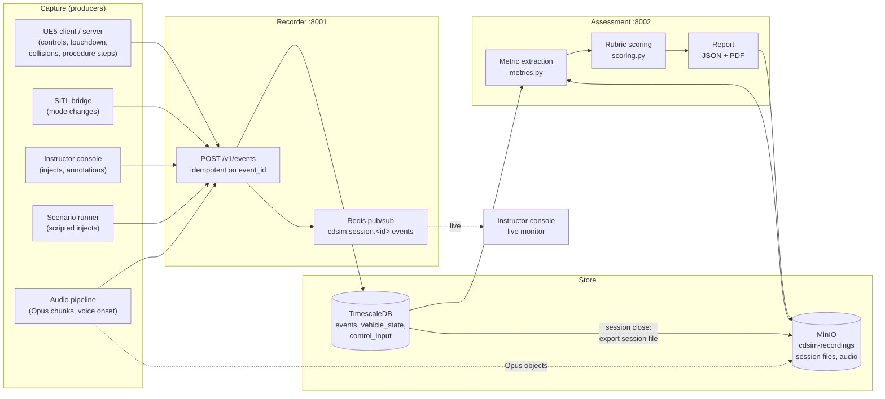

# 06 — Assessment Engine

> **Audience:** engineers building or calibrating the assessment pipeline, and
> instructors who need to know exactly what a score means.
> **Status:** rubric scoring, rubric validation and the landing metric
> readers are implemented and unit-tested (Phase 0). Deriving metrics from
> recordings, audio analysis, reports and the synthetic-stimulus timing test
> are **Phase 3**. See [Status (Phase 0)](#13-status-phase-0).

Related: [02 Architecture](02_ARCHITECTURE.md) (time base, data flow),
[07 Training Modes](07_TRAINING_MODES.md) (scenarios, fleet, maintainer),
[ADR 0015 — unified sim time base](ADR/0015-unified-sim-time-base.md),
[ADR 0016 — schema contracts](ADR/0016-schema-contracts-protobuf-and-json-schema.md),
[ADR 0013 — audio](ADR/0013-audio-opus-whisper.md),
[ADR 0006 — TimescaleDB](ADR/0006-postgresql-timescaledb.md),
[ADR 0007 — MinIO](ADR/0007-minio-object-storage.md),
[Glossary](GLOSSARY.md).

---

## 1. Purpose — why this makes CD Sim a training system

A simulator that only lets someone fly is a game. What turns CD Sim into a
*training system* is that every session produces **evidence**: a complete,
time-aligned record of what the trainee was shown, what they did, and what
resulted — and a **repeatable, explainable score** computed from that record
against a rubric an instructor can read.

The assessment engine therefore has four jobs:

1. **Capture** every stimulus, response, outcome and annotation, plus the
   continuous telemetry, control and audio streams, on **one clock**
   (`sim_time_us`, [ADR 0015](ADR/0015-unified-sim-time-base.md)).
2. **Derive** temporal and precision metrics (reaction time, decision
   latency, hesitation, control smoothness, procedure adherence, landing
   precision, recovery time, communication timeliness) with precise,
   versioned definitions — this document is normative for those definitions.
3. **Score** metrics against a YAML rubric with weights, pass/fail bands and
   critical metrics, deterministically: the same recording and rubric always
   produce byte-identical results.
4. **Report** to trainees, instructors and training managers (JSON for
   machines, PDF for people), and enable **comparative** analysis across a
   fleet class that received the same stimulus.

Design principles:

- **Sim time only.** All metric arithmetic uses `sim_time_us`. Wall-clock
  (`wall_time_us`) is never used to order, join or subtract.
- **Measured, never guessed.** If the engine cannot measure a metric, the
  trainee gets **no credit** for it (score 0, fail band) and the report says
  "not measured". Unimplemented metrics raise `NotImplementedError` rather
  than returning a plausible number.
- **Explainable.** Every score in a report links back to the events and
  sample windows that produced it.
- **Rubric-driven, code-stable.** Instructors tune thresholds and weights in
  YAML; the metric definitions change only through a versioned change to
  this document and `services/assessment/src/cdsim_assessment/metrics.py`.

## 2. Pipeline



| Stage | Component | Phase 0 reality |
|---|---|---|
| Capture | UE5 `sim/Source/CDSim/Recording/CDSimRecorderComponent.*` (event batching + POST), `CDSimAudioCaptureComponent.*` (consent-gated skeleton) | Source written, **UNVERIFIED BUILD** (never compiled). Audio capture is a skeleton that returns `false` until Phase 3. |
| Recorder | `services/recorder` — `POST /v1/events`, `GET /v1/sessions/{id}/events` | **Implemented and tested**; the round-trip recorder → TimescaleDB → ordered read was run against the `make dev` stack. Telemetry/control/audio ingest endpoints are Phase 1/3. |
| Store | TimescaleDB schema `services/recorder/db/001_init.sql`; MinIO buckets `cdsim-recordings`, `cdsim-areas` | Tables and buckets created at stack start. Session-file export is Phase 1. |
| Metric extraction | `services/assessment/src/cdsim_assessment/metrics.py` | Signatures + normative docstrings. `landing_*` readers implemented; everything else raises `NotImplementedError("Phase 3 …")`. |
| Rubric scoring | `services/assessment/src/cdsim_assessment/scoring.py` | **Implemented and unit-tested** (`services/assessment/tests/test_scoring.py`). |
| Report | — | Phase 3 (JSON + PDF). |

## 3. Event schema

Source of truth: `schemas/events.proto` and `schemas/common.proto` (package
`cdsim.v1`). The JSON wire form is the **proto3 JSON mapping** (camelCase
field names, enums by name, 64-bit integers as strings); the Pydantic mirror
is `services/common/src/cdsim_common/events.py`, and a unit test
round-trips it through the compiled protobuf. Contract rules (never renumber,
add optional fields only, breaking changes go to `cdsim.v2`) are in
[ADR 0016](ADR/0016-schema-contracts-protobuf-and-json-schema.md).

### 3.1 Envelope

`Event`:

| Field | Type | Meaning |
|---|---|---|
| `header` | `Header` | Time and identity (below). |
| `event_id` | string (UUID) | Unique id. The recorder is **idempotent** on it: re-sending a batch never duplicates events. |
| `related_event_id` | string | Optional link, typically response/outcome → the stimulus it answers. If empty, the engine infers the link by time window (§5.1). |
| `stimulus` \| `response` \| `outcome` \| `annotation` | oneof | Exactly one family per event. |

`Header` (carried by every recorded message, not only events):

| Field | Type | Meaning |
|---|---|---|
| `sim_time_us` | int64 | Microseconds since session start on the unified clock. **The** ordering key. Never derived from wall-clock. |
| `wall_time_us` | int64 | Producer wall-clock, Unix epoch µs. Reference only (debugging, audit). |
| `session_id` | string | Session UUID. |
| `actor_id` | string | Whom the event is *about*: trainee id, vehicle id, `instructor`, `system`. For per-trainee scoring this is the key. |
| `source` | enum `Source` | `SIM_CLIENT`, `SIM_SERVER`, `AUTOPILOT`, `INSTRUCTOR`, `ASSESSMENT`, `SCENARIO`, `RL`, `AUDIO`. |
| `seq` | uint64 | Producer-local monotonic counter; detects drops and breaks ties at equal `sim_time_us`. |

**Ordering rule:** everything in a session is ordered by
`(sim_time_us, seq)`. The recorder's read endpoint and index
(`events_session_time`) implement exactly this. `recorded_at` (ingest
wall-clock) exists only for TimescaleDB chunking/retention.

### 3.2 Stimulus — something the trainee should notice

| Field | Type | Meaning |
|---|---|---|
| `kind` | enum | `KIND_INSTRUCTOR_INJECT`, `KIND_SYSTEM_FAILURE`, `KIND_TARGET_APPEARANCE`, `KIND_ALARM`. |
| `code` | string | Machine code. For `SYSTEM_FAILURE` it **must** be a `failure_modes[].id` from the platform's `platform.yaml` (e.g. `motor_m1_degraded`). |
| `description` | string | Human text shown in console and report. |
| `broadcast_id` | string | Fleet mode: identical for every copy of a shared stimulus (one per trainee), all delivered at the same `sim_time_us`. Empty for single-trainee stimuli. |
| `expected_response_codes` | repeated string | Response codes that count as "correct" for decision latency (e.g. `mode.LAND`). |
| `params` | map<string,string> | Free-form (e.g. `severity: "0.6"`). Scenario YAML values are stringified. |

| Kind | Producer (`source`) | When emitted |
|---|---|---|
| `instructor_inject` | Instructor console via API → `SimControl.Inject` (`INSTRUCTOR`) | When the instructor presses an inject. The **sim** stamps `sim_time_us` on delivery (the physics step at which the effect begins) and echoes the stamped event (`control.proto`). |
| `system_failure` | Scenario runner (`SCENARIO`) or console (`INSTRUCTOR`), stamped by the sim | At the physics step when the failure-mode effect starts (start of any `ramp_s`). |
| `target_appearance` | UE5 sim (`SIM_CLIENT`/`SIM_SERVER`) | First physics step at which a scenario target becomes visible/active. |
| `alarm` | UE5 sim or SITL bridge (`AUTOPILOT`) | When a cockpit/GCS alarm is raised (e.g. low battery, EKF failsafe reported by the autopilot). |

A stimulus is always stamped **by the simulator at the moment it takes
effect**, not when the instructor clicked — the click-to-effect delay is
network/UI latency the trainee never saw.

### 3.3 Response — something the trainee did

| Field | Type | Meaning |
|---|---|---|
| `kind` | enum | `KIND_CONTROL_INPUT`, `KIND_MODE_CHANGE`, `KIND_VOICE_COMMAND`, `KIND_MENU_ACTION`. |
| `code` | string | Convention below. |
| `description` | string | Human text. |
| `magnitude` | double | Control inputs: normalised deflection change that crossed the threshold, [0, 1]. |
| `params` | map<string,string> | e.g. `axis: pitch`, `from: 0.02`, `to: 0.14`. |

Response code conventions (stable; rubrics and scenarios reference them):

| Kind | Code pattern | Examples | Producer |
|---|---|---|---|
| control_input | `stick.<axis>` | `stick.pitch`, `stick.roll`, `stick.yaw`, `stick.throttle` | UE5 client input layer (`SIM_CLIENT`) |
| mode_change | `mode.<ARDUPILOT_MODE_NAME>` | `mode.LAND`, `mode.RTL`, `mode.ALT_HOLD`, `mode.LOITER` | SITL bridge on HEARTBEAT mode change (`AUTOPILOT`) — records the mode the autopilot **entered**, not the switch position |
| voice_command | `voice.onset`, later `voice.phrase.<id>` | `voice.onset` | Audio pipeline (`AUDIO`) |
| menu_action | `menu.<action>`, `menu.tool.<tool_id>` | `menu.arm`, `menu.tool.prop_wrench` | UE5 UI / maintainer module (`SIM_CLIENT`) |

**Meaningful response threshold.** A control input is *meaningful* when any
normalised stick axis moves by **≥ 0.10** (`MEANINGFUL_DEFLECTION` in
`metrics.py`) from its value at the most recent stimulus for that actor. Axes
are in [-1, 1] (throttle [0, 1]), per `ControlInput` in
`schemas/telemetry.proto`. The client emits one `stick.<axis>` response the
first time the threshold is crossed after each stimulus (edge-triggered,
re-armed on the next stimulus). The Phase 3 metric recomputes this from the
raw `controls` stream as well, so a rubric can override the threshold with
`params.meaningful_deflection` without re-recording. Mode changes, voice
onsets and menu actions are meaningful by definition.

### 3.4 Outcome — a measurable result

| Detail | Fields | Producer and trigger |
|---|---|---|
| `landing_touchdown` | `pad_id` (area pad id, empty if off-pad), `radial_error_m`, `position_error_m` (Vec3, pad-local ENU), `velocity_mps` (Vec3 ENU, z<0 descending), `roll_deg`, `pitch_deg`, `yaw_error_deg` | UE5 sim, at the first physics step where landing-gear contact is registered after being airborne ≥ 1 s. Velocity and attitude are taken from the **last airborne physics step** (so the contact impulse does not corrupt them). `pad_id` = nearest pad whose footprint (`size_m`) contains the contact point. |
| `collision` | `other_object_id`, `impact_speed_mps`, `location` (GeoPoint) | UE5 physics hit on anything that is not a valid landing contact. |
| `geofence_breach` | `volume_id` (area `no_fly_volumes[].id` or scenario fence), `location`, `entered` (true = entered forbidden volume, false = left it) | UE5 sim on volume boundary crossing (both directions). |
| `procedure_step` | `procedure_id`, `step_id` (from `platform.yaml` `maintenance.procedures`), `result` (`STARTED`, `COMPLETED`, `FAILED`, `SKIPPED`), `tool_id`, `failure_reason` | Maintainer module ([07 §7](07_TRAINING_MODES.md#7-maintainer-module-fleet-focus)): `STARTED` when the trainee begins a step, `COMPLETED` when the action is performed at the anchor, `FAILED` (e.g. `failure_reason: wrong_tool`) on an incorrect action, `SKIPPED` when the trainee (or instructor) moves on without completing. |

### 3.5 Annotation

| Field | Type | Meaning |
|---|---|---|
| `text` | string | Instructor free text. |
| `tags` | repeated string | e.g. `good`, `unsafe`, `debrief`. |

Annotations never affect scores; they appear on the report timeline.

### 3.6 Continuous streams (`schemas/telemetry.proto`)

| Stream | Rate | Used by |
|---|---|---|
| `VehicleState` | physics 400 Hz, **recorded at 50 Hz** (20 ms) | recovery time, landing window, final-approach window |
| `ControlInput` | every change, capped at 100 Hz | reaction time (recomputed), control smoothness |
| `AudioChunk` | 20 ms Opus frames batched into ~1 s chunks; `sim_time_us` = first sample; `rms_dbfs` = mean energy | communication timeliness, optional transcription |
| `VideoKeyframe` | optional 1 Hz | replay scrubbing only |

## 4. Session file format

Defined in `schemas/session.proto`. A session file is a directory (or a
`.tar.zst` of it) stored in MinIO bucket `cdsim-recordings` under the
session id:

```
<session_id>/
├── session.json              SessionManifest (proto3 JSON)
├── events.pb                 length-delimited cdsim.v1.Event stream
├── telemetry.pb              length-delimited cdsim.v1.VehicleState stream
├── controls.pb               length-delimited cdsim.v1.ControlInput stream
├── audio/<trainee_id>/
│   ├── index.pb              length-delimited AudioChunk headers (no payload)
│   └── <seq>.opus            Opus chunk payloads
└── report/                   (Phase 3) report.json, report.pdf, per-rubric results
```

"Length-delimited" is the standard protobuf delimited encoding: each message
is preceded by its byte length as a base-128 varint. Every stream file is
written in `(sim_time_us, seq)` order; readers must still sort (merging
several producers is cheap and makes readers robust).

`SessionManifest` fields that matter for assessment:

| Field | Why it matters |
|---|---|
| `session_id`, `kind` | Which rubric families apply (`applies_to`). |
| `area_id`, `area_version`, `scenario_id` | Pad geometry, fences, scripted injects. |
| `rubric_id` | Default rubric for scoring. |
| `participants[]` (`actor_id`, `role`, `vehicle_id`, `platform_id`, `audio_consent`) | Per-trainee scoring; audio is processed only where `audio_consent` is true. |
| `start_wall_time_us`, `end_sim_time_us` | Reference / duration. |
| `sim_rate` | Needed to map audio (real-time) to sim time when rate ≠ 1 (§6.9). |
| `random_seed`, `sim_build_id`, `autopilot_build_id` | Replay must reuse them; the engine records them in the report. |
| `audio_retention_days` | 0 = delete audio at session close, -1 = keep, N = delete after N days (§11). |
| `format_version` | Bump on layout change; readers refuse unknown major versions. |

While a session is live the same data sits in TimescaleDB (`events`,
`vehicle_state`, `control_input` hypertables) and MinIO (audio). At session
close the recorder exports the session file (Phase 1 for events/telemetry,
Phase 3 for audio). Assessment reads **the session file**, so scoring a
session later, on another box, gives the same answer.

## 5. Common rules for all metrics

### 5.1 Stimulus windows and linking

For each stimulus *S* of a kind listed in the rubric metric's
`params.stimulus_kinds` (default: all kinds) and each actor it targets:

- Candidate responses are events with the **same `actor_id`**, family
  `response`, and `S.t ≤ R.t < S.t + window`, where `window` =
  `params.window_s` (default **30 s**).
- If a response carries `related_event_id`, it is linked to that stimulus
  only. Otherwise it is linked to the **most recent** stimulus of that actor
  preceding it (a later stimulus closes the earlier one's window for
  unlinked responses).
- Equal times: a response at exactly `S.t` counts (≥), ordering by `seq`.

### 5.2 Aggregation

A metric may produce one value per stimulus (reaction, decision, hesitation,
recovery, comms) or per session (landing, smoothness, adherence). Rubric
`aggregate` (`mean` default, `median`, `max`, `min`, `last`) reduces the
list to the single value passed to scoring. Values that are `None` (not
measured) are **excluded** from aggregation; if **all** are `None`, the
aggregate is `None` → scored as not measured (§7.4).

### 5.3 Units and rounding

Times are computed in integer microseconds and converted to seconds as
`us / 1_000_000` only at the end. Reported values are rounded to 4 decimal
places for display; scoring uses the unrounded float. No wall-clock ever
enters a calculation.

## 6. Metrics v1

The function names below are the `metric` values allowed by
`schemas/json/rubric.schema.json`. Functions live in
`services/assessment/src/cdsim_assessment/metrics.py`; their docstrings are
normative and this section expands them. Status per metric is in §13.

### 6.1 Reaction time — `reaction_time_s`

- **Definition.** Time from a stimulus to the first *meaningful* response by
  the same actor.
- **Inputs.** Stimulus event; response events of that actor; `controls`
  stream (for threshold recomputation).
- **Algorithm.**
  1. Record each stick axis value at `S.t` (last `ControlInput` at or
     before `S.t`; neutral if none).
  2. Scan candidate responses (§5.1) and control samples in
     `(sim_time_us, seq)` order. The first of: any `mode_change`,
     `voice_command` or `menu_action` response; or any control sample where
     `|axis − axis_at_S| ≥ meaningful_deflection` (default 0.10) on any axis.
  3. `reaction = (t_first − S.t) / 1e6`.
- **Edge cases.** No response in window → `None`. Stick already deflected at
  the stimulus → only a *change* of ≥ 0.10 counts. Two stimuli close
  together → §5.1 linking. An autopilot-initiated mode change (failsafe)
  has `source = AUTOPILOT` but is not trainee-initiated: the SITL bridge sets
  `params.initiator = autopilot` and those are excluded.
  The rubric may restrict kinds via `params.response_kinds` (planned; see
  open question in §14).
- **Units.** seconds.
- **Worked example.** Scenario `landing_motor_failure_01` injects
  `motor_m1_degraded` at `at_s: 60` → stimulus `sim_time_us = 60 000 000`.
  Pitch at stimulus = 0.02. Controls: `60 412 500` pitch 0.07 (Δ 0.05, not
  meaningful); `60 847 500` pitch 0.14 (Δ 0.12 ≥ 0.10). Reaction =
  (60 847 500 − 60 000 000) / 1e6 = **0.8475 s** → band `fast` (≤ 1.0) in
  `precision_landing_v1`.

### 6.2 Decision latency — `decision_latency_s`

- **Definition.** Stimulus → first response whose `code` is in the
  stimulus's `expected_response_codes`.
- **Inputs.** Stimulus (with `expected_response_codes`); responses of that actor.
- **Algorithm.** First candidate response (§5.1) with
  `code ∈ expected_response_codes`; latency = `(t − S.t)/1e6`.
- **Edge cases.** Empty `expected_response_codes` → `None` (metric not
  applicable; a rubric using it on such a stimulus should be fixed).
  Correct response never given → `None` (scores 0, fail). Wrong responses
  before the correct one do not stop the clock.
- **Units.** seconds.
- **Worked example.** Same session: `voice.onset` at `61 900 000`,
  `mode.LAND` at `63 210 000`. The scenario's expected codes are
  `[mode.LAND, mode.ALT_HOLD, voice.onset]`, so the first match is the voice
  onset: **1.9 s** → `fast` (≤ 3.0). Note: because `voice.onset` is listed,
  calling the emergency counts as the decision; if instructors want decision
  latency to mean a *flight* action, remove it from the scenario (then the
  value would be 3.21 s → `adequate`). This is a calibration question for
  instructors (§14).

### 6.3 Hesitation — `hesitation_s`

- **Definition.** `decision_latency − reaction_time`: time spent acting
  before acting correctly.
- **Algorithm.** Compute both for the same stimulus; if either is `None`,
  hesitation is `None`. Result is ≥ 0 by construction (the correct response
  is itself a meaningful response).
- **Units.** seconds.
- **Worked example.** 1.9 − 0.8475 = **1.0525 s**.

### 6.4 Control smoothness — `control_jerk_rms`

- **Definition.** RMS of the second time-derivative of the normalised stick
  axes over a window. (The stick commands rates/attitudes, so its second
  derivative corresponds to jerk of the commanded motion; hence the name.)
- **Inputs.** `ControlInput` samples of the actor in the window; rubric
  `params.window` (`final_approach` in `precision_landing_v1`; `session` =
  whole session).
- **Window `final_approach`.** From the last time the vehicle descends
  through `params.final_approach_agl_m` (default 10 m AGL, from
  `VehicleState.altitude_agl_m`) to the `landing_touchdown` event.
- **Algorithm.**
  1. For each axis (roll, pitch, yaw, throttle) build a uniform 50 Hz grid
     over the window (Δt = 0.02 s) by linear interpolation between
     `ControlInput` samples (inputs are sent on change, so hold the last
     value before the first change).
  2. Smooth with a centred 5-sample moving average (100 ms), edges trimmed.
  3. Second difference `a_k = (x_{k+1} − 2x_k + x_{k−1}) / Δt²`.
  4. `jerk_rms = sqrt(mean over all axes and k of a_k²)`.
- **Edge cases.** Window shorter than 0.5 s (fewer than 25 grid points) →
  `None`. Autopilot-flown segments with no stick input → the axes are
  constant, jerk 0; a rubric should not score smoothness on sessions where
  the trainee was not hand-flying (use `applies_to` / scenario design).
  NaN never arises (inputs are finite by schema); if it did, it would fall
  into the last band (see §7.4).
- **Units.** 1/s² (normalised stick units per second²).
- **Worked example.** A pure sinusoid `x(t) = A sin(2πft)` has
  `|x''| = A(2πf)² |sin|`, RMS `A(2πf)²/√2`. A single axis with
  A = 0.3, f = 1 Hz: 0.3 × 39.48 / 1.414 = 8.37 1/s²; the 100 ms average
  attenuates 1 Hz by sin(0.1π)/(0.1π) = 0.984 → **8.24** → band `busy`
  (5 < 8.24 ≤ 15). A calmer A = 0.2, f = 0.5 Hz gives 1.40 → `smooth`.
  With four axes, the axes that did not move pull the RMS down (divide by
  total samples of all axes) — thresholds must be calibrated with this
  definition.

### 6.5 Procedure adherence — `procedure_adherence`

- **Definition.** Fraction of a procedure's steps completed, in the
  prescribed order, with the declared tool. 0..1.
- **Inputs.** Procedure definition from `platform.yaml`
  (`maintenance.procedures[]`, `ordered`, `steps[].tool_id`, `critical`);
  `procedure_step` outcomes for that `procedure_id` and actor.
- **Algorithm.**
  1. For each declared step take its **first** `COMPLETED` event. It is
     *valid* if the step declares no tool, or `tool_id` equals the declared
     tool.
  2. If `ordered: false`: adherence = valid steps / total steps.
  3. If `ordered: true`: list the valid completion times in declared step
     order; adherence = length of the **longest strictly increasing
     subsequence** of those times / total steps. (LIS is used rather than a
     greedy walk so that one late step does not wipe out credit for all the
     others; it is deterministic.)
  4. Also report (not scored here) critical steps that are not valid, and
     any `FAILED` events, for the debrief.
- **Edge cases.** Step never completed / `SKIPPED` → invalid. Repeated
  completions → only the first counts. Procedure not started → 0.0
  (measured: the trainee did nothing), not `None`.
- **Units.** dimensionless fraction.
- **Worked example.** `preflight_inspection` (5 steps, ordered). Completions:
  s1 5 s; s2 50 s; s3 90 s with `prop_wrench` ✓; s4 60 s; s5 125 s with
  `multimeter` ✓. Times in declared order `[5, 50, 90, 60, 125]`; LIS length
  4 (5, 50, 90, 125). Adherence = 4/5 = **0.8** → `maintainer_procedure_v1`
  band `fail` (< 0.85; `adherence` is critical → session fails).

### 6.6 Procedure step time — `procedure_step_time_s`

- **Definition.** Mean time per completed step. With
  `params.normalise_by_expected: true` (as in `maintainer_procedure_v1`)
  each step's time is divided by its `expected_duration_s`, so 1.0 = on time.
- **Algorithm.** For each step with a `COMPLETED` event: `d` = first
  `COMPLETED` time − latest `STARTED` time before it. If normalising,
  `r = d / expected_duration_s` (steps without `expected_duration_s` are
  excluded). Metric = mean of `r` (or of `d` in seconds).
- **Edge cases.** No `STARTED` → use the previous step's `COMPLETED` time
  (or procedure start). No completed steps → `None`.
- **Units.** seconds, or a dimensionless ratio when normalised (the metric
  name keeps `_s` for the raw form).
- **Worked example.** `preflight_inspection` durations 12, 52, 27, 9, 36 s vs
  expected 10, 40, 30, 10, 30 → ratios 1.2, 1.3, 0.9, 0.9, 1.2 → mean
  **1.1** → band `on_time` (≤ 1.2).

### 6.7 Landing precision — `landing_radial_error_m`, `landing_vertical_speed_mps`, `landing_attitude_deg`

These three read the `landing_touchdown` outcome directly and are
**implemented now**.

| Metric | Definition | Units |
|---|---|---|
| `landing_radial_error_m` | `radial_error_m` from the outcome: horizontal distance from pad centre (= √(x²+y²) of `position_error_m`). | m |
| `landing_vertical_speed_mps` | `abs(velocity_mps.z)` at touchdown. | m/s |
| `landing_attitude_deg` | `max(|roll_deg|, |pitch_deg|)` at touchdown. `yaw_error_deg` is reported but not scored in v1. | deg |

- **Edge cases.** Not a touchdown outcome → `ValueError`. No touchdown in the
  session → `None` (not measured). Multiple touchdowns (bounce, touch-and-go)
  → rubric `aggregate: last` scores the final one. Off-pad touchdown
  (`pad_id` empty) still has a radial error relative to the scenario's target
  pad (the producer uses the target pad for the error).
- **Worked example.** Outcome `position_error_m = (0.30, −0.25, 0)`,
  `velocity_mps.z = −0.62`, roll −3.1°, pitch 1.4°. Radial =
  √(0.09 + 0.0625) = **0.3905 m** (`good`, ≤ 0.50); vertical speed
  **0.62 m/s** (`firm`, ≤ 1.0); attitude max(3.1, 1.4) = **3.1°** (`level`, ≤ 5).

### 6.8 Recovery time after injected failure — `recovery_time_s`

- **Definition.** Time from an injected failure (`system_failure` stimulus)
  to the moment the vehicle is back inside the **stability envelope** and
  stays there for at least `hold_s` (default **2 s**).
- **Stability envelope (v1, multirotor defaults; rubric `params` override):**

  | Quantity (from `VehicleState`) | Limit |
  |---|---|
  | \|roll\|, \|pitch\| (from `attitude`) | ≤ 15° |
  | \|p\|, \|q\| body rates (`angular_velocity_radps`) | ≤ 30°/s (0.524 rad/s) |
  | descent rate (−`velocity_enu_mps.z`) | ≤ 2.0 m/s |
  | horizontal speed | ≤ 8 m/s |
  | `altitude_agl_m` | ≥ 1.0 m **or** landed (`landing_touchdown` not hard) |

- **Algorithm.** Walk 50 Hz `VehicleState` samples from `S.t`. Let
  `t_in` = first sample time inside the envelope such that every sample in
  `[t_in, t_in + hold_s]` is inside. Recovery = `(t_in − S.t)/1e6`. If the
  vehicle never left the envelope, recovery = time of the first sample at or
  after `S.t` that starts a valid hold, i.e. ≈ 0.
- **Edge cases.** Crash (`collision`) or hard touchdown before recovery →
  `None`. Session ends before a full `hold_s` → `None`. Resolution is one
  state sample (20 ms). A controlled landing counts as recovered from the
  touchdown time.
- **Units.** seconds.
- **Worked example.** Failure at 60.000 s (ramps over 1.0 s). Roll exceeds
  15° from 60.60 s, peaks 22° at 60.90 s, first back inside at 62.44 s and
  stays inside through 64.44 s. Recovery = **2.44 s**.

### 6.9 Communication timeliness — `comms_onset_s`

- **Definition.** Stimulus → first **voice-activity onset** of the trainee.
- **Inputs.** `AudioChunk` headers and Opus payloads for the trainee (only if
  `audio_consent`); `voice.onset` responses.
- **Voice-activity detection (energy VAD).** The chunk-level `rms_dbfs` is a
  ~1 s mean — too coarse for onset timing — so it is used only to skip
  silent chunks. The audio pipeline decodes Opus offline (libopus) and:
  1. Computes RMS in dBFS per 20 ms frame.
  2. Noise floor = 10th percentile of frame RMS over the trainee's first
     10 s of audio (or the whole session if shorter).
  3. Threshold = `max(−45 dBFS, noise_floor + 12 dB)` (provisional; rubric
     `params.vad_threshold_dbfs` / `params.vad_margin_db` override).
  4. Onset = first frame of a run of **≥ 10 consecutive frames (200 ms)**
     above threshold (rejects clicks); hangover 300 ms before a new onset can
     be declared.
  5. Frame sim time = `chunk.sim_time_us + k × 20 000 × sim_rate`
     (audio runs in real time; at `sim_rate ≠ 1` sim time advances faster or
     slower than audio, so comms metrics are only meaningful at 1.0× and
     the report flags other rates).
  6. Emits `response{kind: VOICE_COMMAND, code: "voice.onset"}` with
     `source = AUDIO`.
- **Algorithm.** First `voice.onset` in the stimulus window (§5.1).
- **Transcription (optional).** Offline Whisper on CPU
  ([ADR 0013](ADR/0013-audio-opus-whisper.md)) may later produce
  `voice.phrase.<id>` responses for phrase-level scoring (e.g. "MAYDAY").
  It never runs without consent, never needs the internet, and v1 scoring
  does **not** depend on it.
- **Edge cases.** No consent / no audio → `None` → not measured (score 0);
  instructors should use a rubric without `comms` for trainees who declined.
  Speech already in progress at `S.t` → the next onset after a ≥ 300 ms gap.
  Radio chatter from other trainees is excluded because audio is per-trainee.
- **Units.** seconds.
- **Worked example.** Chunk starting at `61 000 000` µs, sim_rate 1.0; frames
  0–44 below threshold (−52 dBFS floor + 12 = −40 dBFS threshold), frames
  45–70 at −28 dBFS. Onset frame 45 → `61 000 000 + 45 × 20 000 =
  61 900 000` → comms = **1.9 s** → `prompt` (≤ 3.0).

## 7. Rubric format

Rubrics are YAML in `services/assessment/rubrics/`, validated by
`schemas/json/rubric.schema.json` (structure) and
`cdsim_common.manifests.rubric_semantic_errors` (semantics) — both run in
`make schemas` and via `POST /v1/rubrics/validate`.

### 7.1 Fields

| Field | Required | Meaning |
|---|---|---|
| `schema_version` | yes | Must be `1`. |
| `id` | yes | `^[a-z][a-z0-9_]*$`; referenced by scenarios (`rubric_id`) and `/v1/score`. |
| `name` | yes | Human name. |
| `version` | yes | SemVer. Bump on any threshold/weight change; reports record it. |
| `description` | no | Free text. |
| `applies_to` | no | Session kinds: `sitl_test`, `autonomy`, `pilot_single`, `pilot_fleet`, `mission_rehearsal`, `maintainer`. |
| `pass_threshold` | yes | 0..1; weighted total needed to pass. |
| `metrics[]` | yes (≥ 1) | See below. |

Per metric:

| Field | Required | Meaning |
|---|---|---|
| `id` | yes | Unique within the rubric; key in `/v1/score` `values`. |
| `metric` | yes | One of the §6 function names. |
| `description` | no | Shown in reports. |
| `weight` | yes | ≥ 0. Normalised at scoring time (§7.3). Sum must be > 0. |
| `direction` | yes | `lower_is_better` or `higher_is_better`. |
| `aggregate` | no | `mean` (default), `median`, `max`, `min`, `last` (§5.2). Applied by the extraction stage, before scoring. |
| `critical` | no (false) | If the metric lands in a band with `pass: false` (or is not measured), the **whole session fails** regardless of total. |
| `params` | no | Metric parameters (`stimulus_kinds`, `window`, `window_s`, `normalise_by_expected`, envelope/VAD overrides…). Passed to extraction. |
| `bands[]` | yes (≥ 2) | Ordered **best → worst**. Each: `label` (req.), `score` 0..1 (req.), `limit` (all but last), `pass` (default **true**). |

### 7.2 Band semantics

Implemented in `scoring.band_for`:

- `lower_is_better`: value falls in the **first** band with `value ≤ limit`.
- `higher_is_better`: first band with `value ≥ limit`.
- The **last band has no limit** and catches everything else.
- Limits are inclusive (a value exactly on a limit takes the better band;
  tested: 1.0 → band `a`, 1.0001 → band `b`).
- Semantic validation enforces: last band has no limit; every other band has
  one; limits run best → worst (ascending for `lower_is_better`, descending
  for `higher_is_better`); metric ids unique; weights sum > 0.
- A band without `pass` **passes**. So `smoothness: erratic` (score 0.2) and
  `comms: none` (score 0.0) in `precision_landing_v1` are low-scoring but not
  failing bands.

### 7.3 Weight normalisation and totals

`total = Σ(score_i × weight_i) / Σ(weight_i)`, rounded to 6 decimals, so the
total is in [0, 1] whatever scale the weights use. Example (unit test
`test_weighted_total_and_pass`): weights 3 and 1, scores 1.0 and 0.5 →
(3 × 1.0 + 1 × 0.5) / 4 = **0.875**.

`passed = total ≥ pass_threshold AND NOT critical_failure`, where
`critical_failure` = any critical metric with `passed == false`.

### 7.4 Missing values

A value that is `None` or absent from the input scores **0.0**, is labelled
`not_measured (<worst band label>)`, and **fails** (`passed: false`). If the
metric is critical this causes a critical failure. Rationale: if the engine
could not measure something, the trainee gets no credit. (NaN is not a valid
input; if one arrived, every `≤`/`≥` comparison is false and it would fall
into the last band.)

### 7.5 Worked scoring example (`precision_landing_v1`)

Inputs are the worked values from §6 (one stimulus, so every aggregate is
that value). This was checked by hand and against `score_rubric`:

| id | value | band | score | weight | score × weight |
|---|---|---|---|---|---|
| landing_radial (critical) | 0.3905 | good (≤ 0.50) | 0.8 | 0.30 | 0.240 |
| touchdown_vspeed (critical) | 0.62 | firm (≤ 1.0) | 0.7 | 0.20 | 0.140 |
| touchdown_attitude | 3.1 | level (≤ 5) | 1.0 | 0.10 | 0.100 |
| failure_reaction | 0.8475 | fast (≤ 1.0) | 1.0 | 0.15 | 0.150 |
| failure_decision | 1.9 | fast (≤ 3.0) | 1.0 | 0.10 | 0.100 |
| smoothness | 8.24 | busy (≤ 15.0) | 0.6 | 0.10 | 0.060 |
| comms | 1.9 | prompt (≤ 3.0) | 1.0 | 0.05 | 0.050 |
| **Σ** | | | | **1.00** | **0.840** |

Total **0.84** ≥ 0.70, no critical failure → **passed**.

Variants (same inputs except as noted; all reproduced with `score_rubric`):

| Change | total | passed | critical_failure | Why |
|---|---|---|---|---|
| `comms` missing (no consent) | 0.79 | true | false | comms → `not_measured (none)`, 0 × 0.05; not critical. |
| `touchdown_vspeed` = 1.3 | 0.70 | **false** | **true** | `hard` band has `pass: false` and the metric is critical: fails even though total = threshold. |
| `failure_reaction` = 2.6 | 0.72 | true | false | `slow` (score 0.2, `pass: false`) but non-critical: that metric fails, session still passes. |

`maintainer_procedure_v1` with the §6.5/6.6 values (adherence 0.8, step
time 1.1): adherence → `fail` (0.0, critical), step_time → `on_time` (1.0);
total = 0.6 × 0 + 0.4 × 1.0 = **0.40**, `critical_failure: true`,
`passed: false`.

### 7.6 Calibration

All thresholds in the shipped rubrics are **placeholders** (they say so in
their headers). Calibration procedure (Phase 3/4): record a cohort of
instructor-graded sessions, compute raw metrics, set band limits so that
bands agree with instructor grades, publish as a new rubric `version`, and
keep old versions so historical reports remain reproducible.

## 8. Report outputs

### 8.1 JSON (Phase 3) — sketch

The per-rubric part is exactly `RubricResult` from `scoring.py`
(`rubric_id`, `rubric_version`, `total`, `passed`, `critical_failure`,
`metrics[] {id, metric, value, band, score, weight, passed, critical}`). The
full report wraps it:

```json
{
  "report_version": 1,
  "session_id": "3f1c…",
  "trainee_id": "t-017",
  "session_kind": "pilot_single",
  "scenario": {"id": "landing_motor_failure_01", "version": "1.0.0"},
  "area": {"id": "hyd_demo_01", "version": "…"},
  "builds": {"sim": "…", "autopilot": "…", "assessment": "0.1.0"},
  "random_seed": 42,
  "sim_rate": 1.0,
  "result": { "rubric_id": "precision_landing_v1", "rubric_version": "1.0.0",
              "total": 0.84, "passed": true, "critical_failure": false,
              "metrics": [ { "id": "landing_radial", "metric": "landing_radial_error_m",
                             "value": 0.3905, "band": "good", "score": 0.8,
                             "weight": 0.3, "passed": true, "critical": true } ] },
  "evidence": [
    {"metric_id": "failure_reaction", "stimulus_event_id": "…",
     "response_event_id": "…", "from_us": 60000000, "to_us": 60847500}
  ],
  "timeline": [ {"sim_time_us": 60000000, "family": "stimulus", "code": "motor_m1_degraded"} ],
  "annotations": [ {"sim_time_us": 64100000, "text": "Good call", "tags": ["good"]} ],
  "fleet": {"broadcast_id": "…", "cohort_size": 4, "rank": 2, "percentile": 66.7},
  "notes": ["comms measured at sim_rate 1.0"]
}
```

Serialisation is canonical (sorted keys, fixed float formatting) so the same
inputs give byte-identical files.

### 8.2 PDF (Phase 3)

Generated fully offline with a pure-Python, open-source PDF library (the
choice is recorded in an ADR in Phase 3; no browser or network rendering).
Every page carries the Chakravyuha Dynamics logo placeholder. Layout:

1. **Header** — logo, "CD Sim — Session assessment", trainee, date (wall
   clock, reference), session id, scenario, area, rubric + version.
2. **Result banner** — PASS / FAIL, total vs threshold, critical failure
   reason if any.
3. **Metric table** — as §7.5 with band colour and "not measured" called out.
4. **Timeline strip** — stimuli, responses, outcomes, annotations on sim time.
5. **Plots** — altitude/attitude around each stimulus with the envelope,
   final-approach ground track over the pad, stick traces.
6. **Fleet comparison** (fleet sessions) — reaction-time distribution for
   each `broadcast_id`, trainee highlighted.
7. **Instructor annotations and debrief notes.**
8. **Provenance footer** — builds, seed, rubric version, report version,
   "thresholds are provisional" notice while rubrics are uncalibrated.

## 9. Determinism requirements

Phase 3 acceptance: *"a golden test session scores identically on every run;
reaction-time test with a synthetic stimulus verified to within 20 ms."*

### 9.1 Golden session

- A recorded session file lives under `tests/fixtures/golden_session/`
  (Phase 3; the directory does not exist yet).
- A test scores it N times (and in two separate processes) and asserts the
  JSON report is **byte-identical** each time and equal to a committed
  expected file.
- Rules that make this hold: pure functions (`scoring.py` has no I/O); inputs
  sorted by `(sim_time_us, seq)`; integer-µs arithmetic; no wall-clock, no
  randomness, no dictionary-order dependence (canonical JSON); fixed
  numerical libraries pinned in the image; rounding only at defined points
  (`total` to 6 dp). `test_scoring_is_deterministic` already covers scoring.

### 9.2 Reaction-time timing test (≤ 20 ms)

The test drives a live sim headless: the scenario runner injects a stimulus
at a known sim time, and a **synthetic responder** (a scripted input device
in the client) applies a stick step of 0.5 exactly *D* = 750 ms of sim time
later. The pipeline must report `reaction_time_s` within ±20 ms of 0.750.

Why 20 ms is achievable:

| Error source | Bound | Reasoning |
|---|---|---|
| Stimulus stamping | ≤ 2.5 ms | The sim stamps the stimulus at the physics step where the effect starts; physics runs at a fixed 2500 µs step (400 Hz). |
| Control-input stamping | ≤ 2.5 ms if input is sampled per physics step; ≤ 1 render frame (≈ 16.7 ms at 60 fps) if stamped on the game thread | Inputs are stamped at the **producer** with the sim time at sampling, so network, recorder and database latency do **not** enter the measurement. The Phase 3 implementation must sample/stamp inputs on the physics step (or interpolate within the frame) to keep the bound at 2.5 ms. |
| Recorded state rate | not used | `VehicleState` is recorded at 50 Hz (20 ms), which alone would consume the whole budget. Reaction time is therefore computed from **events and the control stream**, never from state samples. |
| Threshold detection | 0 | Crossing detection is exact on the recorded samples. |
| Worst case (per-step stamping) | ≈ 5 ms | Well inside 20 ms. |

At sim rates ≠ 1 the bound holds in sim time because both stamps are on the
same clock. Human-in-the-loop latency (display, USB polling) is part of the
trainee's reaction and is not "error" — it is identical for all trainees on
the same hardware, which is why fleet comparisons require identical seat
hardware (§10).

## 10. Fleet comparative analysis

In fleet mode ([07 §3](07_TRAINING_MODES.md#3-fleet-mode)) one inject is
delivered to every targeted trainee at the **same `sim_time_us`**, as one
stimulus event per trainee sharing a `broadcast_id` (scenario injects with
empty `targets` are broadcast). The engine then:

1. Groups per-trainee metric values (reaction, decision, hesitation, comms,
   recovery) by `broadcast_id`.
2. Computes cohort statistics: n, median, IQR, min/max, each trainee's rank
   and percentile; flags outliers (> 1.5 IQR).
3. Adds the comparison to each trainee's report and a cohort report for the
   instructor (Phase 5 console view).

Validity conditions (reported, not silently assumed): same scenario version,
same rubric version, same platform, same seat hardware class; trainees who
were already responding to an earlier stimulus are marked.

## 11. Audio consent and retention

- **Consent first.** `Participant.audio_consent` is captured before
  recording starts (console lobby / seat prompt). The UE5 capture component
  refuses to start without it (`SetConsent`) and stops immediately if it is
  revoked. No consent → no audio recorded, no VAD, no transcription; comms
  metrics are "not measured".
- **Retention.** `SessionManifest.audio_retention_days`: `0` delete audio at
  session close (after VAD has produced `voice.onset` events, which contain
  no speech content), `N` delete after N days, `-1` keep. A retention job
  (Phase 3) deletes `audio/` objects in MinIO and logs the deletion as an
  annotation-free audit record. Events and scores are kept.
- **Transcripts** are derived personal data: same consent and retention as
  the audio they came from.
- **Offline only.** No audio ever leaves the box; Whisper runs locally on CPU.
- Deployment-level defaults and hardening: [09 §8](09_DEPLOYMENT_OFFLINE.md#8-security-hardening).

## 12. API endpoints

| Service | Method & path | Status |
|---|---|---|
| assessment :8002 | `GET /health`, `GET /ready` | **Phase 0, implemented** (ready checks rubrics load, Postgres, Redis). |
| assessment | `GET /v1/rubrics` | **Implemented** — all loaded rubrics. |
| assessment | `POST /v1/rubrics/validate` (body: rubric JSON) | **Implemented** — `{valid, errors[]}` (schema, then semantics). |
| assessment | `POST /v1/score` (body: `{rubric_id, values: {metric_id: float\|null}}`) | **Implemented** — returns `RubricResult`; 404 for unknown rubric. |
| assessment | `POST /v1/sessions/{id}/assess` | Returns **501** ("Phase 3"). Planned: extract metrics from the session file, score, write report. |
| api :8000 | `GET /v1/rubrics`, `GET /v1/rubrics/{id}` | **Implemented** (catalogue). |
| api | `GET /v1/sessions/{id}/score` | **501** (Phase 3). Planned: report JSON. |
| api | `GET /v1/sessions/{id}/replay` | **501** (Phase 1). |
| recorder :8001 | `POST /v1/events`, `GET /v1/sessions/{id}/events?family&from_us&to_us` | **Implemented** (ordered by `(sim_time_us, seq)`; live fan-out on Redis `cdsim.session.<id>.events`). |
| planned | `GET /v1/sessions/{id}/report.pdf`, `GET /v1/sessions/{id}/metrics`, `GET /v1/fleet/{broadcast_id}/comparison`, `POST /v1/recorder/telemetry`, `POST /v1/recorder/audio` | Phase 1 (telemetry ingest), Phase 3 (metrics, report, audio), Phase 5 (fleet comparison). |

## 13. Status (Phase 0)

| Item | Status |
|---|---|
| Event, telemetry, session schemas (`schemas/*.proto`), Pydantic mirror, proto round-trip test | Implemented, unit-tested. |
| Recorder ingest/read of events; TimescaleDB schema; Redis live channel | Implemented; unit-tested; integration round-trip run against the `make dev` stack. |
| Rubric schema + semantic validation, `/v1/rubrics/validate` | Implemented, unit-tested. |
| Rubric scoring (`score_rubric`, band rule, weight normalisation, critical, missing values), `/v1/score` | Implemented, unit-tested (`test_scoring.py`). |
| `landing_radial_error_m`, `landing_vertical_speed_mps`, `landing_attitude_deg` | Implemented (read from outcome); attitude reader unit-tested. |
| `reaction_time_s`, `decision_latency_s`, `hesitation_s`, `control_jerk_rms`, `procedure_adherence`, `recovery_time_s`, `comms_onset_s` | Defined (docstrings + this doc); raise `NotImplementedError` — **Phase 3**. `procedure_step_time_s` is in the rubric schema and defined here; its function is added in Phase 3. |
| Telemetry/control/audio ingest, session-file export | Phase 1 (telemetry/control), Phase 3 (audio). |
| Audio capture in UE5 | Consent-gated skeleton, **UNVERIFIED BUILD**; capture Phase 3. |
| VAD, optional Whisper transcription | Phase 3. |
| JSON/PDF reports, golden session, 20 ms timing test | Phase 3. |
| Fleet comparative analysis | Phase 5 (depends on fleet mode). |
| Rubric thresholds | Placeholders; not calibrated against any trainee data. |

Nothing in this section has been used to assess a real trainee.

## 14. Open questions

- Should `reaction_time_s` count voice onsets and menu actions by default, or
  only control inputs and mode changes? (Proposed: add
  `params.response_kinds`; default all kinds, as `metrics.py` states today.)
- Should `voice.onset` stay in `expected_response_codes` for
  `landing_motor_failure_01` (§6.2)?
- Envelope and VAD defaults (§6.8, §6.9) need instructor and audio-hardware
  calibration.
- PDF library choice (Phase 3 ADR).
