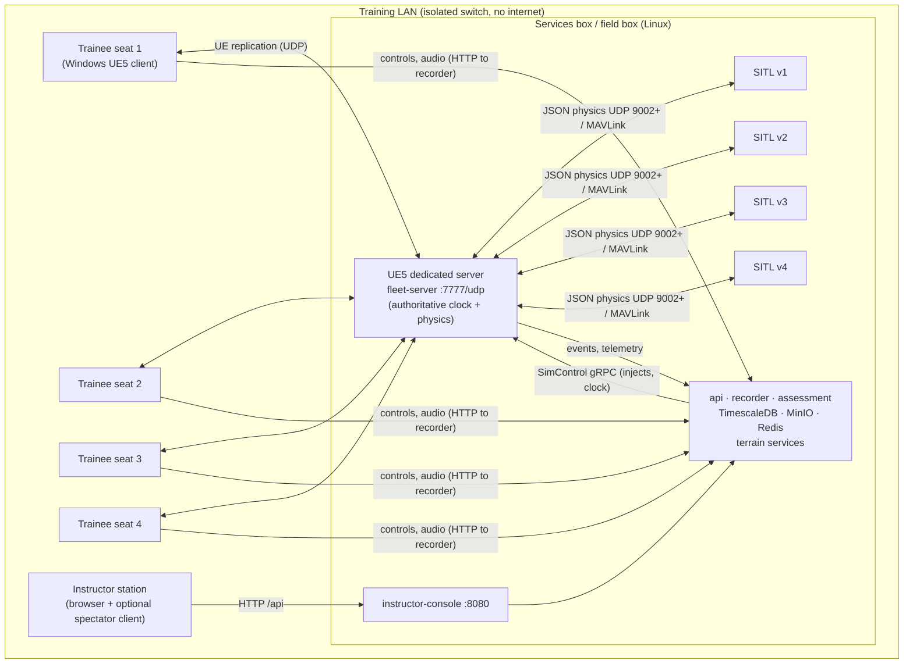
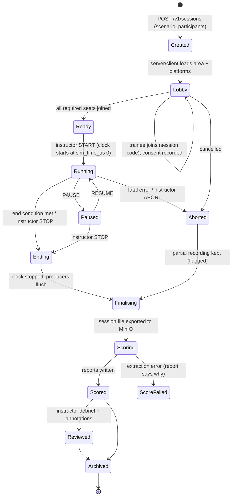

# 07 — Training Modes

> **Audience:** engineers building the trainee seats, the fleet server, the
> VR configuration, the instructor console and the maintainer module; and
> instructors who author scenarios.
> **Status:** scenario format and validation, catalogue endpoints and the
> console's catalogue pages are real in Phase 0. Every training mode itself
> is planned (Phases 1–6). See [Status (Phase 0)](#10-status-phase-0).

Related: [01 Vision and use cases](01_VISION_AND_USECASES.md),
[02 Architecture](02_ARCHITECTURE.md),
[03 Digital terrain twins](03_DIGITAL_TERRAIN_TWINS.md),
[04 Platform plugin spec](04_PLATFORM_PLUGIN_SPEC.md),
[06 Assessment engine](06_ASSESSMENT_ENGINE.md),
[ADR 0009 — React console](ADR/0009-react-typescript-console.md),
[ADR 0010 — replication / dedicated server](ADR/0010-ue5-replication-dedicated-server.md),
[ADR 0011 — OpenXR as configuration](ADR/0011-openxr-vr-as-configuration.md).

---

## 1. One core, several modes

Every mode uses the same UE5 world, the same platform plugins, the same
recorder and the same assessment engine. A mode is a **combination of
configuration**: session kind (`SessionKind` in `schemas/session.proto`),
network topology, display (desktop or VR), and the rubric applied.

| Mode | Session kind | Seats | Network | Display | Default rubric | Phase |
|---|---|---|---|---|---|---|
| Single-seat pilot | `pilot_single` | 1 trainee (+ optional instructor) | local (listen/standalone) | desktop | `precision_landing_v1` | 4 |
| Fleet | `pilot_fleet` | N trainees + 1 instructor | dedicated server on LAN | desktop or VR | `precision_landing_v1` (per trainee) | 5 |
| VR | any pilot/maintainer kind | 1 per headset | as above | OpenXR headset | as above | 5 |
| Mission rehearsal | `mission_rehearsal` | 1..N | as single-seat or fleet | desktop/VR | scenario-specific (to author) | 4–5 (needs Phase 2 terrain) |
| Maintainer (Fleet Focus) | `maintainer` | 1 (+ instructor) | local | desktop, later VR | `maintainer_procedure_v1` | 6 |
| SITL test / autonomy | `sitl_test` / `autonomy` | none (scripted) | headless | none | — | 1 / 7 ([05](05_SITL_INTEGRATION.md), [08](08_AUTONOMY_TRAINING.md)) |

## 2. Single-seat desktop

**What the trainee sees.** A windowed or full-screen UE5 client showing the
platform (initially the placeholder `cdpl_quad_01`) in an area
(`flat_test`, later `hyd_demo_01`), with a HUD (attitude, altitude AGL,
speed, battery, flight mode, active warnings) and the Chakravyuha Dynamics
logo placeholder.

**How it flies.** The vehicle is flown by unmodified ArduPilot SITL
([05](05_SITL_INTEGRATION.md), [ADR 0003](ADR/0003-ardupilot-sitl-json-physics.md));
UE5 owns physics at 400 Hz. The trainee's input device (RC transmitter over
USB, gamepad, or later VR controller; `ControlInput.device`) is mapped to
RC channel overrides sent to SITL over MAVLink. Mode switches map to
ArduPilot flight modes; the autopilot's confirmed mode is recorded as a
`mode.<NAME>` response.

**Session flow.** The instructor (or the trainee in self-study) picks a
scenario in the console → the API creates a session (Phase 4) → the client
loads the area and spawns the vehicle on the scenario's `spawn` pad → audio
consent prompt → the clock starts → scripted injects fire at `at_s` →
end conditions close the session → the recorder exports the session file →
the assessment engine scores it → report available in the console.

**Process layout.** The client, SITL container and services can all run on
one machine (developer laptop or field box, see
[09](09_DEPLOYMENT_OFFLINE.md)). The instructor console is a browser tab on
the same box or another LAN machine.

## 3. Fleet mode

Fleet training = **N trainee clients + 1 instructor + 1 dedicated server on
a LAN** ([ADR 0010](ADR/0010-ue5-replication-dedicated-server.md)). Phase 5
acceptance targets **4 clients**.

### 3.1 Topology



- **Dedicated server** (compose profile `multiplayer`, service
  `fleet-server`, UDP 7777; image produced from the `CDSimServer` target in
  Phase 5 — declared today but not buildable). It is authoritative for
  physics, the sim clock and all world events, runs one SITL container per
  vehicle, and has no renderer (`-nullrhi`), so camera sensors are not
  created on it.
- **Clients** render, capture input and audio, and send inputs to the
  server. They receive replicated state and the authoritative sim time
  (`ACDSimFleetGameState`, republished at ~10 Hz and interpolated —
  `sim/Source/CDSim/Net/CDSimFleetGameState.h`, UNVERIFIED BUILD).
- **Instructor** uses the console (browser) and optionally a spectator
  client to see every vehicle.

### 3.2 Joining by session code

The server generates a **6-character session code** (e.g. `K7QM3X`;
alphabet excludes look-alikes 0/O, 1/I/L; `CDSimSessionCode.h`). The
instructor reads it out or displays it; each trainee types it into the
client. Resolution is LAN-only: the client broadcasts a UDP beacon with the
code and the matching server answers with its address (Phase 5). No
matchmaking service, no internet.

### 3.3 Shared stimuli

A scenario inject with empty `targets` (or an instructor "broadcast" inject)
is applied by the server to every targeted vehicle **at the same physics
step**, producing one stimulus event per trainee with the same
`broadcast_id` and identical `sim_time_us`. This enables comparative
reaction-time analysis across the class
([06 §10](06_ASSESSMENT_ENGINE.md#10-fleet-comparative-analysis)).

### 3.4 Per-trainee recording and scoring

Each participant is a `Participant` in the `SessionManifest` (`actor_id`,
`role`, `vehicle_id`, `platform_id`, `audio_consent`). All events carry the
trainee/vehicle as `actor_id`; controls and audio are per trainee. The
engine scores each trainee separately against the session rubric and adds a
cohort comparison.

### 3.5 Bandwidth and latency (provisional estimates)

These are **engineering estimates, not measurements**; they must be measured
in Phase 5.

| Flow | Estimate per trainee | Notes |
|---|---|---|
| Replication server → client | tens of kB/s | pawn transforms + small state at ~30 Hz for N vehicles. |
| Client → server inputs | < 10 kB/s | stick axes at ≤ 100 Hz. |
| Audio client → recorder | ~ 3–4 kB/s | Opus voice at ~24–32 kbit/s. |
| Telemetry server → recorder | ~ 30–50 kB/s per vehicle | `VehicleState` at 50 Hz, JSON. |
| Camera frames | not networked | rendered locally on each client. |

A dedicated **gigabit switch** gives orders of magnitude headroom for 4–16
seats. Latency on a single switched LAN is sub-millisecond; UE replication
tolerates tens of ms, so LAN latency is not a concern. What matters for
fairness is that **timing metrics are stamped in sim time at the producer**
(the server for stimuli), so network jitter does not change a trainee's
measured reaction time. The residual error is the client's sim-time
estimate between server updates — to be measured in Phase 5 against the
20 ms budget of [06 §9.2](06_ASSESSMENT_ENGINE.md).

## 4. VR

VR is **a configuration, not a fork** ([ADR 0011](ADR/0011-openxr-vr-as-configuration.md)).

- The OpenXR plugin is enabled in `sim/CDSim.uproject` for every client
  build but stays **inactive on desktop**. XR is switched on at launch with
  `-vr` or the console variable `cdsim.XR.Enable=1`
  (`sim/Config/DefaultEngine.ini`, `sim/Config/DefaultGame.ini`). The
  `sim/Source/CDSim/XR/` module is reserved for the XR settings/pawn code
  (Phase 5).
- The same maps, pawns, platforms and recording run in both; only the
  camera rig, HUD presentation and input mapping differ.

**Comfort rules (design requirements).**

| Rule | Why |
|---|---|
| Hold the headset's native refresh rate; drop render quality before frame rate | Frame drops cause discomfort. |
| Seated experience; world-locked horizon option; no artificial camera roll for "chase" views | Vestibular mismatch. |
| Pilot view default = ground-station (first person on the ground watching the drone) — the real operator's view; FPV view optional with a comfort vignette | Matches real operation and is more comfortable. |
| Session length guidance ≤ 20–30 min with breaks | Fatigue (to be confirmed with instructors). |
| No sudden teleports during a scored segment | Would distort reaction timing. |

**Input mapping.**

| Input | Desktop | VR |
|---|---|---|
| Flight axes | RC transmitter (USB) or gamepad | Same physical RC transmitter (recommended), or tracked controller thumbsticks |
| Flight-mode switch | TX switch / gamepad buttons | TX switch / controller buttons |
| Menus, checklists | mouse/keyboard | laser pointer + trigger |
| Maintainer tool selection | mouse | hand/controller pick-up at anchors |
| Push-to-talk (optional) | key | controller button |

`ControlInput.device` records which device was used so reports compare like
with like.

## 5. Instructor station

The instructor station is the React + TypeScript console
(`apps/instructor-console`, served by nginx on :8080 with `/api` proxied to
the API service; [ADR 0009](ADR/0009-react-typescript-console.md)). Every
screen carries the Chakravyuha Dynamics logo placeholder.

| Function | What it does | Phase | Console today |
|---|---|---|---|
| System status | Aggregated health of every service (`/v1/system/health`) | 0 | **Live** |
| Catalogues | Platforms, areas, scenarios (read-only lists from the API) | 0 | **Live** |
| Scenario authoring | Create/edit scenario YAML with form + validation (schema + semantic checks), map picking of spawn/pads | 4 | Planned page |
| Session control | Create session, lobby (participants, consent, session code), start/pause/resume/stop, sim rate | 4 (single), 5 (fleet) | Planned (`/sessions`) |
| Injects | Fire failure modes (`platform.yaml` `failure_modes`), alarms, targets, weather changes; targeted or broadcast | 3 (pipeline), 4 (UI) | Planned |
| Live monitoring | Map + per-vehicle state, event feed from Redis `cdsim.session.<id>.events`, audio level meters | 4 | Planned (`/live`) |
| Annotations | Timestamped free-text notes with tags | 3 (events), 4 (UI) | Planned |
| Replay | Scrub a recorded session on sim time; re-render in the UE5 client | 1 (engine), 3/4 (UI) | Planned (`/replay`) |
| Scoring and reports | View metric table, evidence, PDF download | 3 (engine), 4 (UI) | Planned |
| Trainee records | Per-trainee history, trends, rubric versions | 4 | Planned (`/trainees`) |
| Fleet view | All vehicles, cohort comparison per `broadcast_id` | 5 | Planned (`/fleet`) |
| Maintainer view | Procedure progress, step timings | 6 | Planned (`/maintainer`) |

Planned pages already exist in the navigation (`apps/instructor-console/src/nav.ts`)
and render an honest "planned for Phase N" placeholder. The API returns 501
naming the phase for `/v1/sessions`, `/v1/sessions/{id}/replay`,
`/v1/sessions/{id}/score` and `/v1/trainees`.

## 6. Mission rehearsal on terrain twins

Mission rehearsal is pilot training on a **digital terrain twin of the real
area of operations** ([03](03_DIGITAL_TERRAIN_TWINS.md)).

- The area package (`terrain/areas/<id>/area.yaml` → built package) supplies
  elevation, imagery, mesh, named landing pads, targets, no-fly volumes and
  default weather.
- A rehearsal scenario uses `session_kind: mission_rehearsal`, the real
  `area_id`, the real platform, spawn at the planned launch pad, optional
  `mission_file` (the actual mission plan in QGC WPL format), and injects
  representing expected contingencies (GPS loss, wind, link loss).
- No-fly volumes become `geofence_breach` outcomes; targets become
  `target_appearance` stimuli; pads give landing outcomes.
- Restricted areas: `classification: restricted` packages must stay on
  accredited boxes; the area builder and bundle tooling honour it (Phase 2/8).
- Dependency: Phase 2 (terrain twins in UE5). Until then only `flat_test`
  (Phase 1) is usable. `hyd_demo_01` is a manifest only — it is not built.

## 7. Maintainer module (Fleet Focus)

Fleet Focus teaches maintainers on the **airframe twin**: the platform's
mesh with named sockets, driven entirely by `platform.yaml`
`maintenance` data ([04](04_PLATFORM_PLUGIN_SPEC.md)). Phase 6 builds it on
the placeholder airframe so the real CAD can be swapped in later without
code changes.

### 7.1 Three stages

| Stage | Trainee activity | Scored? |
|---|---|---|
| **Explore** | Walk around / orbit the twin, click a part → name, description, highlight; "find the part" quiz (e.g. "select Motor 2") | Optional quiz accuracy (future rubric) |
| **Rehearse** | Guided procedure: current step's instruction shown, anchor highlighted, trainee selects the tool and performs the action at the anchor; step timing recorded | Yes — `maintainer_procedure_v1` |
| **Improve** | After-action review from the assessment engine: step timeline vs expected durations, wrong tools, out-of-order steps, critical-step violations, comparison with previous attempts | Report only |

### 7.2 Data from `platform.yaml`

For `cdpl_quad_01`:

- **Parts** with anchors — `prop_m1..m4` → `SOCKET_Prop_M1..M4`,
  `motor_m2` → `SOCKET_Motor_M2`, `battery` → `SOCKET_Battery`, `gps_mast`
  → `offset_m: [0, 0, -0.08]` (FRD body offset when no socket exists).
- **Tools** — `hex_2_5`, `prop_wrench`, `multimeter`, `threadlock`.
- **Procedures** — `preflight_inspection` (5 steps), `propeller_replacement`
  (4), `motor_replacement` (6); each `ordered: true`; steps carry
  `instruction`, `part_id`, optional `tool_id`, `expected_duration_s`, and
  `critical`.

Anchors resolve to UE5 **sockets** on the platform's mesh
(`SOCKET_<Name>`), so when real CAD arrives the modeller adds sockets with
the same names and the procedures work unchanged; `offset_m` is a fallback
for parts without a socket.

### 7.3 Interaction and events

| Trainee action | Event emitted |
|---|---|
| Step becomes active and trainee starts it (focuses the step's part) | `outcome.procedure_step{result: STARTED}` |
| Tool picked from the tool tray | `response{kind: MENU_ACTION, code: "menu.tool.<tool_id>"}` |
| Correct action at the anchor with the correct tool (or no tool required) | `procedure_step{result: COMPLETED, tool_id}` |
| Action with the wrong tool, or at the wrong part | `procedure_step{result: FAILED, failure_reason: "wrong_tool" / "wrong_part"}` — the trainee may retry |
| Trainee moves on without completing, or instructor skips | `procedure_step{result: SKIPPED}` |
| Critical step done out of order (e.g. working on a prop with battery connected) | `FAILED` with `failure_reason: "critical_order"` and a `stimulus{kind: ALARM}` safety warning |

Step timing = `COMPLETED` − latest `STARTED` (see
[06 §6.6](06_ASSESSMENT_ENGINE.md)).

### 7.4 Maintainer rubric

`services/assessment/rubrics/maintainer_procedure_v1.yaml`: pass threshold
0.75; `adherence` (`procedure_adherence`, weight 0.6, **critical**, bands
complete ≥ 1.0 → 1.0, minor_deviation ≥ 0.85 → 0.7, else fail) and
`step_time` (`procedure_step_time_s` normalised by expected duration,
weight 0.4, on_time ≤ 1.2 → 1.0, slow ≤ 2.0 → 0.6, else very_slow 0.2).
Worked example in [06 §7.5](06_ASSESSMENT_ENGINE.md#75-worked-scoring-example-precision_landing_v1).
Thresholds are placeholders pending instructor calibration.

## 8. Scenario format

Scenarios are YAML files in `scenarios/`, validated by
`schemas/json/scenario.schema.json` and by
`cdsim_common.manifests.scenario_semantic_errors` (area exists, rubric
exists, platform exists, spawn pad exists in the area, inject failure codes
exist in the platform) — run with `make schemas`, served by
`GET /v1/scenarios` and `GET /v1/scenarios/{id}`.

### 8.1 Fields

| Field | Req. | Type / values | Meaning |
|---|---|---|---|
| `schema_version` | yes | `1` | Format version. |
| `id` | yes | `^[a-z][a-z0-9_]*$` | Stable id; equals the file name stem by convention. |
| `name` | yes | string | Human name. |
| `version` | yes | SemVer | Bump on any change; recorded in the session. |
| `description` | no | string | Briefing text. |
| `session_kind` | yes | `sitl_test`, `autonomy`, `pilot_single`, `pilot_fleet`, `mission_rehearsal`, `maintainer` | Selects mode and valid rubrics. |
| `area_id` | yes | area id | `terrain/areas/<id>`. |
| `rubric_id` | no | rubric id | Default rubric for scoring. |
| `random_seed` | no | integer ≥ 0 | Seed for every random source; replay reuses it. |
| `sim_rate` | no | 0.1–10 | Clock scale (1.0 = real time). |
| `weather_override` | no | object | Overrides area `weather` keys (e.g. `wind_speed_mps`). |
| `vehicles[]` | yes (≥ 1) | | |
| `vehicles[].vehicle_id` | yes | string | Id used as `actor_id`/`vehicle_id`. |
| `vehicles[].platform_id` | yes | platform id | `platforms/<id>`. |
| `vehicles[].spawn` | yes | `pad_id` **or** `lat_deg`+`lon_deg`; optional `alt_agl_m` (default 0), `heading_deg` | Start pose. |
| `vehicles[].mission_file` | no | path | QGC WPL mission for SITL/auto flights. |
| `injects[]` | no | | Scripted stimuli. |
| `injects[].at_s` | yes | ≥ 0 | Sim seconds from session start. |
| `injects[].kind` | yes | `instructor_inject`, `system_failure`, `target_appearance`, `alarm` | Stimulus kind. |
| `injects[].code` | yes | string | For `system_failure`, a `failure_modes[].id` of the platform. |
| `injects[].description` | no | string | Shown to instructor / in report. |
| `injects[].targets` | no | vehicle ids | Empty/absent = **broadcast** to all vehicles (fleet: shared `broadcast_id`). |
| `injects[].expected_response_codes` | no | strings | Correct responses for decision latency. |
| `injects[].params` | no | object | Copied to `Stimulus.params` (values stringified). |
| `end_conditions` | yes | object | Any condition ends the session. |
| `end_conditions.max_duration_s` | no | > 0 | Hard time limit (sim seconds). |
| `end_conditions.on_all_landed` | no | bool | End when every vehicle has landed and disarmed. |
| `end_conditions.on_collision` | no | bool | End on any `collision` outcome. |

### 8.2 Examples

`scenarios/landing_motor_failure_01.yaml` (pilot, single seat):

```yaml
schema_version: 1
id: landing_motor_failure_01
name: Precision landing with degraded motor
version: 1.0.0
session_kind: pilot_single
area_id: hyd_demo_01
rubric_id: precision_landing_v1
random_seed: 42
sim_rate: 1.0
vehicles:
  - vehicle_id: v1
    platform_id: cdpl_quad_01
    spawn: {pad_id: pad_alpha, heading_deg: 0}
injects:
  - at_s: 60
    kind: system_failure
    code: motor_m1_degraded
    description: Motor 1 degraded to 60% thrust.
    expected_response_codes: [mode.LAND, mode.ALT_HOLD, voice.onset]
end_conditions: {max_duration_s: 600, on_all_landed: true, on_collision: true}
```

The trainee transits Pad Alpha → Pad Bravo; at T+60 s motor 1 ramps to 60%
thrust over 1 s; they should call it, stabilise and land on Pad Bravo.
Needs `hyd_demo_01` built (Phase 2).

`scenarios/sitl_core_loop.yaml` (Phase 1 acceptance): `sitl_test` on
`flat_test`, seed 1, vehicle spawned on `pad_home` with
`mission_file: scenarios/missions/core_loop.waypoints` (take off to 10 m,
fly ~50 m north, land), `max_duration_s: 300`, `on_all_landed: true`, no
injects and no rubric.

A fleet variant would set `session_kind: pilot_fleet`, list `v1..v4`, and
leave `targets` empty on the failure inject so all four receive it at the
same sim time.

## 9. Session lifecycle



Notes: sim time does not advance in `Paused`; pausing is itself recorded.
`Aborted` sessions keep their partial recording, flagged, and are not
scored by default. Audio retention (`audio_retention_days`) is applied from
`Finalising` onwards ([06 §11](06_ASSESSMENT_ENGINE.md#11-audio-consent-and-retention)).
In Phase 0 none of these states exists in code yet: session creation is
Phase 4 (the Phase 1 core loop starts sessions from the command line).

## 10. Status (Phase 0)

| Item | Status |
|---|---|
| Scenario JSON Schema + semantic validation; two example scenarios validate in `make schemas` | Implemented, tested. |
| `GET /v1/scenarios`, `/v1/platforms`, `/v1/areas`, `/v1/rubrics` and console catalogue pages | Implemented, tested. |
| Console planned pages (sessions, live, replay, trainees, fleet, maintainer) | Placeholders naming their phase. |
| Session lifecycle, session creation API | Not implemented (API returns 501; Phase 4, listing Phase 1). |
| Single-seat desktop flying | Phase 1 (core loop), Phase 4 (training mode). UE5 source is **UNVERIFIED BUILD**. |
| Fleet mode (server, session-code join, shared stimuli) | Phase 5. Session-code generation/validation and replicated game state written in C++, never compiled. Compose `fleet-server` is a placeholder with no image. |
| VR configuration | Phase 5. OpenXR plugin enabled but inactive; `XR/` module empty. |
| Mission rehearsal | Needs Phase 2 terrain; `hyd_demo_01` not built. |
| Maintainer module | Phase 6. Procedure data exists in `platform.yaml` and is validated. |
| Bandwidth/latency figures | Estimates only, not measured. |
