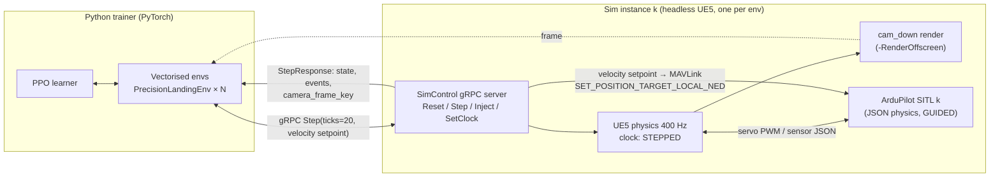
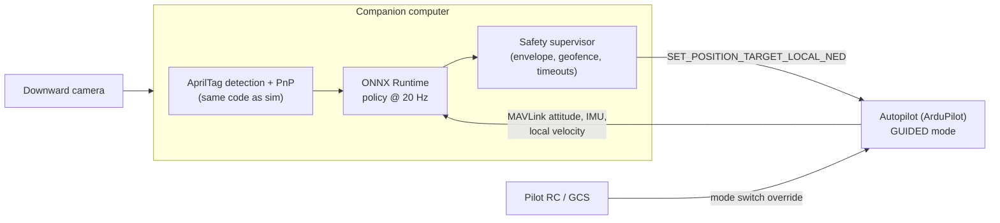

# 08 — Autonomy Training

> **Audience:** engineers building the RL harness, dataset generation and
> the onboard policy path.
> **Status:** the precision-landing reward, touchdown classification, action
> clipping, curriculum and environment configuration are implemented and
> unit-tested (Phase 0). The simulator connection, training, export and
> multi-instance runs are **Phase 7**. See [Status (Phase 0)](#16-status-phase-0).

Related: [02 Architecture](02_ARCHITECTURE.md),
[05 SITL integration](05_SITL_INTEGRATION.md),
[06 Assessment engine](06_ASSESSMENT_ENGINE.md),
[ADR 0012 — gym env, gRPC, PyTorch, ONNX](ADR/0012-rl-gym-env-grpc-pytorch-onnx.md),
[ADR 0015 — unified sim time base](ADR/0015-unified-sim-time-base.md),
[ADR 0003 — ArduPilot SITL JSON physics](ADR/0003-ardupilot-sitl-json-physics.md).

Code: `services/rl/src/cdsim_rl/landing.py` (task maths),
`services/rl/src/cdsim_rl/env.py` (environment), `services/rl/tests/test_landing.py`,
`schemas/control.proto` (`SimControl`).

---

## 1. Goals

1. **Teach a drone a precise action in simulation** — first task:
   **precision landing** on a marked pad, static then moving, in calm then
   windy conditions.
2. **Export the learned policy to ONNX** and document how it runs onboard a
   real vehicle, commanding the unmodified autopilot.
3. **Generate labelled data** (images with ground-truth pad pose, state,
   outcomes) and run scripted **scenario sweeps** for perception and
   controller development.
4. Do it **reproducibly** (seeded, versioned, with model cards) and
   **offline** (no internet at run time; training data and models stay on
   the box).

Non-goals for Phase 7: end-to-end flight certification of a learned policy;
any claim that a policy is fit to fly a real vehicle. A learned policy is an
engineering artefact to be evaluated by CDPL's flight-test process.

## 2. Architecture



## 3. Gym-style environment API

`PrecisionLandingEnv` follows the Gymnasium `Env` contract without importing
Gymnasium yet (Phase 0 stays dependency-free):

```python
class PrecisionLandingEnv:
    def __init__(self, config: EnvConfig | None = None) -> None: ...
    def reset(self, seed: int | None = None,
              options: dict[str, Any] | None = None
              ) -> tuple[LandingObs, dict[str, Any]]: ...
    def step(self, action: tuple[float, float, float, float]
             ) -> tuple[LandingObs, float, bool, bool, dict[str, Any]]:
        # returns (obs, reward, terminated, truncated, info)
    def close(self) -> None: ...
```

`EnvConfig` (frozen dataclass) defaults:

| Field | Default | Meaning |
|---|---|---|
| `sim_endpoint` | `localhost:50051` | gRPC `SimControl` address of this env's sim instance. |
| `scenario_id` | `rl_precision_landing` | Scenario the sim loads on `Reset` (to be authored in Phase 7). |
| `area_id` | `flat_test` | Area. |
| `pad_id` | `pad_target` | Target pad (AprilTag id 1, 2 m, 50 m north of `pad_home`). |
| `control_hz` | 20.0 | Policy rate. |
| `physics_ticks_per_step` | 20 | 400 Hz / 20 Hz. **Validated:** `physics_ticks_per_step × control_hz` must equal 400. |
| `max_episode_s` | 60.0 | Truncation (1200 steps). |
| `curriculum_stage` | 0 | Index into `CURRICULUM`; validated in range. |
| `reward` | `RewardWeights()` | §7. |

In Phase 0, construction and validation work; `reset`/`step` raise
`NotImplementedError("Phase 7 …")` (tested).

## 4. gRPC `SimControl` lock-step

`schemas/control.proto` defines `service SimControl`:

| RPC | Use in RL |
|---|---|
| `SetClock(ClockCommand)` | Put the instance in stepped mode; `sim_rate` (0.1–10) is used only for real-time-paced runs. |
| `Reset(ResetRequest{session_id, scenario_id, random_seed, params})` | New episode: reload scenario, re-seed every random source, apply curriculum/randomisation `params` (e.g. `wind_mps: "4"`, `pad_motion: "linear"`). Returns `initial_state`. |
| `Step(StepRequest{session_id, ticks, vehicle_id, velocity_setpoint_mps, yaw_rate_radps})` | Apply the action and advance exactly `ticks` physics steps (20 × 2500 µs = 50 ms sim time); return `StepResponse{state, events, camera_frame_key}`. |
| `Inject(Event)` | Disturbances during an episode (gust, sensor fault) for robustness training. |
| `StreamState` | Not used in lock-step; used for monitoring. |

**Lock-step semantics.** The UE5 clock (`UCDSimClockSubsystem`, Stepped
mode) advances **only** on `Step`; the SITL process is paced by the JSON
physics exchange, so autopilot and physics stay in lock-step whatever the
wall-clock speed. Throughput is "as fast as the machine can compute", not a
fixed multiple of real time. Episode events (touchdown, collision,
geofence) arrive in `StepResponse.events` and are also recorded like any
other session (`SessionKind.AUTONOMY`), so the assessment engine can score
RL episodes too.

## 5. Observation

The origin brief specifies: downward camera + IMU + estimated pad pose.

| Key | Shape / dtype | Source | Notes |
|---|---|---|---|
| `image` | `(1, 96, 128)` uint8 (grayscale), proposed | `cam_down`: 640×480, 30 Hz, hfov 78°, mounted looking down (`platform.yaml`) | Latest rendered frame at the step boundary, downsampled for the policy. Full-resolution frames are kept only for datasets (§12). Final size is a Phase 7 tuning decision. |
| `imu` | `(6,)` float32 | `imu0` (400 Hz): specific force (3) + body rates (3) | Mean over the 20 physics ticks of the step (with the platform's noise model). |
| `state` | `(10,)` float32 | `LandingObs` | `rel_pad_enu_m` (3), `vel_enu_mps` (3), `roll_rad`, `pitch_rad`, `yaw_rate_radps`, `pad_visible` (0/1). |

`LandingObs` (in `landing.py`) is the low-dimensional part; the camera frame
is carried separately (`StepResponse.camera_frame_key`).

### 5.1 Pad pose estimation (AprilTag)

In `area.yaml`, pads declare `marker` (`apriltag`, `aruco`, `h`, `none`),
`marker_id`, `size_m` and `heading_deg`. In `flat_test`, `pad_home` is
AprilTag id 0 and `pad_target` is AprilTag id 1, both 2.0 m.

Estimation pipeline (runs in the env wrapper in sim, and identically
onboard):

1. Detect AprilTags in the frame with the open-source AprilTag detector;
   keep detections whose id = target pad's `marker_id`.
2. Solve PnP for the tag's four corners using the camera intrinsics from
   `platform.yaml`: `fx = fy = (width/2) / tan(hfov/2)` = 320 / tan 39° ≈
   **395.2 px**, principal point (320, 240), plus the lens model once
   distortion is added (Phase 7).
3. Rotate camera-frame pose to body (mount `rotation_deg: [0, -90, 0]`),
   then to ENU with the vehicle attitude → `rel_pad_enu_m`.
4. If not detected: `pad_visible = 0`; hold the last estimate propagated by
   the vehicle's own velocity for up to 1 s, then zero it.

Visibility check: the ground footprint width is `2 h tan 39° ≈ 1.62 h`. A
tag 1.6 m across seen from 20 m covers 1.6 / 32.4 × 640 ≈ **32 px** —
detectable; from 50 m ≈ 13 px — marginal. Episodes therefore start ≤ 20–25
m above the pad and within the camera footprint in early stages.

Open item: the area schema declares the pad size but not the printed tag
edge length or tag family; Phase 7 must add these (proposed: tag family
36h11, tag edge = 0.8 × `size_m`) — see [10 Roadmap open questions](10_ROADMAP.md#open-questions-and-decisions-needed).

**Privileged vs estimated state.** The *observation* uses the estimated pad
pose (what the real vehicle would have). The *reward* and termination use
**ground-truth** pad-relative state from the sim, so the agent cannot earn
reward by fooling its own estimator. Training may start with ground-truth
observations (stage 0 warm-up) and switch to estimates; the evaluation
protocol (§13) always uses estimates.

## 6. Action

`action = (vx, vy, vz, yaw_rate)` — velocity setpoint in **ENU** (m/s) plus
yaw rate (rad/s), clipped by `clip_action` to `ACTION_LIMITS = (2.0, 2.0,
1.5, 0.5)`: |vx|, |vy| ≤ 2 m/s, |vz| ≤ 1.5 m/s, |yaw rate| ≤ 0.5 rad/s.
Tested: `clip_action((5, -5, 5, -5)) == (2.0, -2.0, 1.5, -0.5)`.

Delivery to the autopilot: in **GUIDED** mode, as MAVLink
`SET_POSITION_TARGET_LOCAL_NED` at 20 Hz, `coordinate_frame =
MAV_FRAME_LOCAL_NED`, `type_mask = 0x05C7` (1479: ignore position,
acceleration and yaw; use velocity and yaw rate). ENU → NED conversion:
`vx_N = vy_ENU`, `vy_E = vx_ENU`, `vz_D = −vz_ENU`. ArduCopter stops the
vehicle if velocity setpoints stop arriving for a few seconds, which is a
useful safety property onboard; 20 Hz is far above that. In lock-step the
sim/bridge forwards `StepRequest.velocity_setpoint_mps` over the SITL's
MAVLink port; onboard, the companion computer sends the same message.

The policy never outputs motor commands: the autopilot keeps attitude
control, failsafes and geofence. This is what makes the sim-to-real path
tractable.

## 7. Reward shaping

From `landing.py` (`RewardWeights` defaults):

```
per step:
  r = − w_radial   · radial_error_m                              (w_radial   = 1.0)
      − w_descent  · max(0, descent_rate_mps − safe_descent_mps)  (w_descent  = 2.0, safe = 0.7 m/s)
      − w_attitude · tilt_rad                                     (w_attitude = 0.5)
      − w_time                                                    (w_time     = 0.01)
  radial_error_m   = hypot(dx, dy) of rel_pad_enu_m
  descent_rate_mps = max(0, −vel_enu_mps.z)
  tilt_rad         = hypot(roll_rad, pitch_rad)

terminal (terminal_reward):
  SUCCESS                 +100  (success_bonus)
  CRASH, HARD_LANDING     −100  (crash_penalty)
  OFF_PAD                 −25   (0.25 × crash_penalty)
  TIMEOUT / NONE          0
```

**Worked example.** Pad offset (0.6, 0.8) m → radial 1.0 → −1.0; descending
at 1.2 m/s → −2.0 × (1.2 − 0.7) = −1.0; roll 0.1 rad, pitch 0 → −0.5 × 0.1
= −0.05; time −0.01. Step reward = **−2.06**. Descending at 0.5 m/s adds no
penalty (tested). Over a 60 s episode (1200 steps) the time term alone is
−12, so a quick clean landing (+100) dominates.

Rationale: the radial term pulls the vehicle over the pad at all times;
the descent term only penalises descending faster than 0.7 m/s so the agent
is free to descend; tilt is penalised to discourage aggressive manoeuvres
that would not transfer; the time term breaks ties in favour of landing.

## 8. Termination

| Condition | Classification | Gymnasium flag | Terminal reward |
|---|---|---|---|
| Touchdown with vertical speed > 1.0 m/s **or** tilt > 10° | `HARD_LANDING` (checked first) | terminated | −100 |
| Touchdown gentle and level but radial error > pad radius (`size_m / 2` = 1.0 m for 2 m pads) | `OFF_PAD` | terminated | −25 |
| Touchdown gentle, level, within pad radius | `SUCCESS` | terminated | +100 |
| `collision` outcome, or leaving the arena (geofence / > 50 m horizontal from the pad, proposed) | `CRASH` | terminated | −100 |
| `max_episode_s` (60 s) reached | `TIMEOUT` | **truncated** | 0 |

`classify_touchdown(td, pad_radius_m, max_vspeed_mps=1.0, max_tilt_deg=10.0)`
is tested for success, hard landing and off-pad. These limits match the
`precision_landing_v1` rubric's fail bands (radial > 1.0 m, vertical speed
> 1.0 m/s), so an RL "success" is also a rubric pass on the landing metrics.

## 9. Curriculum

From `CURRICULUM` in `landing.py`; `next_stage` promotes one stage when the
rolling success rate reaches the stage's bar (never past the last stage).

| # | Name | Wind (m/s) | Gust (m/s) | Pad motion | Pad speed (m/s) | Promote at success rate |
|---|---|---|---|---|---|---|
| 0 | `static_calm` | 0.0 | 0.0 | static | 0.0 | 0.90 |
| 1 | `static_wind` | 4.0 | 2.0 | static | 0.0 | 0.85 |
| 2 | `moving_linear` | 3.0 | 1.0 | linear | 1.0 | 0.80 |
| 3 | `moving_circular_wind` | 5.0 | 3.0 | circular | 1.5 | 0.75 |

"Rolling success rate" = successes over the last 200 episodes (proposed
window) across all workers. Stage parameters are passed to `Reset` as
`params`. A moving pad is a pad actor moving along a line or circle in the
scenario; its velocity is part of the ground truth but **not** of the
observation (the agent must infer it from successive pad estimates).

## 10. Domain randomisation plan

Randomised per episode from the seeded RNG (values provisional, tuned in Phase 7):

| Factor | Range | Why |
|---|---|---|
| Start position | 5–20 m above pad, ±8 m horizontal (pad in view) | Generalise approach. |
| Start velocity / yaw | ±1 m/s, yaw 0–360° | Avoid memorising one approach. |
| Wind speed/direction, gusts, turbulence | stage value ±30%, direction uniform | Wind robustness. |
| Mass, inertia | ±10% | Payload/battery variation. |
| Motor thrust scale, time constant | ±5% per motor | Motor wear; maps to `failure_modes` `actuator_scale`. |
| IMU noise/bias, camera exposure, blur, noise | ±50% of platform noise; exposure ±1 EV | Sensor sim-to-real. |
| Lighting / time of day, sun angle, shadows over pad | 07:00–17:00 | Vision robustness. |
| Pad texture wear, partial occlusion, ground texture | several variants | Detector robustness. |
| Latency: action applied 0–2 steps late | 0–100 ms | Onboard compute/link delay. |
| Camera intrinsics / mount angle | ±2%, ±2° | Calibration error. |

## 11. Headless multi-instance runs

- One **UE5 instance per environment**, each with its own SITL container
  (instance index `-I k`, MAVLink TCP 5760 + 10·k, JSON physics port per
  instance — [05](05_SITL_INTEGRATION.md)) and its own gRPC port (50051 + k).
- Launch the client headless with **`-RenderOffscreen`**: no window, but the
  renderer is alive, so `cam_down` scene captures work. Add `-nosound`,
  `-unattended`.
- **`-nullrhi` disables rendering entirely** — camera frames are then
  unavailable (the down-camera component is not created without a
  renderer). Use `-nullrhi` only for state-only experiments (ground-truth
  pad pose observation) or the dedicated server. This is the key caveat:
  vision-based training needs a GPU per few instances.
- Speed: in lock-step the instance runs as fast as physics + render + SITL
  allow; "N× real time" is the measured ratio of sim time to wall time,
  logged per run. Render cost is bounded by rendering the camera only at the
  step rate (20 Hz) rather than every frame.
- Compose profile `rl` (`rl-worker`) is the placeholder for training workers;
  today its entry point exits with a "Phase 7" message (exit code 3).
- Instance count per machine is limited by GPU memory and CPU cores
  (one SITL process per instance); provisional sizing in
  [09](09_DEPLOYMENT_OFFLINE.md).

## 12. Data generation for labelled datasets

The same machinery produces datasets without training:

- **Sweeps:** a scenario × parameter grid (weather, time of day, altitude,
  pad marker, platform) run with a scripted controller (e.g. descend over the
  pad along a jittered path) or with SITL missions.
- **Per frame:** full-resolution image (PNG, lossless), camera intrinsics and
  extrinsics, vehicle state, **ground-truth** pad pose and 2D corner
  projections, AprilTag id, visibility/occlusion fraction, weather and
  lighting parameters, `sim_time_us`, seed.
- **Layout:** in MinIO under a dataset prefix with a manifest (dataset id,
  generator version, scenario versions, seeds, counts, licence of any
  source imagery used by the area) and train/val/test splits by **seed**
  (never by frame, to avoid leakage between neighbouring frames).
- Areas built from open data carry their licences; datasets inherit the
  attribution requirements ([03](03_DIGITAL_TERRAIN_TWINS.md)).

## 13. Training loop and evaluation protocol

**Training (suggested, Phase 7):** PyTorch, **PPO** with a small CNN encoder
for the image and an MLP for `imu` + `state`, concatenated into shared
actor–critic heads; Gaussian policy over the 4-D action, `tanh`-squashed to
`ACTION_LIMITS`. N vectorised envs (e.g. 8–32), rollouts of 256–1024 steps
per env, GAE(λ=0.95), γ = 0.99, clip 0.2 (standard starting values, to tune).
Curriculum promotion checked after every rollout. Checkpoints and metrics to
local storage/MinIO; no online experiment trackers.

**Evaluation protocol (per checkpoint and before any export):**

1. Deterministic policy (mean action), **estimated** pad pose.
2. Fixed held-out seed set per curriculum stage (e.g. 200 episodes,
   seeds 10 000–10 199), never used in training.
3. Report per stage: success rate, hard-landing rate, off-pad rate, crash
   rate, timeout rate; radial error median / p95; touchdown vertical speed
   median / p95; tilt at touchdown; time to land.
4. Score each episode's landing metrics with the assessment engine.
   `precision_landing_v1` lists `autonomy` in `applies_to`, but its
   reaction/decision/comms metrics are not measurable for a policy and would
   score as "not measured" (0, fail). Phase 7 adds a dedicated
   `autonomy_landing_v1` rubric with only landing metrics.
5. Robustness sweeps outside the training ranges (stronger wind, darker
   lighting, sensor dropout via `Inject`) reported separately.
6. A checkpoint is exportable only if it meets thresholds agreed with the
   flight-test team (to be defined; none exist yet).

## 14. ONNX export and onboard deployment path

**Export.** `torch.onnx.export` of the **actor only** (deterministic mean
action, including the `tanh` squashing and scaling to `ACTION_LIMITS`), with
fixed input names/shapes (`image`, `imu`, `state`) and opset pinned. Verify
by running the ONNX model with ONNX Runtime on the evaluation set and
checking outputs match PyTorch within tolerance (e.g. 1e-4) and success
rate is unchanged. Store with a **model card** (§15).

**Onboard path (how it would run on a real vehicle — design, not yet built
or flown):**



- The companion computer runs ONNX Runtime (CPU is sufficient for a small
  CNN at 20 Hz; an accelerator is optional) and talks MAVLink to the
  autopilot over serial/UDP.
- **Safety envelope** (supervisor, independent of the policy): engage only
  in GUIDED, only below a set altitude and within a set radius of the pad;
  clamp setpoints to `ACTION_LIMITS` (and tighter for first flights); abort
  to LOITER/LAND if the pad is lost for > 1 s, if attitude or descent-rate
  limits are exceeded, if the policy misses its deadline, or on pilot mode
  change. The autopilot's own geofence and failsafes remain active; the
  pilot can always take over with the mode switch.
- **Sim-to-real gap mitigations:** domain randomisation (§10); identical
  detection/estimation code in sim and onboard; latency randomisation;
  calibrated camera intrinsics and mount; platform parameters from real
  measurements once CAD and test data arrive ([04](04_PLATFORM_PLUGIN_SPEC.md));
  staged testing — SITL replay of real logs → hardware-in-the-loop → tethered
  / low-altitude flights → full envelope, each under CDPL's flight-test
  procedures.

## 15. Reproducibility

- **Seeds:** one `random_seed` per episode passed to `Reset` drives every
  random source in the sim (weather, randomisation, sensor noise); the
  trainer seeds PyTorch/NumPy; worker *k* uses `base_seed + k`. Seeds are
  recorded in each episode's `SessionManifest`.
- **Config:** every run writes its full config (EnvConfig, reward weights,
  curriculum, PPO hyper-parameters, randomisation ranges) as YAML next to
  the checkpoints, plus git SHA, `sim_build_id`, `autopilot_build_id`,
  platform and area versions.
- **Determinism caveat:** lock-step makes the *sim* reproducible for a given
  seed and build; GPU training itself is not bit-reproducible unless
  deterministic kernels are forced (slower). Evaluation results, not
  weights, are the reproducibility target.
- **Model card** (stored with every exported ONNX file): task, intended use
  and **out-of-scope uses**, platform and autopilot versions, training data
  (scenarios, areas, seeds, curriculum reached), evaluation results per
  stage and robustness sweep, known failure cases, input/output spec and
  units, safety-supervisor requirements, export verification result,
  licence/attribution of data used, and an explicit statement that it has
  not been flight-validated until the flight-test record says otherwise.

## 16. Status (Phase 0)

| Item | Status |
|---|---|
| Reward (`step_reward`), touchdown classification, terminal reward, action clipping, curriculum and promotion (`landing.py`) | Implemented, unit-tested. |
| `EnvConfig` validation (400 Hz invariant, stage range) | Implemented, unit-tested. |
| `PrecisionLandingEnv.reset/step` | Raise `NotImplementedError` — Phase 7 (tested). |
| `SimControl` gRPC contract (`control.proto`) | Defined and compiled; no server or client implementation. |
| UE5 Stepped clock, down camera component | C++ written, **UNVERIFIED BUILD**; camera read-back is TODO(Phase 7). |
| Pad pose estimation, domain randomisation, headless launcher, PPO training, dataset generator, ONNX export, onboard supervisor | Phase 7 — not started. |
| `python -m cdsim_rl`, compose `rl-worker` | Exit with a "Phase 7" message. |

No policy has been trained; no results exist.
