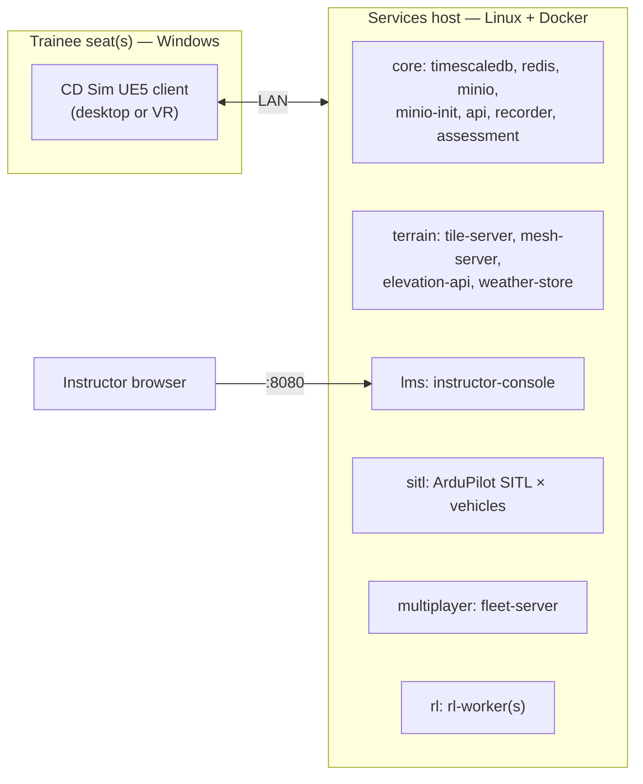

# 09 — Deployment and Offline Operation

> **Audience:** engineers who build, install, update and harden CD Sim boxes;
> anyone who needs to build images behind a restrictive network.
> **Status:** Docker Compose profiles with health checks are real and were
> brought up healthy in Phase 0. Installers, the air-gap bundle and field-box
> hardware selection are **Phase 8**; `make package` and `make deploy-box`
> currently exit non-zero. See [Status (Phase 0)](#13-status-phase-0).

Related: [02 Architecture](02_ARCHITECTURE.md),
[03 Digital terrain twins](03_DIGITAL_TERRAIN_TWINS.md),
[BUILDING_UE5](BUILDING_UE5.md), [ONBOARDING](ONBOARDING.md),
[ADR 0014 — compose profiles and air-gap bundle](ADR/0014-compose-profiles-and-air-gap-bundle.md),
[ADR 0004 — offline terrain twins in Docker](ADR/0004-offline-terrain-twins-in-docker.md),
[ADR 0006](ADR/0006-postgresql-timescaledb.md),
[ADR 0007](ADR/0007-minio-object-storage.md),
[ADR 0008](ADR/0008-redis-live-pubsub.md).

---

## 1. Principles

- **Offline-first.** Nothing needs the internet at run time. Internet is
  allowed only at *build* time (pulling base images, pip/npm packages, the
  ArduPilot source, open terrain data). A deployed box works air-gapped.
- **Phone-home disabled.** TimescaleDB telemetry (`TIMESCALEDB_TELEMETRY:
  off`) and MinIO update checks (`MINIO_UPDATE: off`) are switched off in
  `docker-compose.yml`; the UE5 client must not contact any online service.
- **One artefact per release.** A field box is installed and updated only
  from a self-contained, checksummed bundle.
- **Same compose file everywhere.** Developer laptop, lab server and field
  box use `docker-compose.yml` profiles; only `.env` and the image source
  (build vs. bundle) differ.

## 2. Deployment targets

| Target | Purpose | Typical sessions |
|---|---|---|
| **Developer laptop** | Build, test, run `make dev`; single-seat client; one SITL | 1 seat |
| **Lab server** | Shared services for a training room or engineering lab; fleet dedicated server; RL workers; area builds | 4–16 seats, RL batch runs |
| **Ruggedised field box** | Deployable, air-gapped training kit: services + dedicated server (+ optionally one seat) plus trainee laptops on a private switch | 1–4 seats (provisional) |

## 3. What runs where



| Component | OS | Packaging | Compose profile |
|---|---|---|---|
| UE5 client (trainee seat) | Windows | Windows installer (Phase 8) | — |
| UE5 dedicated server | Linux | container image | `multiplayer` (Phase 5) |
| Headless UE5 for RL | Linux (GPU) | container image or native | `rl` (Phase 7) |
| API, recorder, assessment, TimescaleDB, Redis, MinIO | Linux | container images | `core` |
| Terrain services | Linux | container image | `terrain` |
| Instructor console | Linux (served), any browser | container image (nginx) | `lms` |
| ArduPilot SITL | Linux | container image (one per vehicle) | `sitl` |

On a developer laptop, Windows hosts run the services in Docker Desktop's
Linux VM or WSL2; Linux hosts run everything natively. `make dev` starts
`core + terrain + lms`; `sitl`, `multiplayer` and `rl` are opt-in.

## 4. Recommended hardware — PROVISIONAL

> **PROVISIONAL.** These are starting recommendations derived from Unreal
> Engine 5 and service requirements, **not** validated on real CD Sim
> workloads (no UE5 build of CD Sim has been run yet). They will be
> measured and replaced in **Phase 8** with a field-box hardware spec. No
> specific products or vendors are recommended here.

| Item | Developer laptop | Lab server | Ruggedised field box | Trainee seat (fleet) |
|---|---|---|---|---|
| CPU | 8+ cores, modern x86-64 | 24–32+ cores (SITL instances, RL, builds) | 12–16 cores | 8 cores |
| RAM | 32 GB (64 GB for UE5 editor + C++ builds) | 128–256 GB | 64 GB | 32 GB |
| GPU | Discrete, ≥ 8 GB VRAM, DirectX 12 / Vulkan capable (UE5 SM6) | 1–2 discrete GPUs ≥ 16–24 GB VRAM for headless RL rendering; none needed for services only | Discrete, ≥ 12 GB VRAM if it also hosts a seat or RL | Discrete, ≥ 8 GB VRAM; VR seats: headset vendor's recommended class or better |
| Storage | 1 TB NVMe (engine + DDC ~200+ GB) | 2–4 TB NVMe (DB, MinIO) + bulk storage for datasets/backups | 2 TB NVMe, encrypted | 500 GB NVMe |
| Network | 1 GbE | 2 × 1 GbE or 10 GbE | 2 × 1 GbE (training LAN + optional admin port) | 1 GbE wired (no Wi-Fi for scored sessions) |
| OS | Windows 10/11 or Linux | Linux (current LTS distribution), Docker Engine + Compose v2 | Linux LTS, Docker Engine + Compose v2 | Windows 10/11 |
| Other | — | UPS | Shock-mounted case, wide temperature range, UPS/field power, lockable storage | RC transmitter (USB) or gamepad; headset for VR seats |

**Fleet LAN switch (provisional):** unmanaged or managed gigabit switch
with ≥ (seats + 2) ports, isolated from any other network; managed is
preferred so the training VLAN can be enforced. Fleet traffic is estimated
at well under 1 Mbit/s per seat ([07 §3.5](07_TRAINING_MODES.md#35-bandwidth-and-latency-provisional-estimates));
a gigabit switch leaves large headroom.

## 5. Air-gap bundle — `make deploy-box` (Phase 8 design)

`make deploy-box` will produce one directory (and a tarball of it) that
contains **everything** needed to install or update a box without network.

```
cdsim-bundle-<version>/
├── manifest.json            bundle version, git SHA, build date, target profile set,
│                            image refs + digests, area ids + versions, client build id,
│                            sha256 of every file below
├── SHA256SUMS               checksums of every file (signature: planned)
├── sbom/                    SPDX SBOM per image and for the client build
├── images/
│   └── cdsim-images-<version>.tar.zst   `docker save` of every image, pinned by digest
├── compose/
│   ├── docker-compose.yml   images referenced by digest; no `build:` sections
│   └── .env.template        non-secret settings
├── secrets/                 generated per box at bundle time (see below), mode 0600
│   └── secrets.env          DB/MinIO/service credentials
├── areas/
│   └── <area_id>-<version>.tar.zst      built area packages (terrain builder output)
├── client/
│   └── CDSim-Setup-<version>.exe        Windows client installer (+ portable zip)
├── installer/
│   ├── install.sh           Linux services installer
│   ├── update.sh
│   ├── backup.sh / restore.sh
│   └── smoke_offline.sh     post-install checks
├── docs/                    built documentation site (HTML) for offline reading
└── LICENSES/                third-party licence texts and data attributions
```

Build steps (on a build machine *with* network):

1. Build every image from a clean tree (`docker compose build` for the
   profiles in the bundle), tag with the release version.
2. Resolve and record digests; rewrite the bundle's compose file to use
   `image@sha256:…` and drop `build:`.
3. `docker save` all images (including third-party ones: TimescaleDB,
   Redis, MinIO, nginx base) into one compressed tarball.
4. Package selected areas with `cdsim-area package` (Phase 2; today exits
   with code 3) and copy the tarballs.
5. Build the Windows client (and Linux server target) per
   [BUILDING_UE5](BUILDING_UE5.md) and the installer (`make package`).
6. Generate SBOMs (SPDX) for each image and the client.
7. **Generate secrets**: random DB, MinIO and service credentials for this
   box/site; written to `secrets/secrets.env` (never committed; kept
   separately from the image payload; the bundle can be produced without
   them for transport and they are delivered on separate media).
8. Build the docs site (`make docs`), copy licences/attributions.
9. Write `manifest.json` and `SHA256SUMS`.

## 6. Installation procedure (field box / lab server)

Prerequisites (installed once, from offline media prepared by IT): Linux
LTS, Docker Engine, Docker Compose v2, `zstd`. Offline OS package
repositories are out of scope for the bundle (open question in
[10](10_ROADMAP.md#open-questions-and-decisions-needed)).

```bash
# 1. Verify
cd /media/cdsim-bundle-<version>
sha256sum -c SHA256SUMS

# 2. Install (Phase 8 script; steps it performs are listed below)
sudo ./installer/install.sh --secrets /media/secrets/secrets.env
```

`install.sh` performs:

1. Copy the bundle to `/opt/cdsim/<version>/`, symlink `/opt/cdsim/current`.
2. `docker load` the image tarball; verify loaded digests match `manifest.json`.
3. Install `secrets.env` as `/opt/cdsim/.env` (0600, root-owned).
4. Import area packages into MinIO bucket `cdsim-areas` and unpack them to
   the terrain services' area volume (`terrain/areas/<id>/build/`, marked by
   `package.json`).
5. Install a systemd unit that runs `docker compose --profile core
   --profile terrain --profile lms up -d --wait` at boot (plus
   `multiplayer`/`sitl` where configured).
6. Apply firewall rules (§8).
7. Run `smoke_offline.sh`.

Trainee seats: run `CDSim-Setup-<version>.exe`; configure the services-host
address (recorder URL, fleet server) — the client never uses any online
service.

## 7. First boot, updates, backup and restore

**First boot.** Compose starts TimescaleDB (initialises schema from
`services/recorder/db/001_init.sql`), Redis, MinIO; `minio-init` creates
buckets `cdsim-recordings` and `cdsim-areas`; API/recorder/assessment wait
for healthy dependencies; every service's `/ready` must pass before compose
reports healthy. `GET /v1/system/health` on the API aggregates all of them;
the console's **System status** page shows it.

**Updates** are a new bundle, never an online pull:

1. Back up (below).
2. `sudo ./installer/update.sh` from the new bundle: verify checksums, load
   images, switch `/opt/cdsim/current`, apply DB migrations (`002_*.sql` and
   later, documented in [CHANGELOG](CHANGELOG.md)), restart, smoke test.
3. Rollback = switch the symlink back and restore the backup if a migration
   ran.

**Backup** (with services running, consistent per store):

```bash
# TimescaleDB: logical dump (restore needs the same TimescaleDB version)
docker compose exec -T timescaledb pg_dump -U "$CDSIM_DB_USER" -Fc "$CDSIM_DB_NAME" \
  > backup/cdsim-db-$(date +%F).dump

# MinIO: mirror buckets to backup media with the MinIO client
mc alias set local http://127.0.0.1:9000 "$CDSIM_MINIO_ROOT_USER" "$CDSIM_MINIO_ROOT_PASSWORD"
mc mirror --overwrite local/cdsim-recordings backup/minio/cdsim-recordings
mc mirror --overwrite local/cdsim-areas      backup/minio/cdsim-areas
```

Alternative (simplest, requires downtime): `docker compose down`, then tar
the named volumes `timescale-data` and `minio-data`, then start again.
Redis holds only live pub/sub state and needs no backup.

**Restore** (TimescaleDB-aware):

```bash
docker compose exec -T timescaledb psql -U "$CDSIM_DB_USER" -d "$CDSIM_DB_NAME" \
  -c "SELECT timescaledb_pre_restore();"
docker compose exec -T timescaledb pg_restore -U "$CDSIM_DB_USER" -d "$CDSIM_DB_NAME" \
  --no-owner < backup/cdsim-db-<date>.dump
docker compose exec -T timescaledb psql -U "$CDSIM_DB_USER" -d "$CDSIM_DB_NAME" \
  -c "SELECT timescaledb_post_restore();"
mc mirror --overwrite backup/minio/cdsim-recordings local/cdsim-recordings
```

Backups contain trainee data (and possibly audio): store them encrypted and
apply the same retention rules as the box. These commands are the intended
procedure; they have not yet been exercised as a scripted backup/restore
(Phase 8).

## 8. Security hardening

| Control | Phase 0 state | Field box (Phase 8) |
|---|---|---|
| No internet | Nothing needs it at run time; phone-home disabled | No default route / no upstream interface; bundle-only updates |
| Host port bindings | DB, Redis, MinIO, API, recorder, assessment, terrain services bound to **127.0.0.1**. **Exceptions:** the instructor console (`:8080`) and SITL MAVLink (`:5760`) and the fleet server (`7777/udp`) bind all interfaces | Only console, fleet server, recorder ingest (for seats) and needed MAVLink ports exposed on the training LAN interface |
| LAN firewall | — | Default deny inbound; allow only the ports above from the training subnet; no forwarding |
| Secrets | `.env` from `.env.example` with `*-dev-only` defaults (developer use only); read as `SecretStr` by `cdsim_common.config.Settings` | Per-box generated secrets (§5), rotation procedure: generate new values, update `.env`, rotate DB/MinIO users, restart; rotate on personnel change and at least per release |
| Containers | Python services run as non-root user `cdsim` (uid 10001); manifests mounted read-only | Plus read-only root filesystems where possible, resource limits |
| Audio | Consent-gated capture (skeleton) | Per-session `audio_retention_days` enforced by a retention job; site default set at install; backups follow the same retention ([06 §11](06_ASSESSMENT_ENGINE.md#11-audio-consent-and-retention)) |
| Data at rest | — | Full-disk encryption on field boxes |
| Restricted areas | `classification` field in `area.yaml` | Restricted area packages only on accredited boxes |

## 9. Building behind a proxy

Some build networks use a TLS-inspecting proxy whose certificate is not in
the base images' trust stores, so `pip`/`npm` inside `docker build` fail
with certificate errors. Two optional knobs handle this without changing
any Dockerfile or committing any certificate:

| Variable (in `.env`) | Effect |
|---|---|
| `CDSIM_BUILD_CA=/path/to/proxy-ca.crt` | Provided to every CD Sim image build as the BuildKit secret **`build_ca`** (compose `secrets: build_ca: file: ${CDSIM_BUILD_CA:-/dev/null}`). `services/Dockerfile` mounts it with `--mount=type=secret,id=build_ca,required=false`; if non-empty it sets `PIP_CERT` and `SSL_CERT_FILE` for that `RUN` step only. The CA **is not** written into any image layer. Default `/dev/null` = no CA. |
| `CDSIM_BUILD_NETWORK=host` | Sets the build `network` (default `default`) for environments where the proxy is only reachable from the host network. |

Usage:

```bash
echo 'CDSIM_BUILD_CA=/etc/ssl/certs/proxy-ca.crt' >> .env
echo 'CDSIM_BUILD_NETWORK=host' >> .env   # only if needed
make dev
```

Notes: the proxy environment variables (`HTTPS_PROXY` etc.) must still be
available to the Docker daemon/build as usual. The SITL image
(`services/sitl/docker/Dockerfile`) does not yet use these knobs and has not
been built in Phase 0. These knobs are for **build time only**; images run
without any proxy.

## 10. Image provenance and mirroring

- **Pin every image.** Third-party images are pinned by tag in
  `docker-compose.yml` (`timescale/timescaledb:2.16.1-pg16`,
  `redis:7.4-alpine`, `minio/minio:RELEASE.2024-09-22T00-33-43Z`); Python
  services build from `python:3.11-slim`. Phase 8 pins **by digest** in the
  bundle.
- **Mirror every image** into a CDPL-controlled internal registry, and
  build/bundle only from that mirror, so builds do not depend on external
  registries remaining available.
- **MinIO caveat (known issue).** In the Phase 0 build environment the pinned
  MinIO tag could **not** be pulled. The stack was verified using a locally
  built MinIO stand-in supplied via the **`CDSIM_MINIO_IMAGE`** override
  (`image: ${CDSIM_MINIO_IMAGE:-minio/minio:RELEASE.2024-09-22T00-33-43Z}`).
  The pinned tag must be verified from a network that can reach the
  registry, then mirrored; until then, treat MinIO image sourcing as an open
  decision ([10](10_ROADMAP.md#open-questions-and-decisions-needed)). Any
  replacement must keep the `mc ready local` health check working or the
  health check must be adjusted.
- **SBOM and licences** per image are part of the bundle (§5).

## 11. Smoke test on a clean, no-network machine (Phase 8 acceptance)

Procedure:

1. Take a machine that meets the target spec, freshly installed with the
   prerequisites only, **physically disconnected** (no uplink; verify with
   `ip route` showing no default route).
2. Install from the bundle (§6).
3. Checks (scripted in `smoke_offline.sh`):
   - every compose service healthy; `GET /v1/system/health` all ready;
   - console loads on `:8080` and shows the logo placeholder and system
     status;
   - catalogue endpoints list the bundled platforms, areas (built = true)
     and scenarios; terrain services serve a tile, mesh and elevation for
     each bundled area;
   - recorder accepts an event batch and returns it ordered;
   - `POST /v1/score` scores a sample against `precision_landing_v1`;
   - the Windows client installs and completes the `sitl_core_loop`
     scenario headless against the box, producing a session file that
     replays deterministically;
   - no process attempted an outbound connection (firewall log / packet
     capture on the host shows none).
4. Record results in the release notes; the bundle is releasable only if all
   pass.

Phase 0 has the developer equivalent: `scripts/smoke_dev.sh` (run by
`make dev`) checks the core/terrain/lms health endpoints.

## 12. Operational notes

- Time on the box does not need NTP: all ordering uses sim time; wall-clock
  is reference only. Set the RTC correctly at install for readable reports.
- Disk growth: events and telemetry grow with sessions (hypertables chunked
  on ingest time for retention); audio dominates if retained. Monitor
  volume usage; retention policies per data type are a Phase 8 setting.
- Logs: `make logs` / `docker compose logs`; no remote log shipping.

## 13. Status (Phase 0)

| Item | Status |
|---|---|
| Compose profiles `core`, `terrain`, `lms`, `sitl`, `multiplayer`, `rl`; health checks on every long-running service | Real. `make dev` brought every core/terrain/lms container healthy and the smoke test passed (with the MinIO stand-in, §10). |
| 127.0.0.1 host bindings, disabled phone-home | Real (with the exceptions listed in §8). |
| `CDSIM_BUILD_CA` / `CDSIM_BUILD_NETWORK` / `CDSIM_MINIO_IMAGE` | Real, used in the Phase 0 build environment. |
| SITL image | Declared; **UNVERIFIED BUILD** (never built). |
| `fleet-server` image, `rl-worker` training | Placeholders (Phases 5, 7). |
| `make package`, `make deploy-box` | Print "not implemented — Phase 8" and **exit 1**. |
| Installers, bundle, SBOM, generated secrets, backup/restore scripts, offline smoke test | Phase 8 — designed here, not built. |
| Hardware table | Provisional; nothing measured. |
