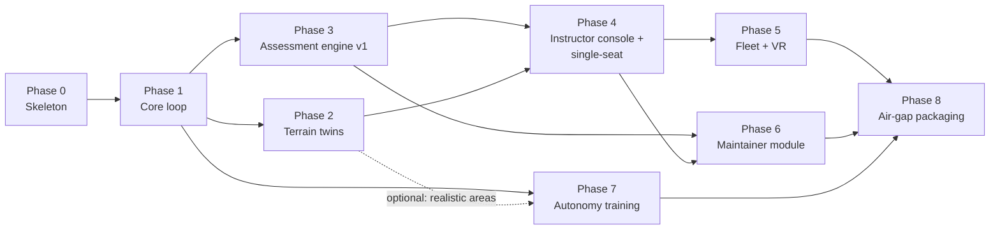

# 10 — Roadmap

> **Audience:** everyone — engineers picking up a phase, reviewers deciding
> whether a phase is done, and the founder/tech lead answering open
> questions.
> **Rule:** phases are built **in order**, each ends with a review stop
> ([How we run a phase](#how-we-run-a-phase)). There is deliberately **no
> calendar schedule** in this document; dates are set at each phase review.

The phases and their acceptance criteria come from the founding brief
([00 Origin prompt](00_ORIGIN_PROMPT.md)). Each phase below quotes the
original acceptance criterion **verbatim** (marked "Origin criterion") and
adds concrete, testable criteria that make "done" unambiguous. Nothing in
this repository other than the RAVEN programme (which lives outside this
repo) is delivered or fielded; every phase here is under build.

Related: [01 Vision](01_VISION_AND_USECASES.md), [02 Architecture](02_ARCHITECTURE.md),
[ONBOARDING](ONBOARDING.md), [CHANGELOG](CHANGELOG.md), [ADR index](ADR/README.md).

---

## Phase dependencies

Solid arrows are hard dependencies; the dotted arrow is a soft one. The
build order stays 0 → 8 as the brief requires; the graph shows which later
phases would be blocked by slippage in an earlier one.

## How we run a phase

1. **Plan.** Write a short phase plan (scope, files touched, acceptance
   tests, risks) and get it approved by the founder/tech lead. Anything that
   touches the fixed tech table in `CLAUDE.md`, the engine version, or would
   need internet at run time is raised **before** building.
2. **Build.** Small Conventional Commits on a branch; `main` always
   buildable. Unimplemented behaviour returns 501 or raises
   `NotImplementedError` naming its phase. Code that could not be compiled
   or run is marked **UNVERIFIED BUILD**.
3. **Test.** Unit tests with the code; acceptance tests from this document
   automated wherever possible. `make lint`, `make typecheck`, `make test`
   green locally and in CI.
4. **Document.** Update the spec docs touched, add an ADR for every
   non-trivial decision ([ADR index](ADR/README.md)), and add a
   [CHANGELOG](CHANGELOG.md) entry that states what was run and what was
   **not** run. Never invent results.
5. **Stop for review.** Present the acceptance evidence; the phase is done
   only when the reviewer accepts it. Then update the status line here.

---

## Phase 0 — Skeleton

- **Goal.** A repository a new engineer can clone, run and understand in a
  day; every contract and decision written down before features.
- **Scope.** Repo layout; all docs as complete drafts; schemas (protobuf +
  JSON Schema); Docker Compose skeleton with health checks; `CLAUDE.md`; CI;
  `ONBOARDING.md`; ADRs for every tech-table row.
- **Deliverables.** `docs/00–10`, `docs/ONBOARDING.md`,
  `docs/BUILDING_UE5.md`, `docs/GLOSSARY.md`, `docs/CHANGELOG.md`,
  ADRs 0001–0017; `schemas/*.proto`, `schemas/json/*.json`; services `api`,
  `recorder`, `assessment`, `sitl` (bridge protocol + image recipe), `rl`
  (task maths), `common`; terrain builder CLI + four terrain services;
  instructor console (catalogue + status pages); platform `cdpl_quad_01`;
  areas `flat_test`, `hyd_demo_01` (manifests); scenarios; rubrics; UE5
  project source skeleton; scaffolders `make new-platform` / `make new-area`;
  `Makefile`; `docker-compose.yml`; CI workflows.
- **Origin criterion (verbatim).** "a new engineer can clone, run `make setup && make dev`, see all services healthy, and read their way to understanding the system in one day."
- **Added testable criteria.**
  1. `make setup && make dev` on a clean developer machine exits 0 and
     `docker compose ps` shows every `core`, `terrain` and `lms` service
     healthy; `scripts/smoke_dev.sh` passes.
  2. `make lint`, `make typecheck` (mypy `--strict`, tsc), `make test`
     (pytest + vitest) and `make schemas` pass.
  3. `make docs` (mkdocs `--strict`) builds with no broken links.
  4. Every unimplemented endpoint returns 501 naming its phase;
     `make package` / `make deploy-box` exit non-zero with a phase message.
  5. An engineer new to the project follows [ONBOARDING](ONBOARDING.md)
     day 1 and can explain the time base, event schema and platform plugin
     model (reviewer judgement).
- **Dependencies.** None.
- **Key risks.** Docs drifting from code; UE5 source unverified;
  pinned third-party images unavailable (MinIO — see open questions).
- **Status: complete, pending review.**
  - *Verified (actually run):* all Python unit tests (pytest), ruff,
    mypy `--strict`; console lint, typecheck, tests and build; `make dev`
    brought every core/terrain/lms container healthy and the smoke test
    passed; event round-trip recorder → TimescaleDB returned events ordered
    by `(sim_time_us, seq)`.
  - *Caveat:* the pinned MinIO image tag could not be pulled in the build
    environment; a locally built MinIO stand-in was used via
    `CDSIM_MINIO_IMAGE`. The pinned tag still has to be verified.
  - *Not run:* any UE5 build (all of `sim/` is **UNVERIFIED BUILD**); the
    SITL image build; GitHub Actions workflows; `make docs` against the
    final doc set (to be run at review); the "one day" onboarding criterion
    (needs a real new engineer).

## Phase 1 — Core loop

- **Goal.** Close the loop: UE5 physics ↔ ArduPilot SITL ↔ recorder ↔ replay
  on one clock.
- **Scope.** Placeholder quad in UE5 on `flat_test`; JSON physics binding at
  400 Hz; MAVLink exposed (TCP 5760 + GCS UDP 14550); telemetry and control
  ingest in the recorder; session-file export; replay; headless run of a
  scripted mission; session listing API.
- **Deliverables.** Compiled UE5 client/server targets (`scripts/ue5/`),
  working `sitl` image, recorder telemetry/control ingest endpoints, session
  export to MinIO (`cdsim-recordings`), replay (API + client),
  `sitl_core_loop` scenario runnable headless, `GET /v1/sessions`.
- **Origin criterion (verbatim).** "scripted takeoff–waypoint–land runs headless and produces a session file that replays deterministically."
- **Added testable criteria.**
  1. `sitl_core_loop` (seed 1, sim rate 1.0) completes headless: vehicle
     takes off from `pad_home`, reaches 10 m, passes within 2 m of the
     waypoint 50 m north, and lands within 2 m of the mission's land point
     (the `pad_target` position); a `landing_touchdown` outcome is recorded
     (tolerances to be confirmed in the Phase 1 plan).
  2. The session file contains `session.json`, `events.pb`, `telemetry.pb`
     (50 Hz), `controls.pb`, all ordered by `(sim_time_us, seq)`, with no
     `seq` gaps per producer.
  3. Replaying the session twice yields byte-identical re-emitted streams;
     re-simulating with the same seed and builds yields vehicle positions
     within a tolerance defined in the Phase 1 plan (e.g. ≤ 1 cm at
     touchdown).
  4. Same run at sim rate 0.5× and 4× completes with the same event
     sequence (SITL `--speedup` + UE clock).
  5. JSON physics frame loss < 0.1% over the run (tracker in
     `cdsim_sitl_bridge/protocol.py`).
  6. A GCS on the LAN can connect to UDP 14550 and see the vehicle.
- **Dependencies.** Phase 0; a Windows/Linux machine with UE5.4 installed.
- **Key risks.** First UE5 compile of the skeleton; determinism of UE
  physics vs. our own rigid-body integration; SITL/JSON timing at >1×.
- **Status:** not started.

## Phase 2 — Terrain twins

- **Goal.** Real areas of operations, built from open data and served
  offline, rendering correctly in UE5.
- **Scope.** `terrain/builder` fetch/process/tile/package; DEM-backed
  elevation API; mesh (heightmap or 3D tiles); UE5 area loader; pads and
  no-fly volumes in-world; area packages in MinIO `cdsim-areas`.
- **Deliverables.** `cdsim-area package` producing
  `<id>-<version>.tar.zst`; built `hyd_demo_01` package; elevation API
  serving DEM values; UE5 `CDSimAreaLoader` + `CDSimLandingPadActor` working.
- **Origin criterion (verbatim).** "the Hyderabad demo area renders in UE5 with correct elevation; landing pads defined in `area.yaml` appear in-world."
- **Added testable criteria.**
  1. `cdsim-area package hyd_demo_01` runs offline from cached sources and
     produces a package whose `package.json` records source checksums
     (sha256 in `area.yaml` verified).
  2. `/v1/elevation?lat&lon` matches the source DEM at 20 sample points
     within the DEM's vertical accuracy (resampling error ≤ 1 m).
  3. In UE5, terrain height under each of the three pads matches the
     elevation API within 1 m; each pad is placed within 0.5 m of its
     `area.yaml` position with the declared heading and marker.
  4. The no-fly volume triggers `geofence_breach` events when entered/left.
  5. `docker compose --profile terrain up` serves the area with the network
     disconnected.
  6. Attributions for Copernicus DEM, Sentinel-2 and OpenStreetMap are shown
     in the client and docs.
- **Dependencies.** Phase 1 (UE5 builds and flies).
- **Key risks.** Coordinate frames/datums (EGM96 vs. ellipsoid, UTM 44N);
  UE large-world precision; open-data licence obligations; build-time
  download size.
- **Status:** not started (builder `validate`/`plan` exist; `package` exits 3).

## Phase 3 — Assessment engine v1

- **Goal.** Every session is scored automatically and explainably.
- **Scope.** Instructor injects via `SimControl.Inject`; event pipeline from
  all producers; audio capture (consent-gated) and energy VAD; optional
  offline Whisper; all metrics v1 ([06](06_ASSESSMENT_ENGINE.md)); session
  assessment endpoint; JSON + PDF reports; retention job.
- **Deliverables.** Implemented `metrics.py` functions (plus
  `procedure_step_time_s`); `POST /v1/sessions/{id}/assess`;
  `GET /v1/sessions/{id}/score`; audio ingest; report generator; golden
  session fixture under `tests/fixtures/`.
- **Origin criterion (verbatim).** "a golden test session scores identically on every run; reaction-time test with a synthetic stimulus verified to within 20 ms."
- **Added testable criteria.**
  1. Golden session scored 10× in two processes → byte-identical JSON
     report equal to the committed expected report.
  2. Synthetic responder test: stimulus + stick step 750 ms later →
     `reaction_time_s` within ±20 ms (target ≤ 5 ms) across 20 trials at
     sim rates 1× and 4×.
  3. Every metric in [06 §6](06_ASSESSMENT_ENGINE.md) has unit tests
     reproducing its worked example exactly.
  4. VAD onset on a recorded test clip within ±40 ms of hand-labelled onset.
  5. With `audio_consent: false` no audio object exists in MinIO and comms
     is reported "not measured"; with `audio_retention_days: 0` audio is
     gone after session close.
  6. PDF report generated fully offline, carries the logo placeholder.
- **Dependencies.** Phase 1 (recording, session files).
- **Key risks.** Input timestamping precision in UE5; VAD robustness to
  fan/room noise; rubric thresholds need instructor calibration data.
- **Status:** not started (rubric scoring, validation and landing readers
  already implemented in Phase 0).

## Phase 4 — Instructor console + single-seat training mode

- **Goal.** An instructor can run and assess a single-seat lesson end to end
  from the console.
- **Scope.** Scenario authoring; session creation and control; live
  monitoring over Redis; injects UI; replay UI; reports; trainee records;
  single-seat mode ([07](07_TRAINING_MODES.md)).
- **Deliverables.** Console pages Sessions, Live monitor, Replay, Trainees;
  API `POST /v1/sessions`, trainee endpoints; scenario runner.
- **Origin criterion (verbatim).** None stated beyond "Instructor console + single-seat training mode with scenario authoring and live monitoring."
- **Added testable criteria.**
  1. Author `landing_motor_failure_01` in the console; saved YAML passes
     `make schemas` and equals the repo file semantically.
  2. Run it single-seat: lobby → consent → start → inject fires at 60 s →
     landing → automatic score visible in the console within 30 s of
     session end.
  3. Live monitor shows vehicle state and events with ≤ 1 s display
     latency on the LAN.
  4. Replay scrubbing to any sim time shows the recorded state.
  5. Trainee record lists the session with rubric version and result.
  6. Every screen shows the logo placeholder.
- **Dependencies.** Phase 3; Phase 2 for `hyd_demo_01` scenarios.
- **Key risks.** Scope creep in authoring UI; usability for instructors.
- **Status:** not started (catalogue + status pages exist).

## Phase 5 — Fleet mode and VR configuration

- **Goal.** Many pilots, one shared world; the same content in VR.
- **Scope.** UE5 dedicated server container; LAN session-code join; N
  clients + instructor; per-trainee recording/scoring; shared stimuli with
  `broadcast_id`; OpenXR configuration.
- **Deliverables.** `fleet-server` image; client join UI; fleet console
  view; cohort comparison report; VR launch configuration and input mapping.
- **Origin criterion (verbatim).** "Fleet mode (dedicated server, 4 clients on LAN) and VR configuration."
- **Added testable criteria.**
  1. 4 clients join by session code on an isolated LAN (no internet) and
     fly for 20 minutes without desync or disconnect.
  2. A broadcast inject produces 4 stimulus events with the same
     `broadcast_id` and identical `sim_time_us`; each trainee's reaction
     time is within ±20 ms under the synthetic-responder test on all 4
     clients.
  3. Per-trainee reports + cohort comparison generated.
  4. Measured bandwidth per client and server CPU recorded (replacing the
     provisional estimates in [07](07_TRAINING_MODES.md)).
  5. The same client build runs desktop and VR (`-vr`) with no separate
     branch; VR holds the headset's native frame rate on the reference
     seat hardware in the demo scenario.
- **Dependencies.** Phase 4.
- **Key risks.** Server-authoritative physics with SITL per vehicle;
  client sim-time estimation; VR performance.
- **Status:** not started (session-code and replicated game-state C++
  written, UNVERIFIED BUILD).

## Phase 6 — Maintainer module (Fleet Focus)

- **Goal.** Explore / Rehearse / Improve on the airframe twin, driven only
  by `platform.yaml`.
- **Scope.** Airframe viewer with sockets; part identification; guided
  procedures with anchors, tool selection, step timing; after-action review;
  maintainer rubric.
- **Deliverables.** Maintainer mode in the client; `procedure_step` events;
  maintainer console page; documented CAD swap procedure test.
- **Origin criterion (verbatim).** "Maintainer module on the placeholder airframe, ready to receive real CAD."
- **Added testable criteria.**
  1. All three `cdpl_quad_01` procedures can be completed; each step emits
     STARTED/COMPLETED (or FAILED/SKIPPED) events with correct tool ids.
  2. Adherence and step time for a scripted run match hand-computed values;
     `maintainer_procedure_v1` scores it.
  3. Replacing the placeholder mesh with a different mesh carrying the same
     socket names requires **no code change** (demonstrated with a
     stand-in mesh).
  4. A second platform scaffolded with `make new-platform` shows its own
     procedures without core changes.
- **Dependencies.** Phase 3 (scoring), Phase 4 (console).
- **Key risks.** Real CAD arrival and quality; socket naming discipline.
- **Status:** not started (procedure data and validation exist).

## Phase 7 — Autonomy training

- **Goal.** Train and export a precision-landing policy
  ([08](08_AUTONOMY_TRAINING.md)).
- **Scope.** gRPC `SimControl` server in UE5 + Python client; gym env;
  pad pose estimation; curriculum; domain randomisation; headless
  multi-instance runs; PPO training; evaluation; ONNX export; dataset
  generator.
- **Deliverables.** Working `PrecisionLandingEnv`; `python -m cdsim_rl`
  training runner; `rl-worker` image; ONNX model + model card; evaluation
  report; `autonomy_landing_v1` rubric.
- **Origin criterion (verbatim).** "gym env, precision-landing curriculum, ONNX export, headless multi-instance runs."
- **Added testable criteria.**
  1. Same seed → identical episode trajectories in lock-step (sim side).
  2. ≥ 8 headless instances run concurrently on the lab server with camera
     observations (`-RenderOffscreen`); aggregate sim-to-wall ratio logged.
  3. Policy reaches the stage-0 promotion bar (≥ 90% success on the held-out
     seed set) and the curriculum promotes automatically; results for all
     stages reported whatever they are.
  4. ONNX export matches PyTorch outputs within 1e-4 on the evaluation set
     and runs in ONNX Runtime on CPU at ≥ 20 Hz.
  5. Model card complete per [08 §15](08_AUTONOMY_TRAINING.md#15-reproducibility).
- **Dependencies.** Phase 1 (clock, SITL); Phase 2 optional.
- **Key risks.** Render throughput; sim-to-real gap; reward hacking.
- **Status:** not started (reward, curriculum, env config tested in Phase 0).

## Phase 8 — Air-gap packaging

- **Goal.** A field box can be installed and updated with no network
  ([09](09_DEPLOYMENT_OFFLINE.md)).
- **Scope.** `make package` (Windows client + Linux services installers);
  `make deploy-box` bundle; field-box hardware spec; backup/restore
  scripts; hardening; offline smoke test.
- **Deliverables.** Bundle per [09 §5](09_DEPLOYMENT_OFFLINE.md#5-air-gap-bundle-make-deploy-box-phase-8-design);
  installers; hardware spec document replacing the provisional table;
  `smoke_offline.sh`.
- **Origin criterion (verbatim).** "`make deploy-box` bundle, installer, field-box hardware spec document, smoke test on a clean machine with no network."
- **Added testable criteria.**
  1. `make deploy-box` exits 0 and produces a bundle whose `SHA256SUMS`
     verify; every image is pinned by digest and has an SBOM.
  2. Clean, physically disconnected machine: install from bundle, all smoke
     checks in [09 §11](09_DEPLOYMENT_OFFLINE.md#11-smoke-test-on-a-clean-no-network-machine-phase-8-acceptance)
     pass; no outbound connection attempts observed.
  3. Update from bundle N to N+1 preserves recordings and scores; rollback
     works.
  4. Backup and restore round-trip reproduces a scored session's report
     byte-identically.
  5. Hardware spec validated by running the reference scenarios (single
     seat, 4-seat fleet) on the chosen hardware.
- **Dependencies.** Phases 5, 6, 7 (everything to be bundled).
- **Key risks.** Image sourcing/mirroring; bundle size; Windows installer
  signing; hardware availability.
- **Status:** not started (`make package` / `make deploy-box` exit 1).

---

## Open questions and decisions needed

These need a decision from the founder/tech lead; each should end in an ADR
or a doc update.

| # | Question | Needed by | Notes |
|---|---|---|---|
| 1 | **MinIO image sourcing.** The pinned tag could not be pulled in the Phase 0 build environment. Verify the tag from another network and mirror it, pin a different release, or build MinIO from source into CDPL's registry? | Phase 1 (and Phase 8 at the latest) | `CDSIM_MINIO_IMAGE` override exists ([09 §10](09_DEPLOYMENT_OFFLINE.md#10-image-provenance-and-mirroring)). |
| 2 | **Internal image registry / mirroring** for all third-party images. | Phase 8 | Needed for reproducible air-gap bundles. |
| 3 | **CAD delivery** for the CDPL multirotor: format (STEP + FBX), timing, who produces sockets/LODs/collision. | Phase 6 | Pipeline in [04](04_PLATFORM_PLUGIN_SPEC.md). |
| 4 | **Field-box hardware selection** (form factor, GPU class, seats per box, power). | Phase 8 | Provisional table in [09 §4](09_DEPLOYMENT_OFFLINE.md#4-recommended-hardware-provisional). |
| 5 | **PX4 timing** — when to add the second autopilot binding. | After Phase 1 | Binding designed to allow it ([05](05_SITL_INTEGRATION.md)). |
| 6 | **Whisper model size** for optional offline transcription (CPU budget vs. accuracy; languages/accents needed). | Phase 3 | [ADR 0013](ADR/0013-audio-opus-whisper.md). |
| 7 | **Rubric calibration**: who provides instructor-graded sessions; should `voice.onset` count as a correct decision; should reaction time include voice/menu responses. | Phase 3 | [06 §14](06_ASSESSMENT_ENGINE.md#14-open-questions). |
| 8 | **Default audio retention** per deployment and consent wording. | Phase 3 | [06 §11](06_ASSESSMENT_ENGINE.md#11-audio-consent-and-retention). |
| 9 | **Landing-pad marker spec**: AprilTag family and printed tag size (not in `area.yaml` today). | Phase 7 (Phase 2 for rendering) | [08 §5.1](08_AUTONOMY_TRAINING.md#51-pad-pose-estimation-apriltag). |
| 10 | **Offline OS prerequisites** (Docker Engine, GPU drivers) — part of the bundle or provided by IT? | Phase 8 | [09 §6](09_DEPLOYMENT_OFFLINE.md#6-installation-procedure-field-box-or-lab-server). |
| 11 | **PDF report library** choice. | Phase 3 | Must be offline and open-source. |
| 12 | **Windows installer signing** and client distribution. | Phase 8 | |
