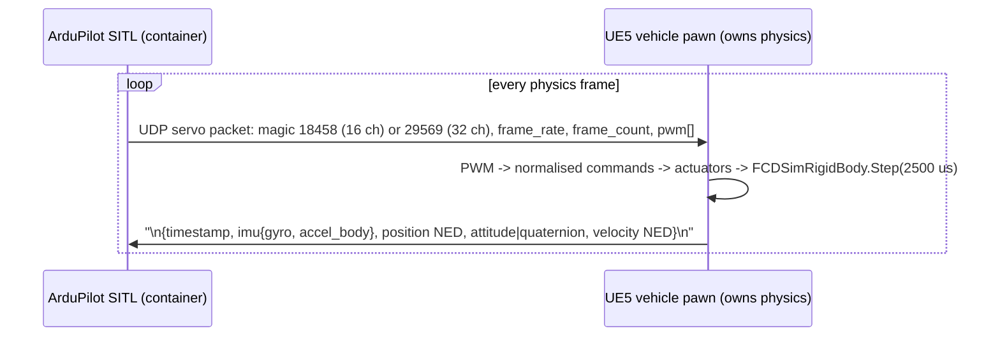

# ADR 0003: Unmodified ArduPilot SITL over the JSON physics backend; UE5 owns physics

| Field | Value |
|---|---|
| Status | Accepted |
| Date | 2026-09-29 |
| Deciders | CDPL founding engineering |
| Supersedes | — |
| Superseded by | — |

## Context

Use case 1 (SITL testing) and the autonomy use case need a real autopilot
flying against the CD Sim world, so that mission scripts, parameters and
failure responses behave as they would on the vehicle. The founding brief
fixes: ArduPilot SITL, **unmodified**, over MAVLink and ArduPilot's JSON
physics interface; **UE5 owns physics**; one SITL container per vehicle;
MAVLink exposed to the instructor console and to a GCS port; sim-rate
scaling 0.1×–10×; and a binding designed so PX4 can be added later.

Owning physics in UE5 matters because the same vehicle model must serve
manual pilot training (no autopilot), fleet mode and RL, and because the
recorded session must be reproducible from one clock
([0015](0015-unified-sim-time-base.md)).

## Decision

**Autopilot build.** `services/sitl/docker/Dockerfile` clones ArduPilot at the
pinned release tag **`Copter-4.5.7`** (build arg `ARDUPILOT_REF`) and builds
`arducopter` for the `sitl` board from source, with no patches. Internet is
used only during that image build; the resulting image runs offline.

**Physics interface.** SITL runs with `--model JSON:$SIM_HOST`. The exchange
(implemented in `sim/Source/CDSim/Vehicle/ArduPilotJsonBinding.h/.cpp`, with a
tested Python reference codec in `services/sitl/src/cdsim_sitl_bridge/protocol.py`):

The binding listens (default UDP 9002); SITL initiates and the binding replies
to the sender. ArduPilot's NED/FRD SI frames are the pawn's native frames, so
no conversion happens in the binding. The JSON `timestamp` is sim time in
seconds (`sim_time_us × 1e-6`), so the autopilot's clock *is* the CD Sim clock.

**Autopilot-agnostic seam.** The pawn talks only to `ICDSimPhysicsBinding`
(`sim/Source/CDSim/Vehicle/CDSimPhysicsBinding.h`): `StartBinding`,
`ReceiveActuatorCommands` (non-blocking, normalised 0–1 per output channel),
`SendSensorState`, `IsConnected`. `UArduPilotJsonBinding` is the first
implementation. PX4 will be a second implementation: PX4 SITL connects to a
simulator over MAVLink and exchanges simulator messages (HIL sensor and
actuator-control messages) in lock-step. Nothing outside the binding changes.
The platform chooses its autopilot in `platform.yaml` (`autopilot.type:
ardupilot|px4|none`, `param_file`).

**Containers and ports.** One SITL container per vehicle, `-I <instance>`:

| Port | Use |
|---|---|
| TCP `5760 + 10·I` (SERIAL0) | console, scripted tests, RL harness |
| UDP `GCS_TARGET` (SERIAL1, default host `14550`) | any MAVLink ground-control station |
| UDP `SIM_HOST:9002` | JSON physics exchange |

**Timing.** Physics steps at 400 Hz sim time. Sim-rate scaling uses SITL's
`--speedup $SIM_RATE` together with the UE5 clock rate (0.1–10, clamped in
`UCDSimClockSubsystem`); both sides advance on the same sim time because
SITL follows the `timestamp` we send. True lock-step (one physics step per
servo frame, UE clock in Stepped mode) is the Phase 1 target and is noted as
a TODO in the binding header.

## Status (Phase 0)

- Dockerfile, `entrypoint.sh`, `healthcheck.py` and the compose `sitl`
  profile exist. **UNVERIFIED BUILD: the SITL image has never been built or
  run.** It is outside `make dev`.
- The Python reference codec (servo packet parse for both magics, state JSON
  framing, frame-loss tracking) is unit-tested.
- `UArduPilotJsonBinding` C++ is written but never compiled (UNVERIFIED BUILD).
- No flight against the UE5 world has happened. That is Phase 1's acceptance:
  scripted takeoff–waypoint–land (`scenarios/sitl_core_loop.yaml`,
  `scenarios/missions/core_loop.waypoints`) headless on `flat_test`.

## Consequences

### Positive

- Real ArduPilot code paths (EKF, failsafes, modes) are exercised; results
  transfer to CDPL vehicles running the same firmware and parameters
  (`platforms/<id>/ardupilot.parm`).
- One vehicle model serves SITL, manual training and RL.
- Tracking upstream is a tag bump, not a patch rebase.

### Negative

- We own sensor realism (noise, bias, latency) on the UE5 side
  (`sim/Source/CDSim/Sensors/`), since SITL's own sensor models are bypassed.
- Building ArduPilot from source makes the image build slow and internet-bound.
- Soft real-time UDP: at high sim rates, dropped frames are possible; the
  frame-loss tracker exists to detect them.

### Risks

| Risk | Mitigation |
|---|---|
| JSON protocol details change between ArduPilot releases | Tag pinned; codec tests; bump tag deliberately with a regression flight |
| Non-lock-step exchange makes replay non-deterministic | Phase 1 lock-step; replay from recorded state, not by re-running SITL |
| Many vehicles overload one host at 400 Hz × rate | One container per vehicle; measure in Phase 5 |

## Alternatives considered

| Alternative | Why rejected |
|---|---|
| SITL's built-in physics models, UE5 as a visualiser | Violates "UE5 owns physics"; manual/RL/fleet modes would use a different model from SITL. |
| Patched ArduPilot | Brief requires unmodified; patches rot and invalidate test transfer. |
| Prebuilt SITL binaries | Provenance and version drift; building a pinned tag is reproducible. |
| PX4 first | Brief orders ArduPilot first, PX4 later; CDPL platforms use ArduPilot params. |
| Autopilot-specific code in the pawn | Blocks PX4; the interface costs almost nothing. |

## Revisit when

- Phase 1 shows the UDP exchange cannot meet deterministic replay even in
  lock-step.
- A CDPL platform requires PX4 (implement the second binding; this ADR stands).
- ArduPilot deprecates or changes the JSON backend, or a newer stable Copter
  release fixes something CDPL vehicles need (bump the tag).
- A platform class needs a different ArduPilot vehicle (Plane, Rover): add
  build targets, keep the same binding.
