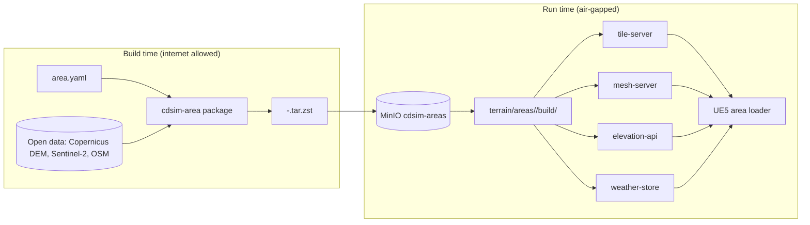

# ADR 0004: Digital terrain twins as offline area packages served from Docker

| Field | Value |
|---|---|
| Status | Accepted |
| Date | 2026-09-29 |
| Deciders | CDPL founding engineering |
| Supersedes | — |
| Superseded by | — |

## Context

Mission rehearsal needs a digital twin of the real area of operations:
elevation, imagery, vectors, optionally photogrammetry, landing pads, no-fly
volumes and weather. The founding brief says digital terrain twins are "the
foundation", must be served from Docker containers that run **fully
offline** on a laptop, a lab server or a ruggedised field box, built from open
data (SRTM / Copernicus DEM, OpenStreetMap, Sentinel imagery) and later from
CDPL-flown photogrammetry, with one `docker compose` up per area package.
Deployed boxes are air-gapped.

## Decision

**An area is a manifest in git plus a built package outside git.**

- The manifest `terrain/areas/<id>/area.yaml` (schema
  `schemas/json/area.schema.json`) declares bounds, local ENU origin, CRS
  (EPSG:4326 geographic, a projected UTM zone, EGM96 vertical datum),
  `sources` (kind, licence, resolution, build-time URL, `sha256`),
  `tile_layers`, elevation, `mesh.kind` (`none | 3d_tiles | heightmap_landscape`),
  `no_fly_volumes`, `landing_pads`, `targets` and default `weather`.
- The **builder** (`terrain/builder`, CLI `cdsim-area validate|plan|package`)
  is the only component allowed to touch the internet, and only at build
  time: it fetches sources, checks `sha256`, reprojects, tiles and packages.
- The built package layout is fixed:
  `tiles/<layer>/{z}/{x}/{y}.<fmt>`, `elevation/dem.tif` (COG),
  `mesh/tileset.json` or `mesh/heightmap.png`, `weather/default.json`,
  `package.json` (marker + build metadata), `area.yaml`.
- It ships as a versioned tarball `<id>-<version>.tar.zst`, stored in the
  MinIO bucket `cdsim-areas` ([0007](0007-minio-object-storage.md)) and
  carried in the air-gap bundle ([0014](0014-compose-profiles-and-air-gap-bundle.md)).
  Area data never goes into git or LFS.
- **Four services** read unpacked packages at `terrain/areas/<id>/build/`
  read-only and serve them over HTTP
  ([0017](0017-own-lightweight-terrain-services.md) explains why they are ours):

| Service | Port | Endpoint |
|---|---|---|
| tile-server | 8101 | `/v1/tiles/{area}/{layer}/{z}/{x}/{y}.{ext}` (raster, terrain-RGB, vector) |
| mesh-server | 8102 | `/v1/mesh/{area}/{path}` (3D Tiles or UE heightmap) |
| elevation-api | 8103 | `/v1/elevation?lat&lon` |
| weather-store | 8104 | `/v1/weather/{area}` (default weather + scenario store) |

- All four are started by **one compose profile**: `docker compose --profile terrain up`.
  Each lists `/v1/areas` with a `built` flag, so an unbuilt manifest is
  visible but not served.

## Status (Phase 0)

- Manifests exist for `hyd_demo_01` (2.2 km box west of Hyderabad, three pads,
  a demo no-fly volume; Copernicus DEM 30 m, Sentinel-2 10 m, OSM) and
  `flat_test` (500 m flat plane, `pad_home` and `pad_target` 50 m north). Both
  validate against the schema. **Neither is built.**
- `cdsim-area validate` and `plan` work; `package` exits with code 3 (Phase 2).
- The four services run and are healthy under `make dev` (verified locally).
  Elevation answers for flat areas; DEM queries return HTTP 501 until Phase 2.
- UE5 side (`sim/Source/CDSim/World/CDSimAreaLoader.*`) is UNVERIFIED BUILD.

## Consequences

### Positive

- An area is reproducible: manifest + checksummed sources + builder version.
- The runtime never needs the internet; the same package works on any box.
- New areas are data changes (`make new-area id=<x>`), not code changes.

### Negative

- Packages must be built and distributed ahead of time; there is no "fly
  anywhere" streaming.
- Large areas at high zoom produce large tarballs and long builds.

### Risks

| Risk | Mitigation |
|---|---|
| Open-data licence terms not honoured | `sources[].licence` is mandatory; attribution in `docs/THIRD_PARTY.md` |
| Restricted areas leak via shared packages | `classification: public|restricted` in the manifest; restricted packages handled by deployment procedure (Phase 8) |
| Source URLs disappear | `sha256` pinned; CDPL archives fetched sources |

## Alternatives considered

| Alternative | Why rejected |
|---|---|
| Online map/terrain streaming | Violates offline-first. |
| Terrain baked only into UE5 levels | Services, console and assessment also need elevation, tiles and no-fly data; baking hides it inside the client. |
| Area data in Git LFS | Tens of GB per area; clones become unusable. |
| One container per area | More images and ports; one set of services serving N packages is simpler. |

## Revisit when

- Phase 2 shows UE5 cannot stream the demo area fast enough from these services.
- Areas grow beyond what fits on a field box's disk.
- CDPL photogrammetry arrives in a format the builder cannot package as 3D Tiles.
