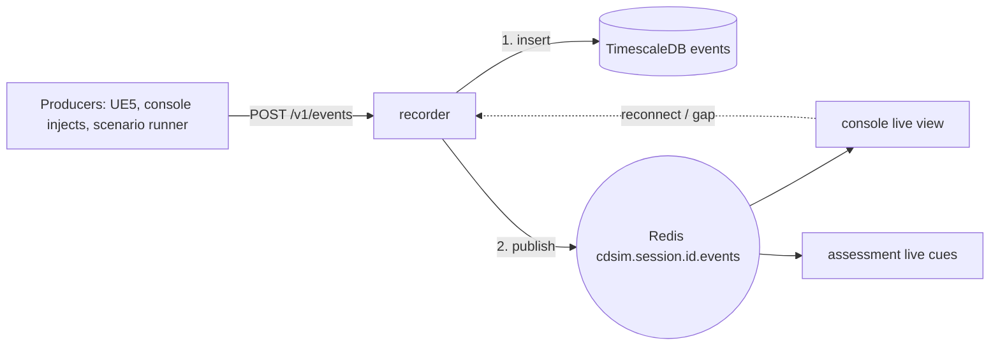

# ADR 0008: Redis for best-effort live pub/sub

| Field | Value |
|---|---|
| Status | Accepted |
| Date | 2026-09-29 |
| Deciders | CDPL founding engineering |
| Supersedes | — |
| Superseded by | — |

## Context

While a session runs, several consumers want events as they happen: the
instructor console (live monitoring, Phase 4), the assessment engine
(live cues, e.g. "reaction time exceeded"), and in fleet mode the instructor
view across trainees (Phase 5). The durable record of those events is the
database ([0006](0006-postgresql-timescaledb.md)); what is needed live is
low-latency fan-out, not another store. It must run offline in Docker and be
simple to operate. The founding brief fixes Redis.

## Decision

We use **Redis** (`redis:7.4-alpine`, `core` profile) for **live pub/sub
only**.

- **Channel naming:** `cdsim.session.<session_id>.events` — one channel per
  session, defined in one place (`channel_for()` in
  `services/recorder/src/cdsim_recorder/store.py`). Future live streams use
  the same pattern: `cdsim.session.<id>.<stream>` (e.g. `state` for
  down-sampled vehicle state in Phase 4). Consumers that want all sessions
  use pattern subscribe `cdsim.session.*.events`.
- **Payload:** the proto3-JSON form of `cdsim.v1.Event` — the same JSON that
  is stored in `events.body` — so subscribers parse with the same Pydantic
  model (`cdsim_common.events.Event`).
- **Write path:** the recorder **writes to the database first, then
  publishes** (`POST /v1/events`). Publication failure never fails ingest.
- **Best-effort semantics:** pub/sub delivers to whoever is subscribed at
  that moment, at most once. A subscriber that disconnects misses messages.
  **The database is the record.** Any consumer that needs completeness
  (assessment scoring, replay, the console after a reconnect) re-reads from
  the recorder's `GET /v1/sessions/{id}/events?from_us=` using the last
  `sim_time_us` it saw, and orders by `(sim_time_us, seq)`.
- **Ordering:** consumers must not assume publish order equals sim-time
  order; they sort on `(sim_time_us, seq)` like everyone else
  ([0015](0015-unified-sim-time-base.md)).
- Redis runs with `--appendonly yes` for its own restart hygiene, but no CD
  Sim data is stored only in Redis. Host port bound to `127.0.0.1`.

## Status (Phase 0)

- Redis runs healthy under `make dev`. The recorder publishes each ingested
  event to `cdsim.session.<id>.events`; the channel name is unit-tested, and the publish
  path ran against real Redis during the local stack round-trip, but no
  subscriber has yet verified receipt. A publish failure is logged and does
  not fail ingest (`services/recorder/src/cdsim_recorder/main.py`).
- No subscriber exists yet: the console's live view is Phase 4, live
  assessment cues Phase 3.

## Consequences

### Positive

- Very low latency, trivial to operate, one small container.
- Clear separation: DB for truth, Redis for "now".
- Late joiners and crashed consumers recover by querying, not by complex
  broker state.

### Negative

- No delivery guarantee; every consumer needs a "catch up from the DB" path.
- Double parsing work for consumers that both subscribe and backfill.

### Risks

| Risk | Mitigation |
|---|---|
| Someone treats pub/sub as the record (e.g. scores from live stream only) | This ADR; assessment scores only from DB reads |
| High-rate state saturates Redis or the console | Publish down-sampled state only; full-rate telemetry goes to DB |
| Session ids with unexpected characters break channel patterns | Session ids are generated by the API (Phase 3/4) from a safe alphabet |

## Alternatives considered

| Alternative | Why rejected |
|---|---|
| Redis Streams (durable, consumer groups) | Duplicates the DB's role; more state to reason about. Could be adopted later if needed. |
| A dedicated message broker | Heavier to run and learn; guarantees we get from the DB anyway. |
| PostgreSQL `LISTEN/NOTIFY` | Payload size limits and ties live fan-out load to the database. |
| Direct WebSocket fan-out from the recorder | Couples consumers to one recorder process; no fan-out across services. |

## Revisit when

- A consumer genuinely needs guaranteed delivery that a DB catch-up cannot
  provide (e.g. an external system integration).
- Phase 5 fleet load shows Redis or the publish path adds measurable ingest
  latency.
- Multiple recorder instances are introduced (check ordering assumptions).
