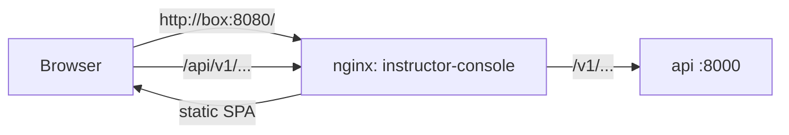

# ADR 0009: React + TypeScript instructor console, served by nginx behind one origin

| Field | Value |
|---|---|
| Status | Accepted |
| Date | 2026-09-29 |
| Deciders | CDPL founding engineering |
| Supersedes | — |
| Superseded by | — |

## Context

Instructors need one screen for scenario authoring, session control, live
monitoring, replay, scoring and trainee records (Phases 4 and later). It must
run in a browser on the instructor station or any LAN machine, work fully
offline, carry the Chakravyuha Dynamics logo placeholder on every screen, and
be maintainable by a new team. The founding brief fixes
"**React + TypeScript** web app **served by the backend**".

"Served by the backend" can be read two ways: the FastAPI process serves the
static bundle, or the back-end stack serves it. This ADR records which one we
chose and why — a deliberate, small departure from the literal wording.

## Decision

**Framework.** React + TypeScript (strict), built with **Vite**; `eslint` +
`prettier`; tests with `vitest` + Testing Library. Source in
`apps/instructor-console/`.

**Serving.** The production bundle is served by **nginx in its own container**
(`instructor-console`, compose profile `lms`, port 8080 → 80), not by the
FastAPI `api` process. nginx (`apps/instructor-console/nginx.conf`):

- serves the static SPA with an `index.html` fallback for client-side routes;
- **reverse-proxies `/api/*` to `http://api:8000/*`** (prefix stripped),
  resolving the upstream per request so the console starts and shows "API
  unreachable" even when the API is down;
- exposes `/healthz` for the compose health check.

To the browser this is **one origin**: the page and its API calls both come
from `http://<box>:8080`. There is no CORS configuration, no second port for
the user to know, and the console only ever calls relative `/api/...` paths.
In development Vite's dev server applies the identical `/api` proxy
(`vite.config.ts`), so code does not change between dev and production.

**Offline, no CDNs.** Every script, font, stylesheet and image is bundled at
build time; nothing is fetched from the internet at runtime. `npm ci` (build
stage of `apps/instructor-console/Dockerfile`) is the only step needing a
network. The same rule is why the FastAPI services disable Swagger UI.

**Branding.** A shared header component renders the logo placeholder
(`src/assets/cdpl-logo-placeholder.svg`) on every page; a unit test asserts it.

## Status (Phase 0)

- The console builds, lints, type-checks and its unit tests pass locally;
  its container ran healthy under `make dev`, and `scripts/smoke_dev.sh`
  fetched `/api/v1/system/health` **through the console's nginx proxy**
  successfully (verified locally, with curl, not in a browser session).
- Pages beyond system status and catalogue views (authoring, live monitor,
  replay, scoring, trainee records) are Phase 4 and later.
- Not verified: behaviour on the instructor-station hardware; accessibility
  review.

## Consequences

### Positive

- The API image stays a pure Python service; the console can be rebuilt and
  redeployed without touching it, and vice versa.
- nginx is very good at static files, caching headers (`/assets/` immutable)
  and proxying; it will also terminate TLS on field boxes if required (Phase 8).
- Same origin for the browser: no CORS, simple security model.

### Negative

- One more container (small) and one more image in the air-gap bundle.
- Two places define the `/api` rewrite (nginx and Vite) and must stay in step.
- Departs from the literal wording of the brief; this ADR is the record.

### Risks

| Risk | Mitigation |
|---|---|
| A dependency silently loads from a CDN (fonts, map tiles, icons) | Review rule; Phase 8 offline smoke test on a machine with no network |
| Proxy timeouts cut long requests (report generation) | `proxy_read_timeout` tuned per route when those endpoints arrive |
| WebSocket/SSE live monitoring needs proxy upgrade headers | Add in Phase 4 alongside the live endpoint |

## Alternatives considered

| Alternative | Why rejected |
|---|---|
| FastAPI serves the bundle (`StaticFiles`) | Works, but couples console releases to API images and puts a Node build inside a Python image; weaker static serving. |
| Separate origins (console and API on different ports, CORS) | More configuration and more to explain; breaks "one address" for instructors. |
| Another SPA framework or server-rendered UI | Brief fixes React + TS; large hiring pool. |
| Create React App / webpack | Slower builds; Vite is the current boring default. |

## Revisit when

- The console needs server-side logic that does not belong in the API.
- Phase 4 live monitoring shows the proxy adds noticeable latency to streams.
- Field-box resource limits make one extra container significant (then
  consider serving the bundle from the API image).
