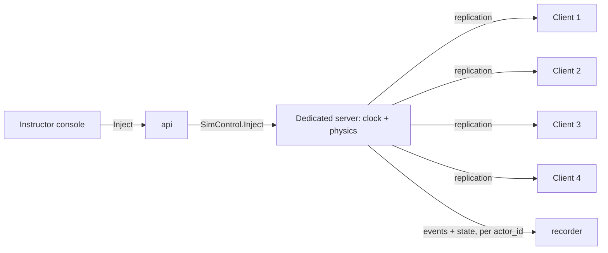

# ADR 0010: UE5 replication with a dedicated server for fleet mode

| Field | Value |
|---|---|
| Status | Accepted |
| Date | 2026-09-29 |
| Deciders | CDPL founding engineering |
| Supersedes | — |
| Superseded by | — |

## Context

Fleet training (use case 3, Phase 5) puts many pilots in one shared world:
N trainee clients + 1 instructor + 1 dedicated server on a **LAN**, with no
internet. The founding brief requires: clients join by **session code**; the
instructor sees all vehicles; **per-trainee recording and scoring**; and
**shared stimuli** — one inject hits all trainees simultaneously so their
reaction times can be compared. Phase 5 acceptance: dedicated server plus 4
clients on a LAN. The brief fixes "UE5 replication with a dedicated server
container".

Physics must stay deterministic and on one clock
([0015](0015-unified-sim-time-base.md), [0002](0002-unreal-engine-5-4-and-git-lfs.md)).

## Decision

**Topology.** Fleet mode uses Unreal's built-in replication with a
**server-authoritative dedicated server** built from the `CDSimServer`
target (`sim/Source/CDSimServer.Target.cs`) and packaged as the
`fleet-server` image (compose profile `multiplayer`, UDP 7777). The server:

- owns the **authoritative sim clock** (`UCDSimClockSubsystem`) and all
  vehicle physics (`FCDSimRigidBody` at 400 Hz); clients render replicated
  state and send inputs;
- hosts one SITL container per autopilot-flown vehicle ([0003](0003-ardupilot-sitl-json-physics.md));
- replicates session identity and sim time via `ACDSimFleetGameState`
  (`sim/Source/CDSim/Net/CDSimFleetGameState.h`: `SessionId`, `SessionCode`,
  `AreaId`, `ReplicatedSimTimeUs` republished at about 10 Hz) and per-trainee
  identity via `ACDSimPlayerState`.

Single-seat mode runs the same code as a standalone instance (listen/standalone
net mode), so there is one code path, not two.

**Joining by session code, LAN only.** The server generates a 6-character
code from an alphabet without look-alike characters
(`UCDSimSessionCode`, `sim/Source/CDSim/Net/CDSimSessionCode.h`, 31⁶ codes).
Clients enter the code; the server answers a **LAN UDP broadcast beacon** for
a matching code with its address, and the client connects. No matchmaking
service, no internet.

**Per-trainee recording.** Every event and state frame carries
`Header.actor_id` (the trainee / vehicle) and the server's `sim_time_us`.
The server's recorder component (`sim/Source/CDSim/Recording/CDSimRecorderComponent.*`)
posts to the recorder service; the session manifest lists every participant.
Assessment scores each trainee separately from the same session record.

**Shared stimuli.** An instructor inject intended for everyone is **one
logical stimulus** with a `broadcast_id` (`schemas/events.proto`,
`Stimulus.broadcast_id`). The server stamps it once at a single
`sim_time_us` and records one stimulus event per trainee (distinct
`event_id`, distinct `actor_id`, same `broadcast_id`, same `sim_time_us`).
Because all trainees share the server clock, reaction times computed per
trainee are directly comparable; the assessment engine groups by
`broadcast_id` for comparative reports.

## Status (Phase 0)

- Written, **UNVERIFIED BUILD** (never compiled): server target,
  `ACDSimFleetGameState`, `ACDSimPlayerState`, session-code generation and
  validation.
- Not implemented: LAN beacon discovery, client-side interpolation of
  replicated sim time, the `fleet-server` image (compose declares the
  service so the topology is visible, but no image is built), shared-stimulus
  fan-out. All Phase 5.
- `broadcast_id` exists in the schema and Pydantic mirror (tested).

## Consequences

### Positive

- Engine-native replication: relevance, prediction and bandwidth handling
  are mature and documented.
- Server authority keeps one clock and one physics truth; recordings are
  consistent across trainees.
- Same code runs single-seat and fleet.

### Negative

- Server CPU scales with vehicles × 400 Hz physics (+ SITL containers).
- Clients see state with network latency; control feel depends on LAN quality.
- A dedicated-server build adds a second packaging target.

### Risks

| Risk | Mitigation |
|---|---|
| Client input latency affects reaction-time metrics | Stamp responses at server receipt in sim time and record client-side input time as reference; measure LAN latency in Phase 5 |
| Beacon broadcast blocked on some networks | Allow direct `host:port` entry as a fallback |
| 4+ vehicles × SITL overload the server box | Measure in Phase 5; SITL containers may run on a second host |

## Alternatives considered

| Alternative | Why rejected |
|---|---|
| Listen server (one trainee hosts) | Host trainee gets zero latency (unfair metrics); session dies with that client. |
| Custom networking over our own protocol | Large effort; replication already solves it. |
| Lock-step peer-to-peer | Complex, fragile with many clients; no single authority. |
| Online matchmaking / session service | Violates offline-first. |
| Per-trainee separate stimuli without a shared id | Cannot prove "simultaneous" or group for comparison. |

## Revisit when

- Phase 5 measurements show more than 4 clients or more vehicles than one
  server box can simulate at 400 Hz.
- Reaction-time fairness tests show LAN latency materially biases scores.
- A need for cross-site (WAN) fleet sessions appears.
