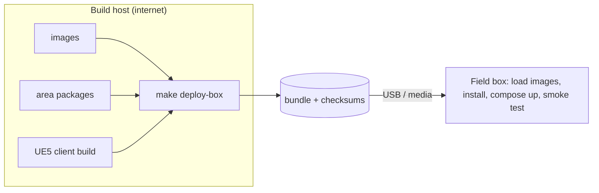

# ADR 0014: Docker Compose profiles and a single air-gap bundle

| Field | Value |
|---|---|
| Status | Accepted |
| Date | 2026-09-29 |
| Deciders | CDPL founding engineering |
| Supersedes | — |
| Superseded by | — |

## Context

CD Sim must run on a developer laptop, a lab server and a ruggedised field
box, and a deployed box must work **air-gapped**. Different sites need
different subsets: a classroom needs the console and fleet server; an RL
workstation needs workers but not the console; terrain services are needed
whenever a real area is used. The founding brief fixes: Docker Compose
profiles; installers for Windows (client) and Linux (services); one
`make deploy-box` producing an air-gap bundle (images + area packages +
client build). Phase 8 delivers packaging.

## Decision

**One `docker-compose.yml`, grouped by profile** (project name `cdsim`):

| Profile | Services | Started by |
|---|---|---|
| `core` | `timescaledb`, `redis`, `minio`, `minio-init`, `api`, `recorder`, `assessment` | `make dev` |
| `terrain` | `tile-server`, `mesh-server`, `elevation-api`, `weather-store` | `make dev` |
| `lms` | `instructor-console` (nginx) | `make dev` |
| `sitl` | `sitl` (one service block per vehicle, `INSTANCE=0,1,…`) | `make sitl` (opt-in) |
| `multiplayer` | `fleet-server` (UDP 7777) | opt-in, Phase 5 |
| `rl` | `rl-worker` | opt-in, Phase 7 |

Rules:

- **Health everywhere.** Every long-running service has a health check;
  Python services check `/ready` (all dependencies OK), so "healthy" means
  usable. `make dev` runs `docker compose … up -d --build --wait` then
  `scripts/smoke_dev.sh`.
- **Offline runtime.** Nothing phones home: `TIMESCALEDB_TELEMETRY=off`,
  `MINIO_UPDATE=off`, no CDN assets ([0009](0009-react-typescript-console.md)).
  Internet is used only while building images.
- **Loopback by default.** Host ports bind to `127.0.0.1`, except the
  console (instructors connect from other machines), the SITL MAVLink/GCS
  ports and the fleet server port.
- **Configuration via `.env`** (copied from `.env.example`); every port and
  credential is overridable; `CDSIM_MINIO_IMAGE` overrides the MinIO image
  ([0007](0007-minio-object-storage.md)).
- **Building behind TLS-inspecting proxies** is supported without editing
  files: `CDSIM_BUILD_CA` supplies a CA as the build secret `build_ca`,
  `CDSIM_BUILD_NETWORK` selects the build network.
- **Data mounts are read-only**: `platforms/`, `terrain/areas/`,
  `scenarios/`, rubrics.

**Air-gap bundle (`make deploy-box`, Phase 8).** One directory/archive
containing:

1. every container image the selected profiles use, **including third-party
   images mirrored by CDPL** (saved with `docker save`, loaded with
   `docker load`) — deployments never pull from public registries;
2. built area packages (`<id>-<version>.tar.zst`) and optional Whisper/ONNX
   model files;
3. the packaged UE5 client (Windows installer) and dedicated server image;
4. the compose file, a generated `.env` with fresh secrets, checksums, and an
   offline smoke test.

## Status (Phase 0)

- All six profiles are declared; `core`, `terrain` and `lms` were brought up
  healthy with `make dev` and the smoke test passed (verified locally, with the
  MinIO stand-in noted in [0007](0007-minio-object-storage.md)).
- `sitl` is UNVERIFIED BUILD; `multiplayer` references an image that does not
  exist yet; `rl` is a placeholder.
- `make package` and `make deploy-box` exit with "not implemented — Phase 8".
  No installer exists. `.github/workflows/stack-smoke.yml` exists but has not run.

## Consequences

### Positive

- One file describes every deployment shape; profiles pick the subset.
- Same compose file in development and on the field box, so field issues
  reproduce on laptops.
- Mirroring images removes dependency on public registries at deployment.

### Negative

- Compose is single-host; multi-host classrooms need manual placement
  (e.g. SITL on a second machine).
- The bundle is large (images + terrain + client), tens of GB.

### Risks

| Risk | Mitigation |
|---|---|
| A hidden runtime internet dependency | Phase 8 acceptance: smoke test on a clean machine with no network |
| Public image disappears (seen with MinIO in Phase 0) | Mirror all images into CDPL registry and bundle |
| Dev defaults (passwords) reach a field box | Bundle generates secrets; installer refuses default credentials |

## Alternatives considered

| Alternative | Why rejected |
|---|---|
| Kubernetes | Heavy for a single field box and a new team. |
| Separate compose files per use case | Duplication and drift; profiles do this in one file. |
| Native (non-container) service installs | Hard to reproduce across sites; OS-dependent. |
| Pulling images at install time | Violates air-gap. |

## Revisit when

- A deployment needs multiple hosts routinely (fleet classrooms with many
  SITL vehicles) — consider a multi-host orchestrator.
- Bundle size exceeds the transfer media CDPL uses.
- The Phase 8 clean-machine test finds steps that cannot be automated in Compose.
