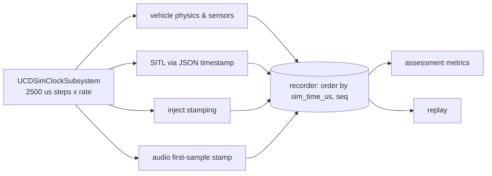

# ADR 0015: One unified simulation clock (`sim_time_us`)

| Field | Value |
|---|---|
| Status | Accepted |
| Date | 2026-09-29 |
| Deciders | CDPL founding engineering |
| Supersedes | — |
| Superseded by | — |

## Context

The assessment engine is what makes CD Sim a training system: reaction time
(stimulus → first response), decision latency, recovery time, procedure-step
timing and communication timeliness are all **differences between
timestamps recorded by different processes** — UE5 (physics, sensors,
outcomes), the console (instructor injects), SITL (autopilot), audio capture,
the recorder. Phase 3 acceptance requires a synthetic reaction-time test to be
correct **within 20 ms** and a golden session to **score identically on every
run**; Phase 1 requires a session to **replay deterministically**. Sessions
also run at 0.1×–10× real time, paused, or lock-stepped for RL.

Wall-clock time cannot satisfy this: hosts' clocks differ and drift, NTP
steps them (often no NTP at all on an air-gapped box), network delay varies,
and at a sim rate of 5× one simulated second is 200 ms of wall time.

## Decision

**Every recorded datum carries `sim_time_us`: a signed 64-bit integer count
of microseconds since the session started, monotonic, never derived from
wall-clock.** It is the first field of `Header` (`schemas/common.proto`),
which every event, vehicle state, control input, audio chunk and video
keyframe carries.

Rules:

1. **One authority.** In a live session the authoritative clock is the UE5
   simulation: `UCDSimClockSubsystem` (`sim/Source/CDSim/Core/CDSimClockSubsystem.h`)
   advances sim time **only in whole fixed physics steps of 2500 µs
   (400 Hz)**. In real-time mode it accumulates frame time × rate and drains
   it in whole steps; in stepped mode only `Step(ticks)` advances it. In
   fleet mode the dedicated server owns it and replicates it
   ([0010](0010-ue5-replication-dedicated-server.md)).
2. **Everyone else stamps with the authority's time.** Instructor injects
   are stamped by the sim on delivery (`SimControl.Inject` echoes the stamped
   event). SITL follows the `timestamp` the physics binding sends
   ([0003](0003-ardupilot-sitl-json-physics.md)). Audio chunks are stamped
   with the sim time of their first sample ([0013](0013-audio-opus-whisper.md)).
3. **Same semantics in Python.** `cdsim_common.simclock.SimClock`
   (`services/common/src/cdsim_common/simclock.py`) mirrors the engine clock
   for tools, the scenario runner, the RL harness and tests: starts paused at
   0; `REALTIME` mode scaled by a rate in [0.1, 10] with rate changes
   applied piecewise (time is banked at the old rate, so it never jumps or
   runs backwards); `STEPPED` mode for lock-step, replay and tests;
   `PHYSICS_STEP_US = 2500`. (The Python clock raises on out-of-range rates;
   the engine clamps and logs, so a UI slider cannot crash a session.)
4. **Canonical order is `(sim_time_us, seq)`.** `seq` is a per-source
   sequence number that breaks ties when several data share a physics step.
   The recorder returns events in this order; database indexes
   (`services/recorder/db/001_init.sql`) are built on it; replay re-emits in it.
5. **Wall-clock is reference only.** `wall_time_us` travels in `Header`,
   `start_wall_time_us` in the manifest, `recorded_at` in the database
   ([0006](0006-postgresql-timescaledb.md), used only for chunking and
   retention). **Never order, join, window or compute a metric by wall-clock.**
6. **Stored as integers.** No floating-point seconds in storage or on the
   wire (except where an external protocol demands it, e.g. the ArduPilot JSON
   `timestamp`, converted at that boundary only).
7. **Reproducibility inputs are recorded**: `sim_rate`, `random_seed`,
   `sim_build_id`, `autopilot_build_id` in `SessionManifest`.

## Failure modes this prevents

| Failure | How wall-clock would cause it | Prevented by |
|---|---|---|
| Negative or inflated reaction times | Console host clock ahead/behind the sim host | Single authority (rule 1–2) |
| Metrics wrong at non-1× rates | 1 s wall ≠ 1 s sim at 5× | Sim time is rate-independent |
| Time "jumps" when rate changes or after pause | Recomputing from a start wall time | Piecewise banking, whole steps |
| Replay differs from original | Ordering by arrival/ingest time | `(sim_time_us, seq)` everywhere |
| NTP step mid-session reorders data | Wall-clock not monotonic | Monotonic integer counter |
| Fleet trainees not comparable | Each client's own clock | Server clock + `broadcast_id` |
| Float rounding breaks ties/equality | Seconds as doubles | Integer microseconds |

## Status (Phase 0)

- `SimClock` (Python) is implemented and unit-tested (monotonicity, rate
  changes, pause/resume, stepped mode, range checks).
- `Header.sim_time_us` / `seq` are in every schema; the recorder orders by
  them; ordered round-trip through TimescaleDB was verified locally.
- `UCDSimClockSubsystem` is written, **UNVERIFIED BUILD**. Deterministic
  replay and the 20 ms reaction-time test are Phase 1 and Phase 3 acceptance
  criteria and have not been run.

## Consequences

### Positive

- Metrics are exact differences of integers from one clock.
- Replay and golden scoring are possible at all.
- Sim rate, pause and lock-step need no special cases in metrics.

### Negative

- Time resolution for physics-derived data is one step (2.5 ms); sub-step
  events are stamped to the step they are observed in.
- Every producer must obtain sim time from the authority; standalone tools
  must run their own `SimClock`.
- Correlating with external real-world logs needs the wall-clock reference.

## Alternatives considered

| Alternative | Why rejected |
|---|---|
| Wall-clock with NTP/PTP sync | Air-gapped boxes may lack a time source; drift and steps; breaks at non-1× rates. |
| Floating-point sim seconds | Rounding, non-exact equality, platform differences. |
| Per-process clocks aligned afterwards | Fragile; alignment errors exceed 20 ms easily. |
| Frame counter instead of µs | Couples data to physics rate; µs survives a future step-size change. |

## Revisit when

- The physics step changes from 2500 µs (µs remains valid; revisit docs and
  tests that assume 400 Hz).
- Phase 3 reaction-time test fails the 20 ms bound because of stamping
  latency in some producer.
- A session needs to exceed 2⁶³ µs (it will not: ~292,000 years).
