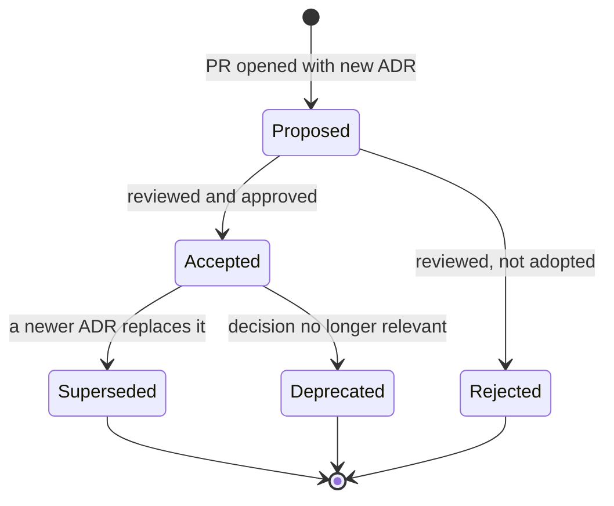

# Architecture Decision Records

An Architecture Decision Record (ADR) is a short document that captures one
significant decision: the context that forced it, what was decided, what it
costs, what else was considered, and when to look at it again. CD Sim uses the
Nygard format (Context / Decision / Consequences) with a few additions that
the team inheriting this repository asked for: an honest **Status (Phase 0)**
section, a table of **Alternatives considered**, and concrete **Revisit when**
triggers.

ADRs exist so that a new engineer can answer "why is it like this?" without
finding the person who decided. If you are about to change something covered
here, read the ADR first; if you still want to change it, write a new ADR.

## Index

| # | Title | Status |
|---|---|---|
| [0000](0000-template.md) | Template (copy this) | — |
| [0001](0001-monorepo-and-layout.md) | One `cd-sim` monorepo and its directory layout | Accepted |
| [0002](0002-unreal-engine-5-4-and-git-lfs.md) | Unreal Engine 5.4, C++ first, Git LFS for binaries | Accepted |
| [0003](0003-ardupilot-sitl-json-physics.md) | Unmodified ArduPilot SITL over the JSON physics backend; UE5 owns physics | Accepted |
| [0004](0004-offline-terrain-twins-in-docker.md) | Digital terrain twins as offline area packages served from Docker | Accepted |
| [0005](0005-python-fastapi-services.md) | Python 3.11 + FastAPI for platform services | Accepted |
| [0006](0006-postgresql-timescaledb.md) | PostgreSQL + TimescaleDB for events and telemetry | Accepted |
| [0007](0007-minio-object-storage.md) | MinIO (S3 API) for recordings and area packages | Accepted |
| [0008](0008-redis-live-pubsub.md) | Redis for best-effort live pub/sub | Accepted |
| [0009](0009-react-typescript-console.md) | React + TypeScript instructor console behind nginx | Accepted |
| [0010](0010-ue5-replication-dedicated-server.md) | UE5 replication with a dedicated server for fleet mode | Accepted |
| [0011](0011-openxr-vr-as-configuration.md) | OpenXR VR as a project configuration, not a fork | Accepted |
| [0012](0012-rl-gym-env-grpc-pytorch-onnx.md) | Gym-style RL env over gRPC; PyTorch; ONNX export | Accepted |
| [0013](0013-audio-opus-whisper.md) | Trainee audio as sim-time-stamped Opus chunks; optional offline Whisper | Accepted |
| [0014](0014-compose-profiles-and-air-gap-bundle.md) | Docker Compose profiles and a single air-gap bundle | Accepted |
| [0015](0015-unified-sim-time-base.md) | One unified simulation clock (`sim_time_us`) | Accepted |
| [0016](0016-schema-contracts-protobuf-and-json-schema.md) | Schema contracts: protobuf for streams, JSON Schema for manifests | Accepted |
| [0017](0017-own-lightweight-terrain-services.md) | Own lightweight terrain services instead of a third-party tile server | Accepted |

ADRs 0002–0014 correspond to the rows of the fixed tech-decision table in
`CLAUDE.md` and the founding brief ([00_ORIGIN_PROMPT.md](../00_ORIGIN_PROMPT.md)).
ADRs 0001 and 0015–0017 record structural decisions taken while building
Phase 0.

## Lifecycle

- **Proposed** — the ADR is in an open pull request. It may change freely.
- **Accepted** — merged and in force. From now on the **Decision** section is
  never edited. You may fix typos, add links, and update the "Status (Phase N)"
  section as implementation progresses, but the decision itself is frozen.
- **Superseded** — a newer ADR replaced it. Set `Status: Superseded` and fill
  `Superseded by` with a link to the new ADR; the new ADR fills `Supersedes`.
  Keep the old file: the history of *why* is the point.
- **Rejected / Deprecated** — kept for the record, with a sentence explaining why.

Changing any row of the fixed tech table in `CLAUDE.md` (engine, autopilot,
databases, UI framework, transport, packaging) requires the founder / tech
lead's approval **before** the superseding ADR is merged.

## When to write one

Write an ADR when a decision is non-trivial and would be expensive to reverse
or confusing to a newcomer, for example:

- choosing or replacing a technology, library, protocol or file format;
- a rule every component must follow (like [0015](0015-unified-sim-time-base.md));
- departing from the founding brief (explain the departure; see
  [0009](0009-react-typescript-console.md) for an example);
- a performance or security trade-off you had to make deliberately.

Do not write one for routine choices a reviewer would accept without comment.

## How to write one

1. Copy [0000-template.md](0000-template.md) to `NNNN-kebab-title.md`.
2. **Numbering rule:** take the next unused four-digit number in this index.
   Numbers are never reused, even for rejected ADRs. If two open PRs grab the
   same number, the one merged second renumbers before merging.
3. File names are lowercase kebab-case; the title inside starts with
   `# ADR NNNN:`.
4. Fill every section. Reference real paths in backticks
   (`services/recorder/db/001_init.sql`), link other ADRs relatively.
5. Be honest in **Status (Phase N)**: what exists, what is tested, what is not.
6. Add the row to the index above in the same PR, and a line to
   `docs/CHANGELOG.md` if the decision is user-visible.
7. Use a Conventional Commit: `docs(adr): add 0018 <title>`.

## Style

- Name open-source projects and open-data programmes as technologies; never
  name a company or a client.
- Keep each ADR short enough to read in five minutes (roughly 60–150 lines).
- Prefer tables for alternatives and risks, Mermaid for flows.
